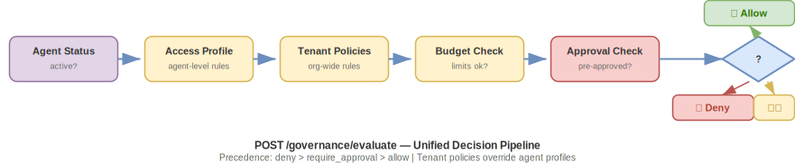

# Agent Governance Runtime (AGR)

**A DAPR-like governance runtime for AI agents across heterogeneous platforms.**

> *"You don't need to standardize on one agent platform. You need to standardize on one governance plane."*

Part of the [Agentic OS](https://marcelaldecoa.github.io/TheAgenticOS) project — implementing the Governance Plane (Ch. 12), Governance Patterns (Ch. 17), and Reference Architecture (Ch. 25).

---

## The Problem

Enterprises face an explosion of "shadow agents" — AI agents on N8N, GPT, Claude, Gemini, Copilot Studio, and custom code — with no central visibility, no audit trail, and no capability governance.

## The Solution

AGR provides **governance building blocks** that work with any agent platform — the same way DAPR provides infrastructure building blocks for any microservice.

## Architecture


## Quick Start

### 1. Run the Server

```bash
git clone https://github.com/marcelaldecoa/TheAgenticOS.git
cd TheAgenticOS/implementations/agent-governance-runtime
cd src/server && pip install -e ".[dev]" && agr-server
# → API at http://localhost:8600, Swagger at /docs
```

### 2. Register an Agent

```bash
pip install -e src/sdk && pip install -e src/cli

curl -X POST http://localhost:8600/registry/agents \
  -H "Content-Type: application/json" \
  -d '{
    "id": "my-agent",
    "name": "My Agent",
    "platform": "custom",
    "owner": {"team": "eng", "contact": "eng@company.com"},
    "access_profile": {
      "mcps_allowed": ["github-mcp", "docs-mcp"],
      "mcps_denied": ["production-db"],
      "actions": {
        "file.read": "allow",
        "file.write": "allow",
        "git.push": "require_approval",
        "deploy.*": "deny"
      },
      "budget": {"max_requests_per_hour": 100, "max_cost_per_day_usd": 5.00}
    }
  }'
# → Returns api_token: "agr_abc123..." — save it, shown only once!
```

### 3. Create Tenant Policies

```bash
curl -X POST http://localhost:8600/policies/rules \
  -H "Content-Type: application/json" \
  -d '{"name": "No prod deploys", "condition": {"action_pattern": "deploy.production"}, "decision": "deny", "priority": 200}'
```

### 4. Evaluate Actions

```bash
curl -X POST http://localhost:8600/governance/evaluate \
  -H "Content-Type: application/json" \
  -H "Authorization: Bearer agr_abc123..." \
  -d '{"agent_id": "my-agent", "action": "deploy.production"}'
# → {"decision": "deny", "reason": "Policy 'No prod deploys': deploy.production → deny", ...}
```

## Unified Governance Evaluation

Every decision flows through one endpoint — `/governance/evaluate`:



**Precedence**: deny > require_approval > allow. Tenant policies override agent profiles.

## Platform Integrations

| Platform | Method | Details |
|----------|--------|---------|
| **Claude Code** | MCP server + instructions | [integrations/claude-code/](integrations/claude-code/) |
| **N8N** | HTTP Request nodes | [integrations/n8n/](integrations/n8n/) |
| **Custom Python** | SDK (`GovernanceClient`) | [src/sdk/](src/sdk/) |
| **Any HTTP client** | REST API | `/docs` for OpenAPI |

### Claude Code

```json
// .vscode/mcp.json
{"servers": {"agr-governance": {"command": "agr-mcp", "env": {"AGR_SERVER_URL": "http://localhost:8600", "AGR_AGENT_TOKEN": "agr_<token>"}}}}
```

### Python SDK

```python
from agr_sdk import GovernanceClient

gov = GovernanceClient(server_url="http://localhost:8600", agent_id="my-agent")
record = gov.register(name="My Agent", platform="custom", owner_team="eng", owner_contact="eng@co.com")
token = record["api_token"]

gov = GovernanceClient(server_url="http://localhost:8600", token=token)
decision = gov.evaluate("email.send")
if decision["decision"] == "allow":
    with gov.action("email.send", intent="Notify customer") as act:
        send_email(...)
        act.set_result("success")
```

## Security

- **Tokens**: Generated server-side, prefixed `agr_`, shown once on creation, redacted from all GET/LIST
- **Auth resolution**: `GET /auth/resolve` maps token → agent principal (no iteration, no self-declared identity)
- **Audit integrity**: Bearer token present → `agent_id` derived from token, not request body
- **Server-side enforcement**: All decisions via `/governance/evaluate` — clients are thin
- **Append-only audit**: No update/delete on audit records

## API Reference

| Endpoint | Method | Description |
|----------|--------|-------------|
| `/registry/agents` | POST | Register (returns token) |
| `/registry/agents` | GET | List (tokens redacted) |
| `/registry/agents/{id}` | GET/PUT/DELETE | CRUD |
| `/auth/resolve` | GET | Token → principal |
| `/governance/evaluate` | POST | **Decision endpoint** |
| `/policies/rules` | POST/GET | Policy CRUD |
| `/policies/rules/{id}` | GET/PATCH | Get/disable policy |
| `/audit/records` | POST/GET | Audit trail |
| `/audit/traces/{id}` | GET | Trace reconstruction |
| `/budget/consume` | POST | Record consumption |
| `/budget/{agent_id}` | GET | Budget status |
| `/operators` | POST/GET | Operator RBAC management |
| `/approvals/request` | POST | Create approval (idempotent) |
| `/approvals/pending` | GET | List pending approvals |
| `/approvals/{id}/decide` | POST | Approve/deny (operator) |
| `/dashboard/summary` | GET | Fleet stats |
| `/dashboard/violations` | GET | Recent denied actions |
| `/dashboard/top-consumers` | GET | Top agents by usage |
| `/dashboard/approvals` | GET | Approval flow stats |
| `/compliance/export` | GET | Evidence report (JSON) |

Full OpenAPI: `http://localhost:8600/docs`

## What's New in Phase 3 (This Release)

- ✅ **Operator RBAC** — admin/approver/auditor roles, API key auth, bootstrap flow
- ✅ **Approval flows** — idempotent creation, one-time-use, auto-expiry, operator decisions
- ✅ **Approval ↔ evaluate integration** — approved requests waive require_approval (but NOT deny/budget)
- ✅ **Fleet dashboard** — summary, top consumers, violations, approval stats
- ✅ **Compliance export** — structured JSON evidence report with schema versioning and gap detection
- ✅ **Structured governance audit** — decision, source, matched_policy_ids, approval_id in metadata
- ✅ **Webhook notifications** — configurable webhook on approval creation (Teams/Slack ready)
- ✅ **79 tests** across all 9 test files

### Previous Releases

**Phase 2**: Auth hardening, policy engine, unified evaluate, budget tracking, MCP v2, N8N integration
**Phase 1**: Agent registry, audit trail, access profiles, MCP server, SDK, CLI, Claude Code integration

## Theoretical Foundation

| Concept | Source | AGR Component |
|---------|--------|---------------|
| Governance Plane | Agentic OS, Ch. 12 | The entire runtime |
| Capability-Based Access | Agentic OS, Ch. 17 | Access profiles |
| Permission Gate | Agentic OS, Ch. 17 | `/governance/evaluate` |
| Auditable Action | Agentic OS, Ch. 17 | Append-only audit trail |
| Risk-Tiered Execution | Agentic OS, Ch. 17 | allow / deny / require_approval |
| Budget Controller | Agentic OS, Ch. 25 | Budget tracking + enforcement |
| Human Escalation | Agentic OS, Ch. 17 | Approval flows |

## License

Apache License 2.0 — see [LICENSE](LICENSE).
