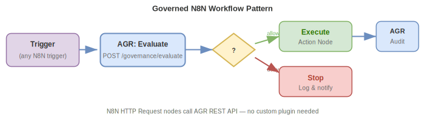

# N8N Integration with Agent Governance Runtime

## Overview

N8N workflows can integrate with AGR using the **Webhook + HTTP Request** pattern.
No custom plugin needed — N8N's built-in nodes call the AGR REST API directly.

## Pattern: Governed N8N Workflow



## Setup

### 1. Register the N8N Agent

```bash
# Using the AGR CLI
agr register n8n-customer-workflow \
  --name "Customer Onboarding Workflow" \
  --platform n8n \
  --owner support-team \
  --contact support@company.com \
  --env production \
  --profile access-profile.json

# Or via HTTP
curl -X POST http://localhost:8600/registry/agents \
  -H "Content-Type: application/json" \
  -d '{
    "id": "n8n-customer-workflow",
    "name": "Customer Onboarding Workflow",
    "platform": "n8n",
    "owner": {"team": "support", "contact": "support@company.com"},
    "deployment": {"environment": "production"},
    "access_profile": {
      "mcps_allowed": [],
      "actions": {
        "email.send": "allow",
        "crm.update": "allow",
        "database.write": "require_approval",
        "deploy.*": "deny"
      },
      "budget": {
        "max_requests_per_hour": 50,
        "max_cost_per_day_usd": 2.00
      }
    },
    "discovery_method": "manual"
  }'
```

Save the `api_token` from the response — you'll use it as a credential in N8N.

### 2. Configure N8N Credentials

In N8N, create a **Header Auth** credential:
- Name: `AGR Governance`
- Header Name: `Authorization`
- Header Value: `Bearer agr_<your-token>`

### 3. Governance Check Node (HTTP Request)

Add an **HTTP Request** node before any side-effecting action:

```json
{
  "method": "POST",
  "url": "http://your-agr-server:8600/governance/evaluate",
  "authentication": "predefinedCredentialType",
  "nodeCredentialType": "httpHeaderAuth",
  "sendHeaders": true,
  "headerParameters": {
    "parameters": [
      {"name": "Content-Type", "value": "application/json"}
    ]
  },
  "sendBody": true,
  "bodyParameters": {
    "parameters": [
      {"name": "agent_id", "value": "n8n-customer-workflow"},
      {"name": "action", "value": "email.send"}
    ]
  }
}
```

### 4. IF Node (Check Decision)

Route based on the governance decision:

- **Condition**: `{{ $json.decision }}` equals `allow`
- **True branch**: Proceed with the action
- **False branch**: Log and stop (or notify admin)

### 5. Audit Node (HTTP Request)

After execution, log the result:

```json
{
  "method": "POST",
  "url": "http://your-agr-server:8600/audit/records",
  "sendBody": true,
  "bodyParameters": {
    "parameters": [
      {"name": "agent_id", "value": "n8n-customer-workflow"},
      {"name": "action", "value": "email.send"},
      {"name": "result", "value": "success"},
      {"name": "intent", "value": "Send onboarding email to new customer"}
    ]
  }
}
```

## Example: Complete Workflow JSON

Import this into N8N to get a working governance-checked workflow:

```json
{
  "name": "AGR-Governed Email Workflow",
  "nodes": [
    {
      "name": "Manual Trigger",
      "type": "n8n-nodes-base.manualTrigger",
      "position": [250, 300]
    },
    {
      "name": "Check Governance",
      "type": "n8n-nodes-base.httpRequest",
      "position": [450, 300],
      "parameters": {
        "method": "POST",
        "url": "={{$env.AGR_SERVER_URL}}/governance/evaluate",
        "sendBody": true,
        "bodyContentType": "json",
        "jsonBody": "{ \"agent_id\": \"n8n-customer-workflow\", \"action\": \"email.send\" }"
      }
    },
    {
      "name": "Decision Gate",
      "type": "n8n-nodes-base.if",
      "position": [650, 300],
      "parameters": {
        "conditions": {
          "string": [{"value1": "={{$json.decision}}", "value2": "allow"}]
        }
      }
    },
    {
      "name": "Send Email",
      "type": "n8n-nodes-base.emailSend",
      "position": [850, 200],
      "parameters": {
        "fromEmail": "noreply@company.com",
        "toEmail": "customer@example.com",
        "subject": "Welcome!",
        "text": "Welcome to our platform."
      }
    },
    {
      "name": "Audit Success",
      "type": "n8n-nodes-base.httpRequest",
      "position": [1050, 200],
      "parameters": {
        "method": "POST",
        "url": "={{$env.AGR_SERVER_URL}}/audit/records",
        "sendBody": true,
        "bodyContentType": "json",
        "jsonBody": "{ \"agent_id\": \"n8n-customer-workflow\", \"action\": \"email.send\", \"result\": \"success\", \"intent\": \"Send onboarding email\" }"
      }
    },
    {
      "name": "Blocked",
      "type": "n8n-nodes-base.noOp",
      "position": [850, 400]
    }
  ],
  "connections": {
    "Manual Trigger": {"main": [[{"node": "Check Governance"}]]},
    "Check Governance": {"main": [[{"node": "Decision Gate"}]]},
    "Decision Gate": {"main": [[{"node": "Send Email"}], [{"node": "Blocked"}]]},
    "Send Email": {"main": [[{"node": "Audit Success"}]]}
  }
}
```

## Environment Variables

Set these in your N8N instance:

| Variable | Description | Example |
|----------|-------------|---------|
| `AGR_SERVER_URL` | AGR server URL | `http://agr-server:8600` |

The `Authorization` header with the agent token should be set as an N8N credential.
