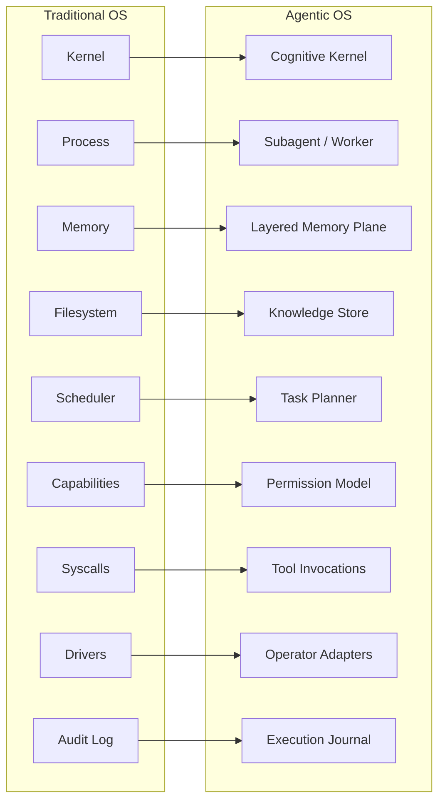

# Why Operating Systems Are the Right Analogy

> *Agentic systems need the same class of abstractions that made operating systems scalable and reliable.*

## The Insight

Operating systems are humanity's most successful answer to a specific class of problem: how do you take a powerful but dangerous resource (a processor, memory, I/O devices) and make it safe, shared, composable, and observable?

Agentic systems face the same class of problem with a different resource: intelligence. An LLM is powerful but dangerous. It can reason, but also hallucinate. It can act, but also cause harm. It can process vast context, but also lose track. It needs the same kind of operational structure that computing hardware needed fifty years ago.

## The Mapping

| OS Concept | Agentic Equivalent | Purpose |
|------------|-------------------|---------|
| **Kernel** | Cognitive Kernel | Routes intent, coordinates reasoning, enforces policy |
| **Process** | Subagent / Worker | Isolated unit of work with bounded context and lifecycle |
| **Memory** | Layered Memory Plane | Working, episodic, semantic memory with compression and retrieval |
| **Filesystem** | Knowledge Store | Persistent, structured access to documents, data, and artifacts |
| **Scheduler** | Task Planner | Prioritizes, sequences, and parallelizes work |
| **Capabilities** | Permission Model | Scoped access to tools, data, and actions |
| **Syscalls** | Tool Invocations | Controlled interface between agents and external capabilities |
| **Drivers** | Operator Adapters | Translate between the system and specific external services |
| **Audit Log** | Execution Journal | Records decisions, actions, and outcomes for inspection |

This is not a metaphor. It is a structural correspondence. The problems are isomorphic. The abstractions that solved them for computing solve them for agency.

## What OS Abstractions Give Us

### Isolation

Processes run in their own address space. Subagents operate in their own context sandbox. One failure does not cascade.

### Scheduling

The OS decides which process runs when, based on priority and resources. The Agentic OS decides which task to execute, how to parallelize, and when to preempt.

### Memory Discipline

Virtual memory, paging, caching, eviction — the OS manages memory as a tiered resource. The Agentic OS manages context the same way: working memory for immediate tasks, compressed episodic memory for recent history, semantic memory for long-term knowledge.

### Permissions

The OS enforces who can read, write, and execute what. The Agentic OS enforces which agents can invoke which tools, access which data, and perform which actions.

### Extensibility

Device drivers let the OS support new hardware without changing the kernel. Operator adapters let the Agentic OS support new tools and services without changing the core system.

### Observability

System logs, process tables, resource monitors — the OS makes its internal state visible. The Agentic OS needs the same: execution journals, decision traces, policy evaluation records.

## The Thesis

The operating system abstraction is not one possible framing among many. It is the *right* framing — the one that naturally produces the properties we need:

- **Performance** through scheduling, caching, and context management
- **Efficiency** through isolation, bounded execution, and resource envelopes
- **Reusability** through well-defined interfaces, operators, and skills
- **Extensibility** through registries, adapters, and governed plugin models

This book develops this analogy into a full architectural framework: the Agentic OS.
