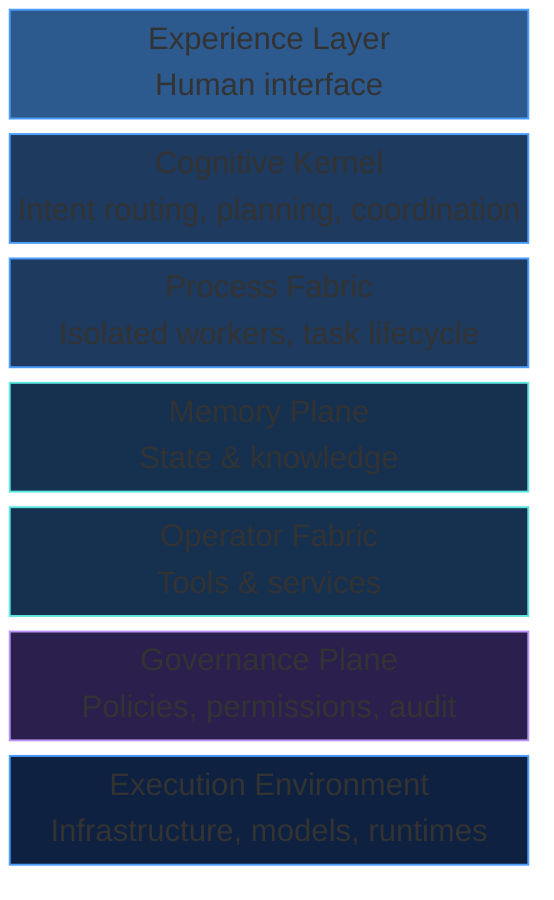

# Core Layers of the Agentic OS

This is the architectural heart of the book. The Agentic OS is composed of distinct layers, each with clear responsibilities, boundaries, and interfaces.

## The Stack

## Layer Responsibilities

### Experience Layer

The boundary between humans and the system. It translates human communication into structured intent and presents system output as meaningful responses. It is a UI concern, not an intelligence concern.

### Cognitive Kernel

The brain of the system. It receives interpreted intent, decides how to approach the problem, creates plans, delegates to workers, consolidates results, handles failures, and evaluates policies. It is the scheduler, the coordinator, and the decision-maker.

### Process Fabric

The runtime for workers. Each task is executed by an isolated process (subagent) with its own context sandbox, scoped capabilities, and lifecycle. The process fabric manages spawning, monitoring, context boundaries, and result collection.

### Memory Plane

The system's memory infrastructure. It provides tiered storage — working memory for the current task, episodic memory for recent interactions, semantic memory for long-term knowledge, and operational state for system metadata. It handles compression, retrieval, contradiction pruning, and eviction.

### Operator Fabric

The system's interface to the outside world. Tools, APIs, MCP servers, and external services are accessed through operators — controlled, typed, permissioned action surfaces. The operator fabric provides registration, discovery, composition, isolation, and fallback.

### Governance Plane

The system's policy engine. It defines what agents can do, under what conditions, with what approval, and with what audit trail. It enforces capability-based permissions, evaluates risk, manages escalation, and maintains the execution journal.

### Execution Environment

The infrastructure that runs everything: LLM providers, embedding models, vector stores, compute resources, network access. This layer is mostly invisible to the rest of the system, abstracted behind clean interfaces.

## Design Principles Across Layers

1. **Clear boundaries.** Each layer has a defined interface. No layer reaches into another's internals.
2. **Governance throughout.** The governance plane is not a top layer — it cuts across all layers. Every action, at every level, is subject to policy.
3. **Composability.** Layers can be replaced, extended, or specialized independently.
4. **Observability.** Every layer emits structured telemetry that feeds into the execution journal.

## Why Layers Matter

Without layering, agentic systems become monoliths — everything tangled together, impossible to debug, impossible to extend, impossible to govern. Layering provides:

- **Separation of concerns** — Each problem is solved in one place
- **Independent evolution** — Memory strategies can improve without changing the kernel
- **Testability** — Each layer can be tested in isolation
- **Reuse** — Layers can be shared across different domain-specific Agentic OS implementations

The following chapters explore each layer in depth.
