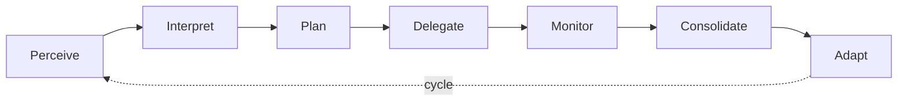

# The Cognitive Kernel

The cognitive kernel is to the Agentic OS what the kernel is to an operating system: the central coordinator that manages the most critical operations of the system.

## Responsibilities

### Intent Routing

When a request enters the system, the kernel interprets it and decides how to handle it. This is not simple keyword matching — it involves understanding the goal, identifying constraints, assessing complexity, and choosing an execution strategy.

### Decomposition

Complex requests are broken down into subtasks. The kernel decides:

- What can be done in parallel vs. sequentially
- What requires specialized workers
- What depends on external data
- What needs human approval before proceeding

### Planning

The kernel creates an execution plan — a structured representation of what needs to happen, in what order, with what resources, and under what constraints. Plans are not rigid scripts; they are adaptive frameworks that can be revised as execution proceeds.

### Delegation

The kernel spawns workers in the process fabric, scoping each one with:

- A clear task definition
- The minimum necessary context
- Explicit capabilities (what tools it can use)
- Success criteria and failure boundaries

### Scheduling

When multiple tasks compete for resources (context budget, model access, tool throughput), the kernel prioritizes. It decides what runs now, what waits, and what gets preempted.

### Result Consolidation

As workers complete their tasks, the kernel collects, validates, and synthesizes their outputs into a coherent result. It handles conflicts, gaps, and contradictions.

### Policy Evaluation

Before every significant action, the kernel consults the governance plane: Is this action allowed? Does it need approval? What is the risk level? This evaluation is continuous, not one-time.

## The Kernel Loop

The cognitive kernel operates in a continuous loop:

Each cycle may trigger new cycles as the plan evolves, workers report back, or conditions change. The kernel is the system's executive function — it does not do the work itself, but it decides what work gets done, by whom, with what resources, and under what rules.

## What the Kernel Is Not

The kernel is **not** the language model. The language model is a resource the kernel uses, just as an OS kernel uses the CPU. The kernel is the logic that decides *how* to use that resource — when to invoke it, with what context, for what purpose, and how to interpret the result.

## Design Considerations

- **Keep the kernel lean.** The kernel coordinates; it does not execute domain logic. Heavy reasoning is delegated to workers.
- **Make planning explicit.** Plans should be inspectable data structures, not implicit chains of thought.
- **Evaluate policy continuously.** Do not check permissions once at the start. Check at each decision point.
- **Support plan adaptation.** The initial plan is a hypothesis. Workers may discover information that changes everything. The kernel must be able to revise, extend, or abandon the plan.

## Governing What You Cannot Predict

A traditional OS kernel issues instructions to a CPU and gets deterministic results. The cognitive kernel has no such guarantee. The language model at the center of the system is stochastic: the same input may produce different outputs, quality varies across invocations, and failure modes are difficult to anticipate. This is the hardest structural problem in agentic system design.

The cognitive kernel addresses this through four mechanisms:

**1. Treating every output as a hypothesis.** The kernel does not trust the first result from a model or a worker. It validates outputs against success criteria, checks for internal consistency, and compares results against known constraints. The consolidation phase of the kernel loop is not a formality — it is the primary quality gate.

**2. Making uncertainty visible.** Where a traditional kernel tracks process state (running, ready, blocked), the cognitive kernel also tracks **confidence** — how reliable was this result? Was it validated? Did it require retries? This metadata flows through the system so that downstream decisions can account for upstream uncertainty. A plan built on high-confidence inputs can proceed autonomously; one built on low-confidence inputs triggers additional validation or human review.

**3. Designing for variance, not just errors.** Traditional error handling distinguishes success from failure. The cognitive kernel must handle a third category: *plausible but wrong*. A model may return well-formatted, syntactically valid output that is factually incorrect or subtly misaligned with the goal. The kernel loop's check phase must evaluate not just "did it complete?" but "does the result actually satisfy the intent?" This requires richer validation — semantic checks, cross-referencing, and sometimes redundant execution with comparison.

**4. Earning trust incrementally.** The kernel does not grant workers or models a fixed level of trust. It calibrates autonomy based on observed performance. A worker that consistently produces validated results earns broader delegation. One that produces inconsistent results gets tighter oversight, smaller tasks, or a different model. This is staged autonomy applied at the kernel level — the kernel adapts its own coordination strategy based on the empirical reliability of the components it orchestrates.

These mechanisms are not defensive measures bolted onto an otherwise clean design. They are the core of what makes the cognitive kernel different from a traditional OS kernel. The substrate is nondeterministic, so the coordinator must be adaptive. Every plan is a hypothesis. Every output is provisional. Every cycle of the kernel loop is an opportunity to detect divergence, correct course, and maintain coherence in a system that cannot guarantee deterministic behavior from its most fundamental component.
