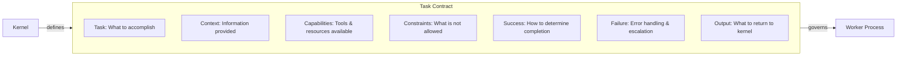
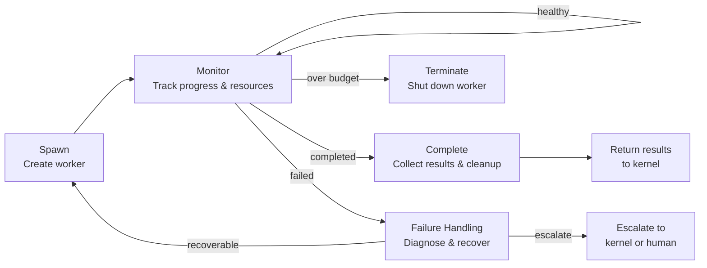

# Process Fabric

In an operating system, the process is the fundamental unit of execution: an isolated program running in its own address space, with its own resources, lifecycle, and permissions. The Agentic OS needs the same abstraction.

## Subagents as Processes

Every unit of delegated work runs as a **subagent** — an isolated worker with:

- **Bounded context** — Only the information it needs, not the entire conversation history
- **Scoped capabilities** — Only the tools and permissions relevant to its task
- **A clear task contract** — What it must accomplish, how to report results, and when to escalate
- **A defined lifecycle** — It is spawned, runs, completes (or fails), and is terminated

This is fundamentally different from the chatbot model, where everything happens in one monolithic context.

## Why Isolation Matters

Without isolation, agentic systems suffer from:

- **Context pollution** — Irrelevant information from one task confuses another
- **Capability creep** — A worker intended for research ends up with write access to production
- **Failure cascades** — One broken subtask corrupts the state of the entire system
- **Debugging nightmares** — When everything runs in one space, tracing a problem to its source is nearly impossible

Isolation provides the inverse: clarity, safety, containment, and debuggability.

## Process Types

| Type | Purpose | Lifecycle |
|------|---------|-----------|
| **Ephemeral Worker** | One-shot task, discarded after completion | Short |
| **Scoped Worker** | Sustained task with defined boundaries | Medium |
| **Specialist** | Domain expert invoked for specific capabilities | On-demand |
| **Reviewer** | Validates output of other workers | After primary work |
| **Recovery** | Handles failures and retries | Triggered by failure |

## The Task Contract

Every process operates under a task contract:

This contract is the interface between the kernel and the process fabric. It makes delegation explicit, inspectable, and governable.

## Lifecycle Management

The process fabric manages:

1. **Spawning** — Creating a new worker with its context and capabilities
2. **Monitoring** — Tracking progress, resource usage, and health
3. **Completion** — Collecting results and cleaning up resources
4. **Failure handling** — Detecting failures, triggering recovery processes, or escalating
5. **Termination** — Shutting down workers that exceed their boundaries or budgets

## Parallelism

When tasks are independent, the process fabric can run them in parallel. This is one of the key performance advantages of the OS model — work that does not depend on each other should not wait for each other.

The cognitive kernel identifies parallelizable tasks during planning. The process fabric executes them concurrently and synchronizes their results.
