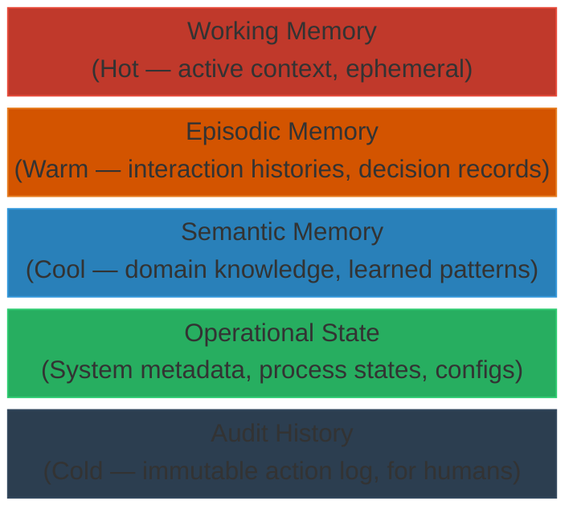

# Memory Plane

Memory is one of the hardest problems in agentic systems, and one of the most poorly solved. The chatbot model treats memory as a growing list of messages that eventually overflows. The Agentic OS treats memory as a **managed, tiered, disciplined resource**.

## The Problem

Language models have a fixed context window. Everything the model can "think about" must fit in that window. Without memory discipline, agentic systems face a brutal tradeoff: either keep everything (and overflow) or discard things (and lose critical context).

Operating systems solved this problem decades ago with virtual memory, paging, caching, and tiered storage. The Agentic OS applies the same principles to cognitive context.

## Memory Tiers

### Working Memory

The immediate context of the current task. This is what the active process can "see" right now. It is small, focused, and ephemeral.

- Current task definition
- Relevant retrieved context
- Intermediate reasoning results
- Active plan state

### Episodic Memory

Records of what has happened. Structured summaries of past interactions, decisions, and outcomes. Episodic memory answers: "What did we do before?"

- Compressed interaction histories
- Decision records
- Outcome summaries
- Failure logs

### Semantic Memory

Long-term knowledge that is not tied to specific interactions. Facts, concepts, domain knowledge, learned patterns. Semantic memory answers: "What do we know?"

- Domain knowledge bases
- Learned patterns and heuristics
- Entity relationships
- Organizational knowledge

### Operational State

System-level metadata about the current state of the Agentic OS itself. Not task content, but system health and status.

- Active processes and their states
- Resource utilization
- Policy configurations
- Pending approvals

### Audit History

An immutable record of every action, decision, and policy evaluation. This is not for the model to reason over — it is for humans to inspect, debug, and verify.

## Memory Operations

| Operation | Purpose |
|-----------|---------|
| **Store** | Write information to the appropriate tier |
| **Retrieve** | Pull relevant information into working memory |
| **Compress** | Summarize detailed records into compact representations |
| **Evict** | Remove information that is no longer needed |
| **Reconcile** | Resolve contradictions between memory tiers |
| **Prune** | Remove outdated or contradicted information |

## Memory Discipline

The key insight is that memory must be *managed*, not just *accumulated*. This means:

- **Selective retrieval** — Only pull into working memory what the current task needs
- **Strategic compression** — Summarize rather than discard; preserve the signal, reduce the noise
- **Contradiction detection** — When new information conflicts with stored memory, resolve it explicitly
- **Budget enforcement** — Each process has a context budget; the memory plane ensures it is respected

## The OS Parallel

Just as an OS pages memory to disk when RAM is full and pages it back when needed, the memory plane moves context between tiers:

- Hot context lives in working memory (fast, small)
- Warm context lives in episodic memory (summarized, retrievable)
- Cold context lives in semantic memory (indexed, searchable)
- Frozen context lives in audit history (immutable, archival)

This tiering is what makes agentic systems efficient. Without it, context windows overflow and performance collapses.
