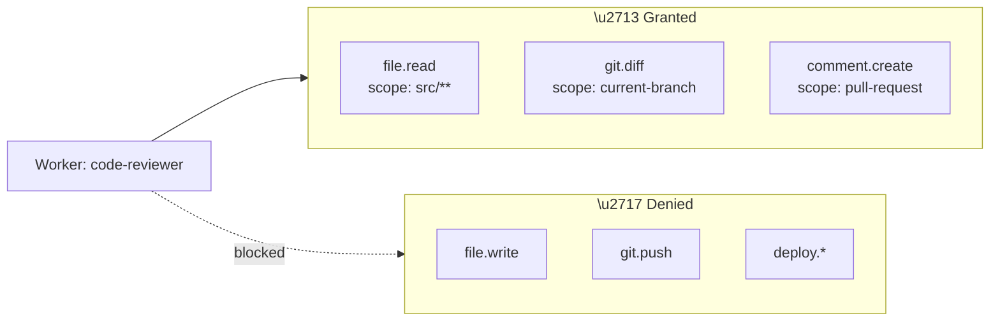
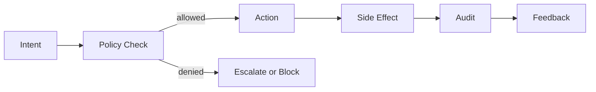

# Governance Plane

The governance plane is arguably the most important layer of the Agentic OS. Without it, every other layer is unsafe. With it, the system becomes trustworthy.

## Why Governance Is a Plane, Not a Layer

Governance is not a single tier in the stack. It **cuts across all layers**. The kernel evaluates policy. The process fabric enforces capability scoping. The memory plane controls information flow. The operator fabric gates tool access. Governance is pervasive — it is the circulatory system, not a single organ.

We call it a "plane" because it exists in a different dimension than the vertical stack. Every component interacts with it. Every action passes through it.

## Core Components

### Capability-Based Permissions

Inspired by capability-based security in operating systems, each agent or worker receives an explicit set of capabilities — tokens that grant specific, scoped permissions.

Capabilities are granted, not assumed. No agent starts with full access.

### Permission Gates

Before any action with side effects, the system evaluates a permission gate:

1. Does the agent have the required capability?
2. Does the action comply with the current policy?
3. Does the risk level require human approval?
4. Is the action within the resource envelope?

If any gate fails, the action is blocked and the decision is logged.

### Approval Flows

Some actions are too important for automated approval. The governance plane supports approval flows:

- **Synchronous approval** — The system pauses and waits for human confirmation
- **Asynchronous approval** — The system queues the action and continues with other work
- **Delegated approval** — A higher-privilege agent or role approves on behalf of the human

### Trust Boundaries

The system defines explicit trust boundaries:

- **Internal boundary** — Between core system components (kernel, memory, etc.)
- **Process boundary** — Between the kernel and spawned workers
- **External boundary** — Between the system and external tools/services
- **Human boundary** — Between the system and human users/operators

Data and actions crossing boundaries are validated, sanitized, and logged.

### Auditability

Every action carried out by the system is recorded in the **execution journal**:

- What was done
- Why (which intent, which plan step)
- By whom (which agent, which process)
- Under what policy
- With what result
- What side effects occurred

The execution journal is immutable. It is the system's black box — the authoritative record of everything that happened.

### Escalation

When the system encounters a situation it cannot resolve within its current permissions or confidence:

1. It identifies the escalation trigger (policy violation, confidence threshold, risk level)
2. It packages the context for escalation (what happened, what it wanted to do, why it is escalating)
3. It routes the escalation to the appropriate authority (human, higher-privilege agent, policy engine)
4. It waits for resolution before proceeding

Escalation is not a failure. It is a design feature. The best agentic systems escalate well.

## The Governance Loop

This loop runs for every action, at every level. It is the heartbeat of a trustworthy system.
