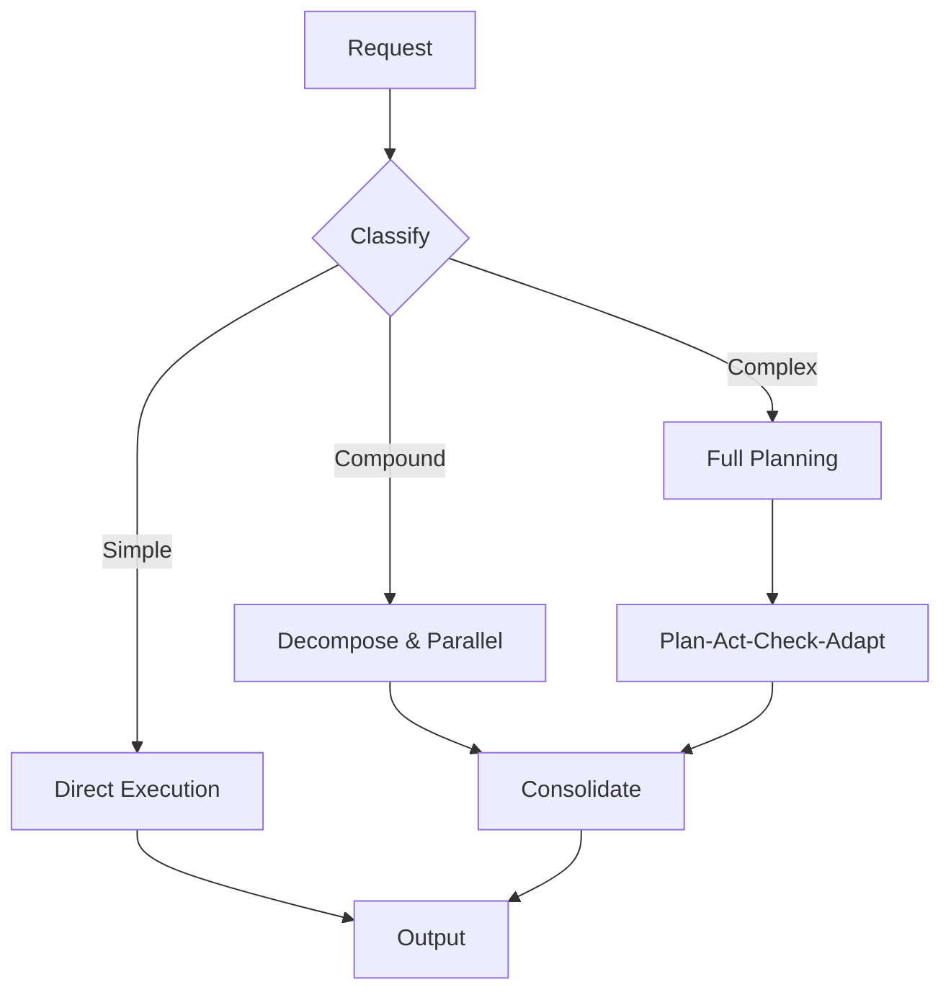
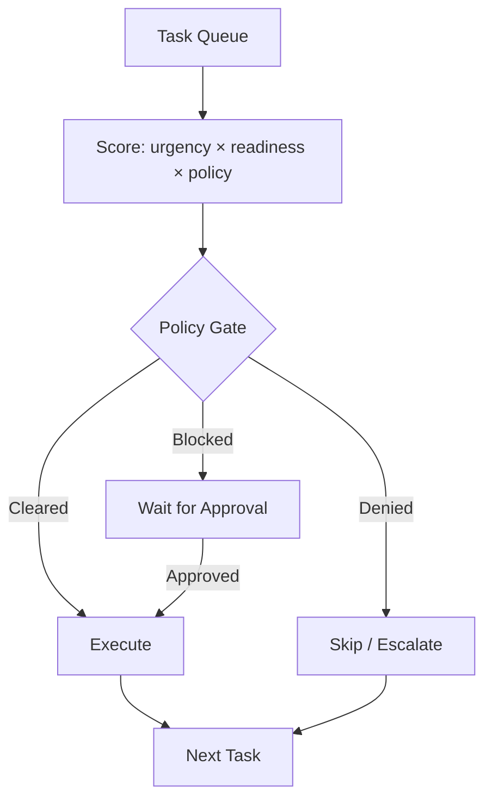
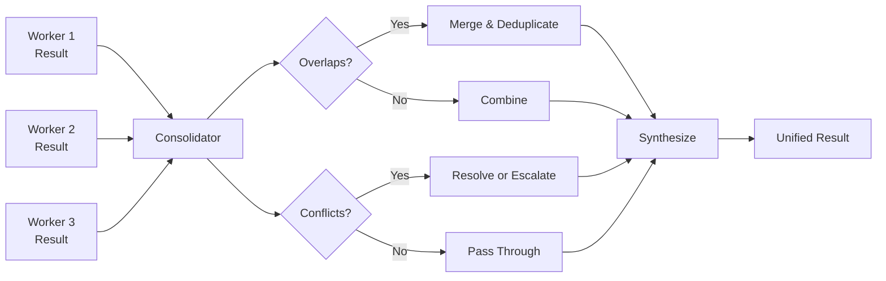
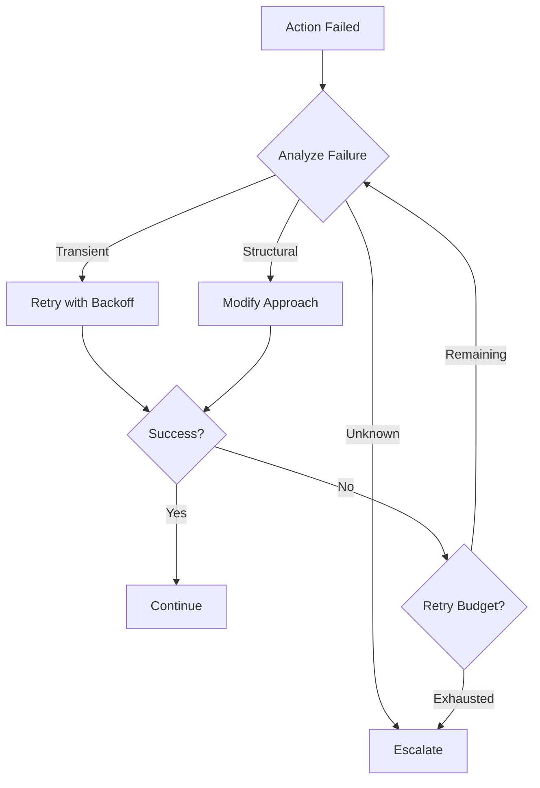
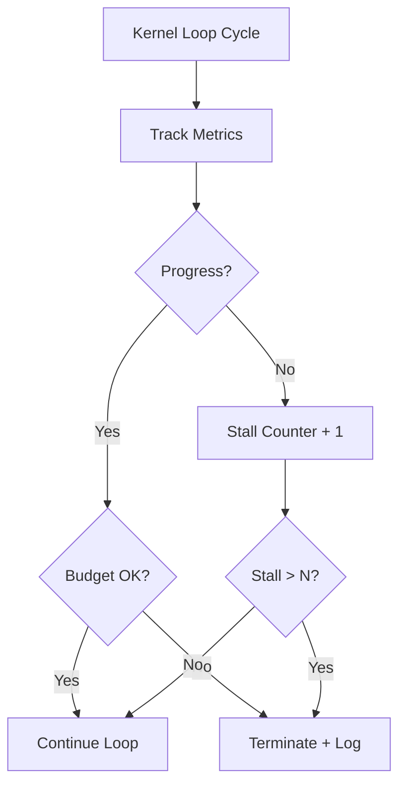

# Kernel Patterns

These patterns govern how the cognitive kernel interprets intent, plans work, and coordinates execution.

---

## Intent Router

### Intent
Route incoming requests to the appropriate execution strategy based on their nature, complexity, and requirements.

### Context
When the kernel receives a new request, it must decide: Is this a simple task or a complex one? Does it need decomposition? Which specialists are required? What governance applies?

### Forces
- Requests vary enormously in complexity and type
- Misrouting wastes resources or produces poor results
- Over-analysis of simple requests adds unnecessary latency

### Structure
The intent router classifies requests along dimensions: complexity (simple → compound → complex), domain (code, research, operations), risk level, and required capabilities. Each classification maps to an execution strategy.

### Dynamics
Simple requests are executed directly. Compound requests are decomposed into independent subtasks. Complex requests trigger full planning with iterative refinement.

### Benefits
Efficient resource usage. Simple things stay simple. Complex things get the structure they need.

### Tradeoffs
Routing logic itself becomes a point of failure. Misclassification leads to under- or over-engineering a response.

### Failure Modes
A complex request classified as simple produces shallow results. A simple request classified as complex wastes resources and adds latency.

### Related Patterns
[Planner-Executor Split](#planner-executor-split), [Policy-Aware Scheduler](#policy-aware-scheduler)

---

## Planner-Executor Split

### Intent
Separate the decision of *what to do* from the execution of *how to do it*.

### Context
When a task requires multiple steps, reasoning about the plan and executing the steps are different cognitive activities. Mixing them leads to plans that drift and executions that lack coherence.

### Forces
- Planning requires broad context and strategic thinking
- Execution requires focused context and precision
- Tight coupling between planning and execution makes adaptation difficult

### Structure
The planner creates a structured plan: a sequence (or graph) of steps with dependencies, required capabilities, and success criteria. The executor takes each step and carries it out within a focused worker. The planner reviews results and adapts the plan.

### Dynamics
Plan → Execute step 1 → Review → Adapt plan → Execute step 2 → ... → Consolidate

### Benefits
Plans are inspectable and adjustable. Execution is focused. Adaptation is explicit.

### Tradeoffs
The overhead of maintaining a plan is not justified for trivial tasks. The planner must be invoked again after each step, adding latency.

### Failure Modes
The planner produces an overly detailed plan that constrains the executor unnecessarily. The executor deviates from the plan without reporting back, causing the planner to lose coherence. The plan-review cycle becomes a bottleneck when every step requires a full replanning pass.

### Related Patterns
[Intent Router](#intent-router), [Execution Loop Supervisor](#execution-loop-supervisor), [Reflective Retry](#reflective-retry)

---

## Policy-Aware Scheduler

### Intent
Prioritize and sequence work based on both task requirements and governance policies.

### Context
When the kernel has multiple tasks to execute, it must decide what runs first, what runs in parallel, and what is blocked by policy (e.g., requires human approval).

### Forces
- Some tasks are urgent but risky
- Some tasks are safe but low priority
- Policy constraints can block otherwise-ready work

### Structure
The scheduler maintains a priority queue of tasks, each annotated with risk level, dependencies, resource requirements, and policy status. It selects the next task to execute based on a scoring function that balances urgency, readiness, and governance compliance.

### Dynamics
The scheduler continuously re-evaluates the queue as new tasks arrive, existing tasks complete, and policy decisions are returned. A task that was blocked may become ready when approval arrives. A task that was ready may be preempted by a higher-priority arrival. The scoring function runs on every cycle, not once at submission.

### Benefits
High-priority safe work proceeds immediately. Risky work waits for appropriate approval without blocking the rest.

### Tradeoffs
Scheduling logic adds complexity. Poor priority functions lead to starvation of important work.

### Failure Modes
Priority inversion — a low-risk, low-priority task runs while a high-priority but policy-gated task starves waiting for approval. The scoring function over-weights urgency, causing risky work to bypass governance. Scheduling overhead dominates when the task queue is small and contention is low.

### Related Patterns
[Permission Gate](./17-governance-patterns.md#permission-gate), [Staged Autonomy](./18-runtime-patterns.md#staged-autonomy)

---

## Result Consolidator

### Intent
Synthesize outputs from multiple workers into a coherent, unified result.

### Context
When a task is decomposed and delegated to multiple workers, their individual outputs must be combined. Different workers may produce overlapping, complementary, or conflicting results.

### Forces
- Workers operate independently with partial views
- Results may conflict
- Simple concatenation is rarely sufficient

### Structure
The consolidator collects worker outputs, identifies overlaps and conflicts, resolves contradictions (or flags them for escalation), and synthesizes a unified result that addresses the original intent.

### Dynamics
Consolidation begins when all expected workers complete or when a timeout forces partial consolidation. The consolidator first aligns outputs to the original intent, then performs deduplication, conflict detection, and synthesis in a single pass. When conflicts are irreconcilable, the consolidator produces a result with explicit caveats rather than silently choosing a side.

### Benefits
Coherent output despite distributed execution. Contradictions are surfaced, not hidden.

### Tradeoffs
Consolidation itself requires model invocations and context. Complex consolidation can be as expensive as the original work.

### Failure Modes
The consolidator silently drops a worker's output because it does not fit the expected format. Contradictions are resolved by choosing the last result rather than the best, hiding minority viewpoints. Partial consolidation under timeout produces an incomplete result that appears complete.

### Related Patterns
[Subagent as Process](./14-process-patterns.md#subagent-as-process), [Reviewer Process](./14-process-patterns.md#reviewer-process)

---

## Reflective Retry

### Intent
When an action fails, analyze the failure before retrying — do not simply retry blindly.

### Context
Failures in agentic systems are common: tools return errors, models produce invalid output, context is insufficient. Blind retries waste resources and often repeat the same failure.

### Forces
- Some failures are transient (network errors) — simple retry works
- Some failures are structural (wrong approach) — retrying the same way is futile
- Distinguishing between them requires reasoning

### Structure
On failure, the kernel (or worker) analyzes the error: What went wrong? Is it transient or structural? If transient, retry with backoff. If structural, modify the approach (different tool, different decomposition, more context) and try again.

### Dynamics
The first failure triggers analysis, not retry. The analysis classifies the failure and selects a strategy. Each subsequent failure feeds back into analysis with accumulated failure history, enabling the system to detect patterns (e.g., three different transient errors suggest a systemic issue, not a transient one). The retry budget decreases with each attempt, and the analysis becomes more conservative as attempts are consumed.

### Benefits
Higher success rate with fewer wasted invocations. Structural problems are addressed, not repeated.

### Tradeoffs
Reflection adds latency. The analysis itself can be wrong.

### Failure Modes
The analysis misclassifies a structural failure as transient, wasting retry budget on an approach that will never succeed. The system modifies its approach so aggressively that the new approach is worse than the original. Reflection consumes significant context budget, leaving less room for the actual retry.

### Related Patterns
[Recovery Process](./14-process-patterns.md#recovery-process), [Failure Containment](./18-runtime-patterns.md#failure-containment)

---

## Execution Loop Supervisor

### Intent
Monitor the kernel's execution loop to prevent infinite cycles, resource exhaustion, and unproductive repetition.

### Context
The kernel operates in a loop: plan, delegate, consolidate, adapt. Without supervision, this loop can run indefinitely — especially when the system retries failed tasks or refines plans endlessly.

### Forces
- Some tasks genuinely require many iterations
- Some loops are pathological (no progress despite effort)
- Arbitrary iteration limits are crude but necessary

### Structure
The supervisor tracks loop metrics: iteration count, progress indicators, resource consumption, time elapsed. It triggers alerts or termination when:
- Iteration count exceeds a threshold
- No measurable progress is made across N iterations
- Resource budget is exhausted

### Dynamics
The supervisor runs as a parallel observer, not as a gate within the loop. It samples progress at each cycle boundary — comparing the current state board to the previous one. Progress is measured by concrete indicators: tasks completed, outputs produced, state changes recorded. If the loop is making progress (even slowly), the supervisor permits continuation. If the loop is cycling without state change, the stall counter increments. Termination includes a diagnostic snapshot: last N iterations, resource consumption, and the state at which progress stalled.

### Benefits
Prevents runaway execution. Provides diagnostic data for post-mortem analysis.

### Tradeoffs
A strict supervisor may kill useful work that is simply slow. A lenient supervisor may waste resources.

### Failure Modes
Progress indicators are too coarse — the loop appears to make progress (new outputs generated) but is actually oscillating between equivalent states. The supervisor terminates a task that was one iteration away from completion. The stall threshold is set uniformly when different task types have fundamentally different iteration patterns.

### Related Patterns
[Resource Envelope](./18-runtime-patterns.md#resource-envelope), [Context Budget Enforcement](./18-runtime-patterns.md#context-budget-enforcement)

---

## Applicability Guide

Not every system needs every kernel pattern. Use the simplest approach that works.

### Decision Matrix

| Pattern | Apply When | Do Not Apply When |
|---|---|---|
| **Intent Router** | Requests vary in complexity; you need different execution strategies for different task types | All requests are uniform — a single execution path handles everything |
| **Planner-Executor Split** | Tasks require 3+ steps with dependencies; plan quality matters and plans need to be inspectable | Tasks are single-step or follow a fixed script; the overhead of a separate planning phase exceeds the value |
| **Policy-Aware Scheduler** | Multiple tasks compete for resources; some tasks have governance constraints that block execution | Tasks are processed sequentially with no contention; all tasks have identical governance profiles |
| **Result Consolidator** | Multiple workers produce partial results that must be synthesized into a coherent whole | Each worker produces a complete, standalone result; simple concatenation is sufficient |
| **Reflective Retry** | Failures contain diagnostic information that can inform a different approach; the task is worth retrying | Failures are deterministic (same input always fails); the task is cheap to abandon and restart |
| **Execution Loop Supervisor** | Tasks involve open-ended iteration (research, optimization); runaway loops are a real risk | Tasks have a fixed number of steps with deterministic termination |

### Start Simple

For a new system, start with only the **Intent Router** (to distinguish simple from complex requests) and the **Planner-Executor Split** (for complex requests). Add the other patterns as you observe specific failure modes:

- Seeing resource contention? Add the **Policy-Aware Scheduler**.
- Multi-worker results are incoherent? Add the **Result Consolidator**.
- Workers fail and retry the same wrong approach? Add **Reflective Retry**.
- Workers loop indefinitely? Add the **Execution Loop Supervisor**.

The cost of adding a pattern prematurely is unnecessary complexity. The cost of adding it too late is usually acceptable — integrate it when the need becomes clear.
