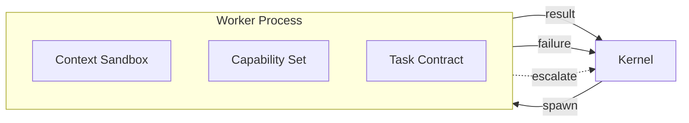
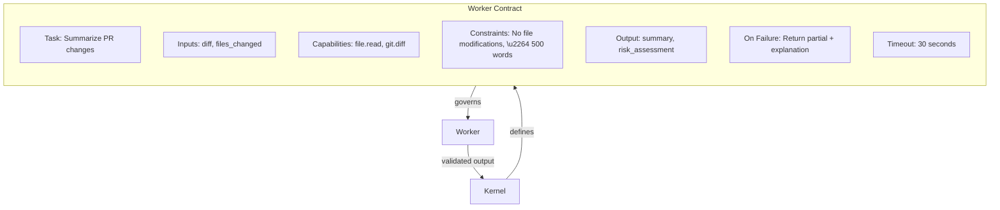
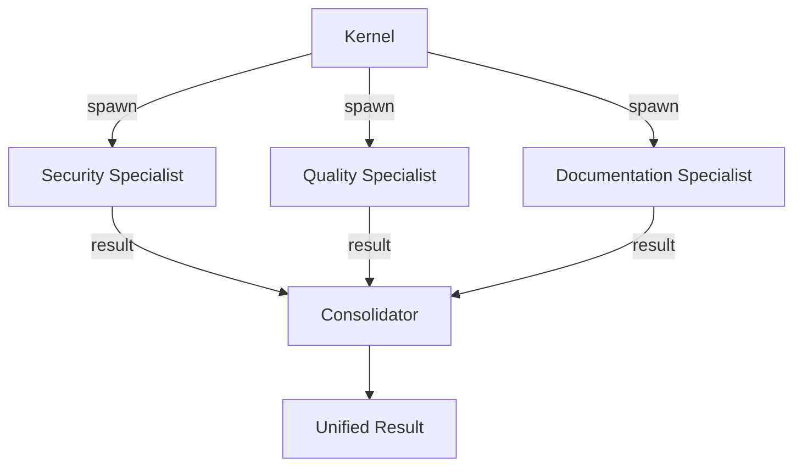
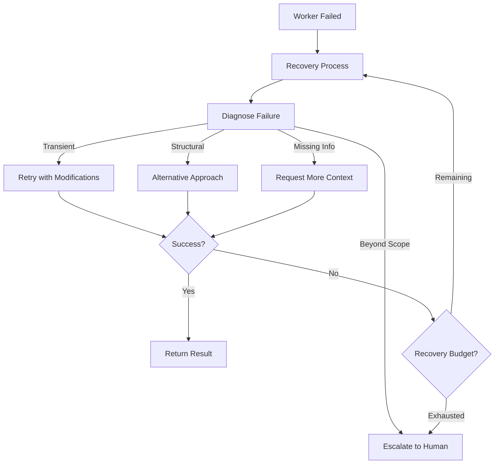

# Process Patterns

These patterns govern how workers are created, isolated, managed, and coordinated.

---

## Subagent as Process

### Intent
Model every unit of delegated work as an isolated process with its own context, capabilities, and lifecycle.

### Context
When the kernel delegates work, the worker must operate independently without polluting the kernel's context or other workers. This is the foundational pattern of the process fabric.

### Forces
- Workers need enough context to do their job
- Workers must not see more than they need
- The kernel must be able to inspect, manage, and terminate workers
- Worker failures must not cascade

### Structure
Each worker is spawned as an isolated process with:
- A context sandbox (only relevant information)
- A capability set (only authorized tools)
- A task contract (inputs, constraints, outputs)
- A lifecycle (creation, execution, completion/failure, termination)

### Dynamics
The kernel spawns the worker with a scoped context and capability set. The worker executes independently — it cannot access the kernel's state or other workers' contexts. On completion, the worker returns its result and is terminated. On failure, the worker returns a structured error. If the worker exceeds its resource envelope or timeout, the kernel terminates it forcefully and logs the event.

### Benefits
Clean isolation. Predictable resource usage. Observable execution. Governed capabilities.

### Tradeoffs
Isolation adds overhead (context copying, capability scoping). Very simple tasks may not justify the overhead.

### Failure Modes
Over-isolation — the worker lacks critical context because the sandbox was too restrictive, producing low-quality results without signaling that it was under-informed. Under-isolation — shared mutable state between workers causes one worker's output to corrupt another's reasoning.

### Related Patterns
Context Sandbox, Scoped Worker Contract, Ephemeral Worker

---

## Context Sandbox

### Intent
Provide each worker with exactly the context it needs — no more, no less.

### Context
Context windows are a finite resource. Giving a worker the entire conversation history wastes tokens and introduces noise. Giving it too little context leads to poor results.

### Forces
- More context → better understanding but more cost and potential confusion
- Less context → faster and cheaper but higher risk of misunderstanding
- The right amount depends on the task
- Sensitive information may leak if context boundaries are not enforced

### Structure
The kernel curates a context package for each worker: task definition, relevant retrieved information, relevant prior results, and any required constraints. Irrelevant history, other workers' contexts, and system internals are excluded.

### Dynamics
Context curation happens at spawn time. The kernel selects relevant memory from the memory plane, attaches the task contract, and excludes everything else. During execution, the worker may request additional context through memory-on-demand, which is fulfilled by the memory plane — not by direct access to the kernel's state. The sandbox boundary is enforced, not advisory.

### Benefits
Focused workers produce better results. Token budgets are respected. Information leakage between tasks is prevented.

### Tradeoffs
Context curation requires effort and judgment. Mistakes in curation (missing critical information) lead to poor worker performance.

### Failure Modes
The sandbox includes irrelevant context that distracts the worker (e.g., full conversation history injected "just in case"). Critical context is excluded because the curation logic lacks domain awareness. The worker infers missing information incorrectly rather than requesting it, producing confident but wrong results.

### Related Patterns
Subagent as Process, Memory on Demand

---

## Ephemeral Worker

### Intent
For one-shot tasks, spawn a worker that is fully discarded after completion.

### Context
Many subtasks are atomic: summarize this document, extract these fields, classify this ticket. They do not need persistent state or long-running context.

### Forces
- Retaining worker state between tasks adds complexity and memory pressure
- Some tasks benefit from a clean slate — no contamination from prior work
- Worker creation overhead must be low enough to justify per-task spawning

### Structure
The worker is created, given its task and context, produces its output, and is immediately terminated. No state is preserved from the worker itself — though the kernel may store the result in memory.

### Dynamics
Create → Execute → Return result → Terminate. The entire lifecycle is a single pass with no state carried forward. If the same type of work recurs, a new ephemeral worker is spawned from scratch. The kernel's memory plane provides any continuity needed — the worker itself is stateless.

### Benefits
Minimal resource usage. No stale state. Clean lifecycle.

### Tradeoffs
If the same type of work recurs, the lack of persistent state means the worker cannot learn from previous invocations. The kernel's memory must compensate.

### Failure Modes
Worker creation overhead becomes a bottleneck when hundreds of ephemeral workers are spawned per second. Results are lost if the kernel fails to capture them before the worker terminates. Ephemeral workers are used for tasks that actually need accumulated state, leading to repeated mistakes.

### Related Patterns
Context Sandbox, Subagent as Process

---

## Scoped Worker Contract

### Intent
Define a formal contract between the kernel and each worker specifying inputs, constraints, capabilities, outputs, and failure handling.

### Context
Without a clear contract, workers operate on implicit assumptions. They may exceed their scope, use unauthorized tools, or produce output in unexpected formats.

### Forces
- Implicit contracts are flexible but lead to unpredictable behavior
- Overly rigid contracts constrain workers that need adaptive reasoning
- The contract must be machine-readable for enforcement, not just human-readable for documentation

### Structure

### Dynamics
The kernel constructs the contract at delegation time. The worker receives it as part of its context sandbox. Upon completion, the kernel validates the output against the contract — checking type conformance, constraint compliance, and capability usage. Violations are logged and may trigger re-execution or escalation.

### Benefits
Explicit expectations. Verifiable compliance. Clear failure semantics.

### Tradeoffs
Contract authoring adds overhead. Contracts that are too specific prevent the worker from exercising useful judgment. Contracts that are too vague provide little enforcement value.

### Failure Modes
The contract specifies the output format but not the quality criteria, so the worker returns well-formatted but useless output. The timeout is too aggressive for the task's actual complexity, causing premature termination. Capabilities are copy-pasted from a template rather than scoped to the specific task.

### Related Patterns
Subagent as Process, Permission Gate

---

## Parallel Specialist Swarm

### Intent
Execute independent subtasks concurrently using specialized workers.

### Context
When a complex request decomposes into independent subtasks (e.g., analyze code quality, check security vulnerabilities, review documentation), running them sequentially wastes time.

### Forces
- Parallelism reduces latency but increases peak resource consumption
- Not all subtasks are truly independent — hidden dependencies cause failures
- Consolidating parallel results is harder than consolidating sequential results

### Structure
The kernel identifies independent subtasks, spawns a specialist worker for each, and runs them in parallel. Results are collected and consolidated when all workers complete (or when a timeout is reached).

### Dynamics
Workers start simultaneously and execute independently. The kernel monitors each worker's progress. As workers complete, their results are staged for consolidation. If one worker is significantly slower, the kernel may decide to consolidate partial results rather than waiting indefinitely. Failed workers trigger fallback strategies without blocking the other specialists.

### Benefits
Dramatic latency reduction for decomposable tasks. Each specialist is optimized for its domain.

### Tradeoffs
Parallel execution increases peak resource usage. Consolidation of parallel results adds complexity. Not all tasks are truly independent.

### Failure Modes
Subtasks assumed to be independent are actually coupled — a security specialist's findings depend on the quality specialist's code analysis, but both run without the other's output. One slow specialist blocks the entire swarm because the consolidator waits for all results. The result consolidator cannot reconcile contradictory specialist opinions.

### Related Patterns
Result Consolidator, Planner-Executor Split

---

## Reviewer Process

### Intent
Validate the output of a primary worker before returning it to the kernel.

### Context
Worker output may be incorrect, incomplete, or inconsistent. A separate reviewer with different perspective or criteria can catch errors.

### Forces
- Primary workers are optimized for production, not self-critique
- A separate reviewer brings fresh perspective but adds cost
- Reviewing everything is wasteful; reviewing nothing is reckless

### Structure
After a primary worker produces output, a reviewer process is spawned with: the original task, the output, and review criteria. The reviewer validates, critiques, and either approves or sends back for revision.

### Dynamics
The reviewer operates on a different context than the primary worker — it sees the output against the original intent and review criteria, not the intermediate reasoning. This fresh perspective is the source of its value. Revision loops are bounded (typically 1–2 passes) to prevent infinite cycling. The reviewer's critique is structured, not free-form, so the primary worker can act on specific feedback.

### Benefits
Higher quality output. Catches errors that the primary worker is blind to.

### Tradeoffs
Adds latency and cost. The reviewer itself can be wrong. Reviewing every task is overkill — use selectively for high-risk or high-value outputs.

### Failure Modes
The reviewer rubber-stamps output without meaningful analysis because the review criteria are too vague. The revision loop oscillates — the reviewer and worker disagree on approach and trade revisions indefinitely. The reviewer applies different quality standards than the task actually requires, blocking acceptable output.

### Related Patterns
Result Consolidator, Recovery Process

---

## Recovery Process

### Intent
Handle failed tasks with a specialized recovery strategy rather than simple retries.

### Context
When a worker fails, the failure may require diagnosis, alternative approaches, or human escalation — not just repeating the same work.

### Forces
- Simple retry works for transient failures but wastes resources on structural ones
- Recovery requires understanding *why* the failure occurred, not just *that* it occurred
- Multiple recovery attempts consume resources and add latency

### Structure
A recovery process is spawned with: the original task, the failure details, and previous attempts. It analyzes the failure, determines a recovery strategy (retry with modifications, use alternative approach, request more context, escalate), and executes it.

### Dynamics
The recovery process receives the full failure context: the original task, the worker's output (if any), error messages, and the number of prior attempts. It diagnoses the failure class and selects a strategy. Each recovery attempt is itself bounded by a contract and timeout. Failed recoveries feed back into the diagnosis with accumulated evidence. The recovery budget decreases with each attempt, biasing toward escalation as options narrow.

### Benefits
Intelligent failure recovery. Avoids wasting resources on repeated failures.

### Tradeoffs
Recovery logic is itself fallible. Multiple recovery attempts can consume significant resources.

### Failure Modes
The recovery process misdiagnoses the failure and applies the wrong strategy repeatedly. Recovery consumes more resources than the original task was worth. The recovery process itself fails, creating a recursive failure that the supervisor must catch.

### Related Patterns
Reflective Retry, Failure Containment, Human Escalation

---

## Applicability Guide

Process patterns govern how workers are created, scoped, and managed. The right combination depends on your concurrency needs and failure tolerance.

### Decision Matrix

| Pattern | Apply When | Do Not Apply When |
|---|---|---|
| **Subagent as Process** | You need multiple workers with independent context and lifecycle | A single agent handles all work serially without context conflicts |
| **Context Sandbox** | Workers must be isolated from data and tools they should not access; security boundaries matter | You have a single trusted worker operating on a single task in a controlled environment |
| **Ephemeral Worker** | Tasks are stateless and independent; you want clean context for each task | Workers need to accumulate state across tasks (e.g., long-running monitoring); creation overhead is prohibitive |
| **Scoped Worker Contract** | Workers are delegated to with clear success criteria; you need verifiable outputs | The kernel executes everything directly; there is no delegation |
| **Parallel Specialist Swarm** | A task decomposes into independent, parallelizable subtasks assigned to different specialists | Tasks are inherently sequential; parallelism adds coordination cost without latency benefit |
| **Reviewer Process** | Output quality is critical and benefits from a separate review pass; adversarial checking adds value | The output has automated validation (tests, type-checks) that is sufficient; the review cost exceeds the quality gain |
| **Recovery Process** | Failures require diagnosis and alternative strategies, not just retries | Failures are transient (network timeouts) and simple retry is sufficient; or the task is cheap enough to abandon |

### The Minimum Viable Process Fabric

Start with **Ephemeral Workers** and **Scoped Worker Contracts**. These two patterns give you isolated execution with clear interfaces. Add the others as complexity demands:

- Need security isolation? Add **Context Sandbox**.
- Multiple independent subtasks? Add **Parallel Specialist Swarm**.
- Quality-critical output? Add **Reviewer Process**.
- Complex failure scenarios? Add **Recovery Process**.
