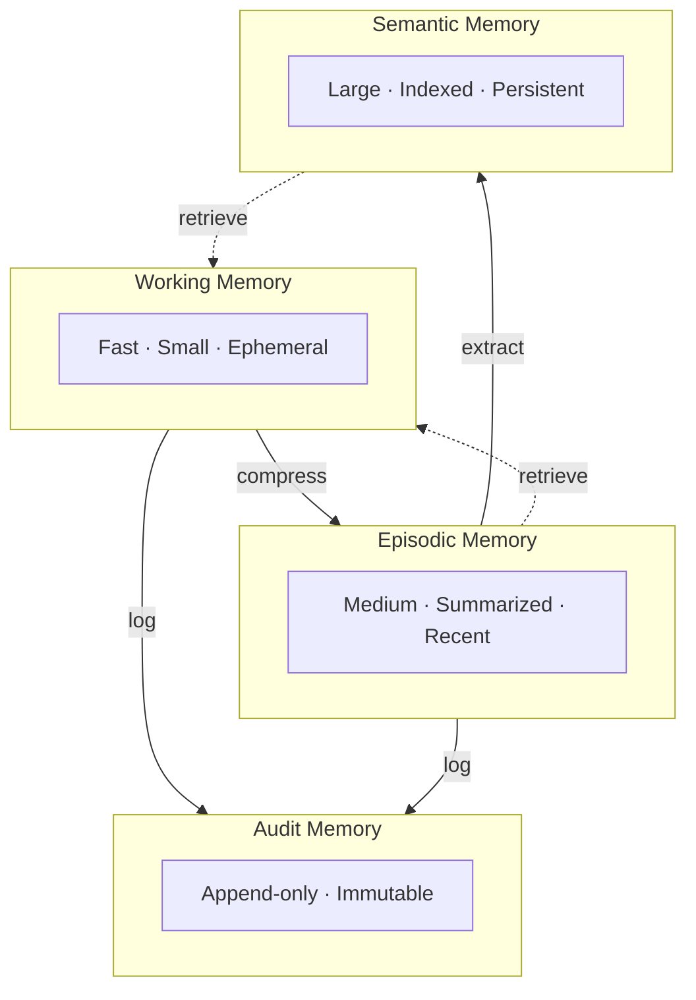

# Memory Patterns

These patterns govern how information is stored, retrieved, compressed, and managed across the memory plane.

---

## Layered Memory

### Intent
Organize memory into tiers with different characteristics: speed, capacity, retention, and purpose.

### Context
A single flat memory (like a conversation history) cannot serve all needs. Current task context, recent interaction summaries, long-term knowledge, and audit records have fundamentally different access patterns and lifecycle requirements.

### Forces
- A single memory tier forces a tradeoff between size and speed
- Different information has different lifetimes — task context is ephemeral, knowledge is persistent
- Context windows are finite, so not everything can be loaded at once
- Governance requires immutable audit records that must not be compressed or evicted

### Structure
- **Working memory** — Small, fast, ephemeral. Active task context.
- **Episodic memory** — Medium, summarized. What happened recently.
- **Semantic memory** — Large, indexed. What the system knows.
- **Audit memory** — Append-only, immutable. What happened and why.

Each tier has its own storage, retrieval, and eviction strategies.

### Dynamics
During active execution, workers read from and write to working memory. At task boundaries, the kernel triggers compression: working memory is summarized into episodic memory. Over time, episodic entries are further distilled into semantic memory. Audit memory is written continuously and never compressed. Retrieval flows upward: when a worker needs historical context, the memory plane retrieves from episodic or semantic tiers and injects into working memory.

### Benefits
Efficient context usage. Appropriate retention. Clear information lifecycle.

### Tradeoffs
Tier boundaries add complexity. Information may be in the wrong tier at the wrong time — too soon for long-term storage, too late for working memory. Compression across tiers is lossy by design.

### Failure Modes
All memory is treated as working memory, exhausting the context budget. Compression is too aggressive, discarding details that matter later. Tier boundaries are poorly defined, so information is duplicated across tiers without clear ownership.

### Related Patterns
[Memory on Demand](#memory-on-demand), [Compression Pipeline](#compression-pipeline), [Pointer Memory](#pointer-memory)

---

## Pointer Memory

### Intent
Instead of inserting large content into context, store a pointer (reference) that can be resolved on demand.

### Context
Context windows are finite. Embedding full documents, code files, or data sets consumes budget that could be used for reasoning. Often, only a small portion of a large artifact is relevant.

### Forces
- Large artifacts must be accessible but cannot fit in context
- Embedding full content wastes tokens on irrelevant sections
- Indirection adds latency but dramatically reduces context pressure
- Pointers can become stale if the underlying content changes

### Structure
Store metadata and a reference (file path, document ID, chunk identifier) in the context. When the worker needs the actual content, it retrieves just the relevant portion through the memory plane.

### Dynamics
At context curation time, large artifacts are replaced with pointers: a brief description, metadata (size, type, last modified), and a resolution mechanism. The worker reasons over the pointer metadata to decide whether it needs the full content. If it does, it issues a retrieval request. The memory plane resolves the pointer, retrieves the relevant portion, and injects it into working memory. Multiple pointers may be resolved selectively — the worker does not need to resolve all of them.

### Benefits
Dramatically reduces context consumption. Enables work with artifacts much larger than the context window.

### Tradeoffs
Retrieval adds latency. The pointer may become stale if the underlying content changes.

### Failure Modes
The pointer's metadata is insufficient for the worker to decide whether to resolve it, causing either unnecessary retrieval or missed critical content. The underlying content changes between pointer creation and resolution, producing inconsistent results. Workers resolve every pointer preemptively, negating the pattern's benefits.

### Related Patterns
[Memory on Demand](#memory-on-demand), [Context Sandbox](./14-process-patterns.md#context-sandbox)

---

## Memory on Demand

### Intent
Retrieve context from memory only when a worker actually needs it, not preemptively.

### Context
Preloading all potentially relevant context into every worker wastes tokens and introduces noise. Many workers need only a small subset of available knowledge.

### Forces
- Preloading maximizes information but wastes context budget
- On-demand retrieval minimizes waste but requires the worker to know what it needs
- Retrieval round-trips add latency to the execution loop
- The worker may not realize it is missing critical information

### Structure
Workers are given their task and minimal context. When they identify a need for additional information, they issue a memory retrieval request. The memory plane fulfills the request and injects the relevant context.

### Dynamics
The worker begins execution with a lean context. As it reasons about the task, it encounters knowledge gaps: unfamiliar terms, missing reference data, or insufficient background. It formulates a retrieval query and issues it to the memory plane. The memory plane searches across the appropriate tiers (semantic memory for knowledge, episodic memory for recent events) and returns the most relevant results. The worker integrates the retrieved context and continues. Multiple retrieval rounds may occur within a single task.

### Benefits
Minimal upfront context cost. Workers self-select what they need. Relevant information arrives when it is needed.

### Tradeoffs
Workers must be able to recognize what they do not know. Multiple retrieval round-trips add latency.

### Failure Modes
The worker does not realize it needs information and produces results based on incomplete knowledge. Retrieval returns irrelevant results because the query was poorly formed. Multiple retrieval rounds consume more total context than preloading would have — the cure is worse than the disease.

### Related Patterns
[Pointer Memory](#pointer-memory), [Layered Memory](#layered-memory)

---

## Operational State Board

### Intent
Maintain a shared, structured view of the current operational state of the system.

### Context
As work progresses, the system accumulates state: which tasks are complete, which are in progress, what results have been collected, what decisions have been made. Without a central state board, this information is scattered and easily lost.

### Forces
- Multiple workers and the kernel need a consistent view of progress
- State scattered across worker contexts is inaccessible and unsynchronized
- The state board must be structured enough to be machine-readable but flexible enough to accommodate different task types

### Structure
A structured state object that tracks:
- Active plan and its status
- Completed tasks and their results
- Pending tasks and their dependencies
- Open questions and blockers
- Resource usage

The kernel updates the state board after each step. Workers can read relevant portions.

### Dynamics
The kernel writes to the state board at each cycle boundary: updating task status, recording results, flagging blockers. Workers receive a read-only view of the portions relevant to their task. The state board is the kernel's primary source of truth for planning decisions — it answers questions like "what is done?", "what is blocked?", and "what has changed?" Adaptation decisions (replanning, escalation, termination) are driven by state board inspection.

### Benefits
Single source of truth for system state. Enables informed planning and adaptation.

### Tradeoffs
Maintaining the state board adds overhead to every kernel cycle. A stale state board is worse than no state board — it produces confident but wrong planning decisions.

### Failure Modes
The state board becomes a bottleneck when many workers attempt concurrent updates. Stale entries mislead the kernel into replanning based on outdated information. The board grows unboundedly when completed task entries are never archived.

### Related Patterns
[Active Plan Board](./18-runtime-patterns.md#active-plan-board), [Execution Journal](./18-runtime-patterns.md#execution-journal)

---

## Memory Reconciliation

### Intent
When information from different sources or tiers conflicts, resolve the contradictions explicitly.

### Context
Workers may produce conflicting results. Semantic memory may contain outdated facts. Episodic memory may record a decision that was later reversed. These contradictions must be caught and resolved.

### Forces
- Multiple independent workers may write conflicting information without awareness of each other
- Newer information is usually but not always more accurate
- Silent contradiction degrades downstream reasoning without visible symptoms

### Structure
The memory plane detects contradictions (through embeddings, timestamps, or explicit flags). It presents the conflict to the kernel with context for each side. The kernel (or a specialist worker) resolves the contradiction and updates memory accordingly.

### Dynamics
Contradiction detection runs at write time: when new information enters a memory tier, it is checked against existing entries. If a conflict is found, the write is held and the conflict is surfaced. The kernel evaluates the conflicting entries based on recency, source authority, and supporting evidence. Resolution may produce a merged entry, a replacement, or a flagged disagreement that is preserved for future reference. The resolution decision is recorded in audit memory.

### Benefits
Memory stays consistent. Contradictions are surfaced rather than silently degrading quality.

### Tradeoffs
Detection is imperfect. Resolution requires reasoning and costs resources.

### Failure Modes
The detection logic has too narrow a scope, catching only exact duplicates while missing semantic contradictions. Resolution always favors the most recent entry, discarding earlier information that was actually correct. False positives in conflict detection create a flood of reconciliation tasks that overwhelm the kernel.

### Related Patterns
[Contradiction Pruning](#contradiction-pruning), [Compression Pipeline](#compression-pipeline)

---

## Compression Pipeline

### Intent
Reduce the size of stored memories while preserving their essential information.

### Context
Over time, episodic memory accumulates detailed records that are too large to fit into working memory. Raw records must be compressed into summaries that preserve key insights.

### Forces
- Uncompressed memory grows without bound, eventually exhausting storage and retrieval budgets
- Compression is inherently lossy — some information will be discarded
- Different types of information tolerate different levels of compression
- Audit records must never be compressed

### Structure
A pipeline that processes memories through stages:
1. **Filter** — Remove noise and irrelevant details
2. **Summarize** — Compress the remaining content into key points
3. **Index** — Create searchable metadata for retrieval
4. **Store** — Write the compressed memory to the appropriate tier

### Dynamics
Compression runs asynchronously at tier boundaries: working memory is compressed into episodic memory after a task completes, and episodic memory is further compressed into semantic memory on a schedule or when a size threshold is reached. Each stage applies domain-aware logic — code summaries preserve function signatures and key changes, research summaries preserve findings and sources. The original raw memory may be retained briefly for recovery, then discarded.

### Benefits
Memory stays manageable. Historical context is preserved at appropriate granularity.

### Tradeoffs
Compression is lossy. Important details may be discarded if the compression logic is poor.

### Failure Modes
The summarizer discards critical details (e.g., a specific error message that would diagnose a recurring bug). Compression runs too infrequently, causing memory to grow until retrieval performance degrades. Compression runs too aggressively, losing detail before it has been fully utilized.

### Related Patterns
[Layered Memory](#layered-memory), [Memory Reconciliation](#memory-reconciliation)

---

## Contradiction Pruning

### Intent
Proactively identify and remove contradicted or outdated information from memory.

### Context
As the system operates, earlier beliefs or facts may be superseded by newer, more accurate information. Keeping contradicted information degrades reasoning quality.

### Forces
- Outdated information actively degrades reasoning when retrieved alongside current facts
- Aggressive pruning risks discarding information that is still valid or useful for context
- Pruning decisions should be auditable — knowing what was removed and why

### Structure
Periodically (or on trigger), scan memory for entries that are contradicted by newer entries. Mark or remove the outdated entries. Record the pruning decision in audit memory.

### Dynamics
Pruning runs as a background maintenance task. It scans semantic and episodic memory for entries that have been superseded: a newer entry with the same subject and higher confidence, an explicit correction recorded by a worker, or a time-based expiry. Contradicted entries are not deleted immediately — they are first marked as deprecated and excluded from retrieval. After a retention period, deprecated entries are archived or deleted. Every pruning decision is logged with the contradicting evidence.

### Benefits
Cleaner memory. Better reasoning. Reduced confusion.

### Tradeoffs
Aggressive pruning may remove information that turns out to be relevant later. The pruning logic itself must be reliable.

### Failure Modes
The pruning logic removes a fact that was correct, based on a newer entry that was actually wrong (e.g., a hallucinated correction). Pruning runs so infrequently that contradicted information is retrieved many times before being cleaned. The pruning log grows large but is never reviewed, hiding systematic errors in the pruning logic.

### Related Patterns
[Memory Reconciliation](#memory-reconciliation), [Compression Pipeline](#compression-pipeline)

---

## Applicability Guide

Memory patterns range from essential (every system needs some form of layered memory) to advanced (contradiction pruning is for mature systems with rich accumulated knowledge).

### Decision Matrix

| Pattern | Apply When | Do Not Apply When |
|---|---|---|
| **Layered Memory** | The system operates across sessions; past context improves future performance | The system is stateless by design — each request starts from zero and that is acceptable |
| **Pointer Memory** | Full artifacts are too large for context windows; you need references that resolve on demand | All relevant data fits comfortably in the context window; indirection adds complexity without benefit |
| **Memory on Demand** | Context windows are precious; loading all potentially relevant memory upfront wastes tokens | The system has abundant context capacity or the memory corpus is small enough to include entirely |
| **Operational State Board** | Multiple workers need shared visibility into a task's progress, findings, and decisions | A single worker handles the entire task; there is no shared state to coordinate |
| **Memory Reconciliation** | Multiple workers produce memories that may overlap or conflict; the system accumulates knowledge over time | Memories are append-only and never revised; or each memory source is authoritative in its domain with no overlaps |
| **Compression Pipeline** | The memory store grows unboundedly; older memories need summarization to remain useful without consuming storage | The memory corpus is bounded and manageable; or every detail must be preserved at full fidelity (audit requirements) |
| **Contradiction Pruning** | The system has long-lived memory where earlier facts are frequently superseded | The system's domain has few contradictions; or memories are versioned and consumers handle contradiction themselves |

### Progressive Memory Architecture

**Phase 1** (MVP): **Layered Memory** with working memory (per-task context) and a simple semantic store (embeddings over documents). This is sufficient for most single-session and short-lived multi-session systems.

**Phase 2** (Growth): Add **Memory on Demand** and **Pointer Memory** as the corpus grows beyond what fits in context. Add **Operational State Board** when you introduce multi-worker coordination.

**Phase 3** (Maturity): Add **Compression Pipeline**, **Memory Reconciliation**, and **Contradiction Pruning** as the system accumulates months of operational knowledge and stale information begins to degrade quality.
