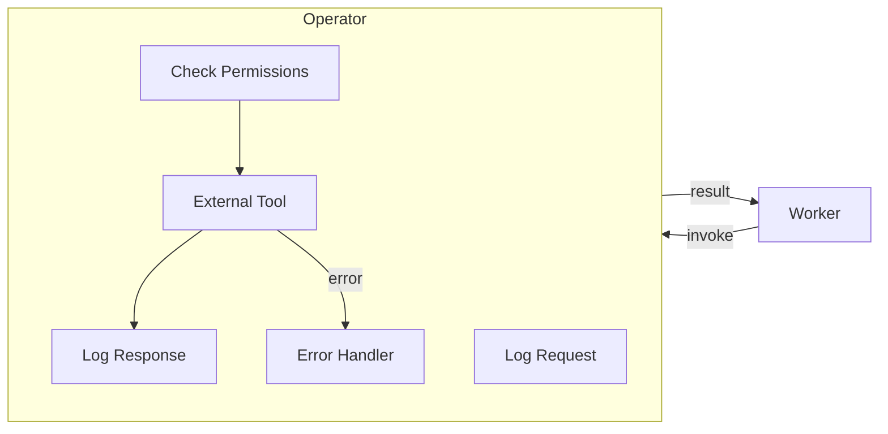
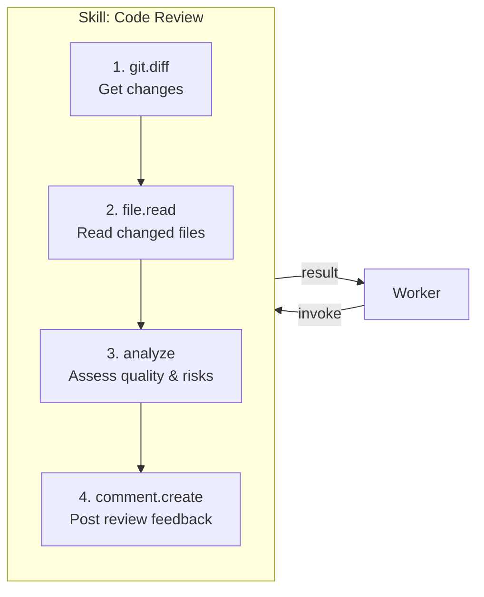
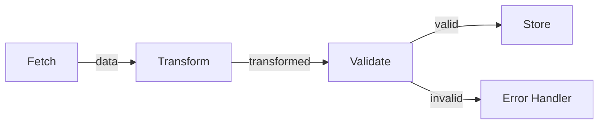
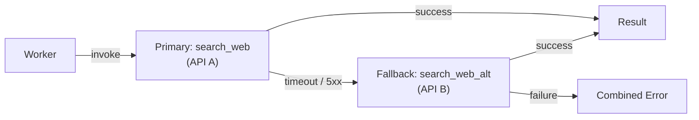

# Operator Patterns

These patterns govern how the Agentic OS interacts with external tools, APIs, and services.

---

## Tool as Operator

### Intent
Wrap every external tool as a typed, permissioned, observable operator.

### Context
Raw tool access — "give the model a function and let it call it" — lacks governance, typing, and observability. Wrapping tools as operators provides the control surface needed for production systems.

### Forces
- Direct tool access is fast and simple but ungoverned
- Governance and observability add overhead that must be justified
- Different tools have wildly different interfaces, reliability, and risk profiles
- The system must treat all tools uniformly while respecting their differences

### Structure
An operator wraps a tool with:
- **Type signature** — Inputs and outputs are explicitly typed
- **Permission requirements** — What capabilities are needed to invoke it
- **Risk classification** — Low, medium, high
- **Observability** — Invocations are logged with inputs, outputs, latency, and errors
- **Error handling** — Failures are captured and returned as structured results

### Dynamics
When a worker invokes an operator, the wrapper first validates permissions against the worker's capability set. If authorized, it logs the request, invokes the underlying tool, logs the response (or error), and returns a typed result. The invocation is fully observable — latency, success/failure, input/output hashes — without exposing sensitive content.

### Benefits
Governed, observable, reliable tool access. Consistent interface regardless of underlying tool implementation.

### Tradeoffs
Wrapper overhead adds latency to every tool invocation. Maintaining operator wrappers requires effort when underlying tools change their interfaces.

### Failure Modes
The wrapper obscures tool-specific error details behind a generic error type, making diagnosis difficult. Permission checks are too coarse, blocking legitimate use or too permissive, allowing unauthorized access. Observability logging captures sensitive data that should not be persisted.

### Related Patterns
Operator Registry, Operator Isolation, Skill over Operators

---

## Operator Registry

### Intent
Maintain a central catalog of all available operators with their metadata, permissions, and status.

### Context
As the number of available tools grows, the system needs a way to discover, select, and manage them. Without a registry, tool selection is ad-hoc and ungoverned.

### Forces
- Tool sprawl — dozens of tools with overlapping capabilities
- Workers need to discover available tools dynamically, not through hardcoded references
- The registry must be the single source of truth for tool availability and governance

### Structure
A registry that stores for each operator:
- Name and description
- Type signature
- Permission requirements
- Risk classification
- Status (active, deprecated, disabled)
- Usage metrics

The kernel consults the registry when deciding which operators to make available to a worker.

### Dynamics
At worker spawn time, the kernel queries the registry for operators that match the worker's task requirements and capability set. The registry returns only active, authorized operators. At runtime, operators may be added, deprecated, or disabled without restarting the system. Usage metrics (invocation count, error rate, latency) are updated after each invocation and inform future selection decisions.

### Benefits
Central governance point. Dynamic capability management. Clear documentation.

### Tradeoffs
The registry becomes a single point of failure for tool discovery. Registry maintenance requires discipline — stale entries mislead workers.

### Failure Modes
The registry contains stale entries for tools that no longer exist, causing invocation failures. Deprecated operators are still selected because the replacement was not registered. The registry grows to include hundreds of operators, making tool selection noisy and imprecise.

### Related Patterns
Tool as Operator, Capability-Based Access

---

## Skill over Operators

### Intent
Compose multiple operators into a higher-level reusable recipe called a skill.

### Context
Many real-world tasks require a specific sequence of tool invocations with logic connecting them. Rather than having the model improvise this sequence every time, encode it as a skill.

### Structure
A skill is a named, tested recipe that:
- Combines specific operators in a defined sequence or graph
- Includes logic for handling intermediate results
- Has its own input/output contract
- Is registered and versioned

Example:

### Dynamics
When a worker invokes a skill, the skill engine steps through the defined sequence, invoking each operator and passing results forward. At each step, the engine evaluates success criteria before proceeding. If a step fails, the skill's error handling logic determines the recovery strategy (retry, skip, abort). Skills are versioned — updating a skill creates a new version while preserving the previous one. Workers always invoke a specific skill version or the latest.

### Benefits
Consistency and reliability. Tested workflows. Reusable across contexts.

### Tradeoffs
Skills are less flexible than improvised workflows. They must be maintained as tools and APIs evolve.

### Failure Modes
A skill encodes an operator sequence that worked at creation time but breaks after an operator's interface changes. Skills are too rigid, forcing workers through unnecessary steps. Skills are too numerous and overlapping, making it unclear which skill to use for a given task.

### Related Patterns
Composable Operator Chain, Patternized Skills

---

## Composable Operator Chain

### Intent
Allow operators to be chained into pipelines where the output of one becomes the input of the next.

### Context
Many tasks are naturally pipelines: fetch → transform → validate → store. Expressing these as chains makes them composable and reusable.

### Forces
- Multi-step operations need clear data flow between stages
- Tight coupling between stages prevents reuse
- Each stage in a chain may fail independently

### Structure
Operators expose typed inputs and outputs. The system matches output types to input types, forming a pipeline. Each step in the chain is independently observable and governable.

### Dynamics
The chain executes sequentially. Each operator receives the previous operator's output as its input. Type checking at chain boundaries catches mismatches before invocation. If any operator fails, the chain stops and reports which stage failed, with the partial results collected so far. Chains can be defined declaratively and stored as reusable recipes.

### Benefits
Clean data flow. Each operator is testable in isolation. Chains are composable — new pipelines from existing operators.

### Tradeoffs
Chains are rigid — branching logic requires escaping the pipeline model. Long chains amplify latency from sequential execution.

### Failure Modes
A type mismatch between stages causes a runtime error that should have been caught at chain definition time. A mid-chain failure loses the partial results from earlier stages. The chain abstraction is applied to operations that are not truly pipelines, forcing awkward data transformations between stages.

### Related Patterns
Skill over Operators, Tool as Operator

---

## Operator Isolation

### Intent
Ensure that a failure in one operator does not crash the system or corrupt other operators.

### Context
External tools fail. APIs time out. Services return errors. These failures must be contained.

### Forces
- External tools are outside the system's control — they can fail in unexpected ways
- A single tool failure should not propagate to other tools or workers
- Isolation must not add so much overhead that tool invocation becomes impractical

### Structure
Each operator invocation runs in its own error boundary. Failures are captured as structured results (not exceptions) and returned to the caller. The caller (worker or kernel) decides how to handle the failure.

### Dynamics
The operator wrapper intercepts all failure modes: exceptions, timeouts, malformed responses, and resource exhaustion. Each failure is converted to a structured error result with a failure category, message, and the partial output (if any). The wrapper enforces a timeout: if the underlying tool does not respond within the configured window, the invocation is terminated and a timeout error is returned. The worker receives the error result and decides: retry, fall back, or escalate.

### Benefits
System stability. Graceful degradation. Clear error handling paths.

### Tradeoffs
Isolation overhead adds latency. Structured error conversion may lose tool-specific diagnostic details.

### Failure Modes
The isolation boundary leaks — a tool that consumes excessive memory affects other operators sharing the same process. Timeout values are set too aggressively, killing tools that are slow but would eventually succeed. The structured error result lacks enough detail for the worker to choose the right recovery strategy.

### Related Patterns
Operator Fallback, Failure Containment

---

## Operator Fallback

### Intent
When a primary operator fails, automatically attempt an alternative operator that can fulfill the same need.

### Context
External services are unreliable. Having a fallback operator reduces the impact of failures.

### Structure
The operator registry associates fallback operators with primary operators:

### Dynamics
When the primary operator returns a failure matching the fallback condition, the system automatically invokes the fallback operator with the same inputs. The fallback result is returned to the caller transparently. If the fallback also fails, the combined failure is reported. Fallback invocations are flagged in the execution journal so that persistent primary failures trigger operational alerts.

### Benefits
Higher reliability. Transparent to the caller.

### Tradeoffs
Fallback operators may have different characteristics (latency, result quality). Managing fallback chains adds complexity.

### Failure Modes
The fallback operator has subtly different semantics than the primary, producing results that appear correct but differ in important ways. Both primary and fallback fail, but the combined error message is confusing. Fallback masks a systemic primary failure, delaying investigation.

### Related Patterns
Operator Isolation, Tool as Operator

---

## Resource-Aware Invocation

### Intent
Consider resource costs (latency, tokens, API limits) when deciding which operator to invoke and how.

### Context
Operators have costs: API rate limits, token consumption, latency, monetary cost. Ignoring these leads to budget exhaustion, throttling, or excessive latency.

### Forces
- Different operators have vastly different cost profiles
- Budget constraints are real — rate limits, token budgets, monetary budgets
- A cheaper operator may produce acceptable results for low-stakes tasks
- Cost information must be available at decision time, not discovered after invocation

### Structure
The kernel tracks resource budgets and operator costs. Before invoking an operator, it checks:
- Is the budget sufficient?
- Is the operator within rate limits?
- Is a cheaper alternative available?
- Should this invocation be batched or deferred?

### Dynamics
The kernel maintains a real-time resource ledger: tokens consumed, API calls made, cost incurred. Before each operator invocation, the scheduler consults the ledger and the operator's cost profile. If the budget is sufficient, the invocation proceeds and the ledger is updated. If the budget is low, the scheduler may select a cheaper alternative, batch the invocation with others, or defer it to a lower-priority queue. Rate-limited operators include a backoff window in their cost profile.

### Benefits
Sustainable execution. Cost control. Graceful behavior under resource pressure.

### Tradeoffs
Cost tracking adds overhead. Cost estimates may be inaccurate, leading to either over-cautious scheduling or budget overruns.

### Failure Modes
Cost profiles are stale — the operator's actual cost has changed but the registry has not been updated. The system defers critical invocations to save budget, degrading result quality. Resource accounting is not thread-safe, allowing parallel workers to collectively exceed the budget.

### Related Patterns
Resource Envelope, Context Budget Enforcement

---

## Applicability Guide

Operator patterns structure how the system interacts with the external world. Start with the minimum tooling surface and expand deliberately.

### Decision Matrix

| Pattern | Apply When | Do Not Apply When |
|---|---|---|
| **Tool as Operator** | The system needs to interact with external services, files, or APIs through a uniform interface | The system is purely reasoning-based with no external side effects |
| **Operator Registry** | You have 5+ tools; workers need to discover tools dynamically; governance must scope tool access | You have 1-2 hardcoded tools that every worker always uses |
| **Skill over Operators** | Recurring multi-step workflows benefit from packaged instructions, strategies, and tool selections | Every task is novel; no workflow repeats enough to justify packaging |
| **Composable Operator Chain** | Multi-stage operations where one tool's output feeds the next (e.g., search → fetch → extract) | Each tool invocation is independent; composition adds indirection without value |
| **Operator Isolation** | Tool failures should not crash the worker; untrusted tools need sandboxing | All tools are trusted, well-tested, and fast; isolation overhead is not justified |
| **Operator Fallback** | Primary tools have reliability issues; alternative providers exist | Each tool is unique with no equivalent alternative; or reliability is already sufficient |
| **Resource-Aware Invocation** | Tools have rate limits, costs, or latency constraints that require budgeting | Tools are free, unlimited, and fast; cost tracking adds overhead without benefit |

### Start Here

Every system needs **Tool as Operator** (a structured interface to external capabilities). Add the **Operator Registry** once you have more than a handful of tools. Add **Skill over Operators** when you notice teams repeatedly assembling the same tool combinations for similar tasks. The other patterns respond to operational pressures — add them when you observe the specific problem they solve.
