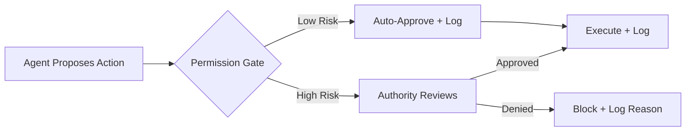
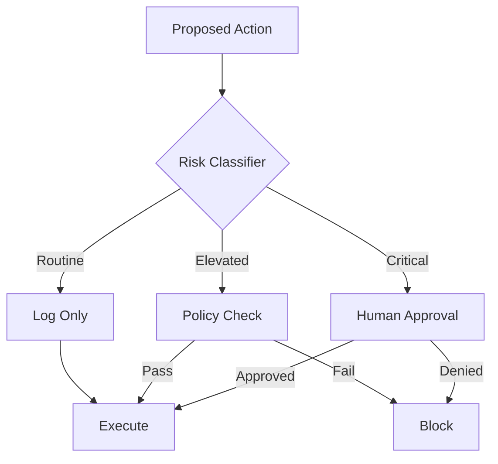

# Governance Patterns

These patterns establish how authority, permissions, and accountability flow through an Agentic OS. Without governance, agentic systems become unpredictable liabilities. With too much governance, they become paralyzed. These patterns find the balance.

---

## Capability-Based Access

### Intent
Grant agents only the specific capabilities they need, rather than broad role-based permissions.

### Context
When agents invoke operators, access memory, or spawn subprocesses, they require permissions. Traditional role-based access is too coarse — an agent with the "developer" role might have access to delete production databases when it only needs to read a configuration file.

### Forces
- Broad permissions increase blast radius of failures
- Fine-grained permissions increase configuration complexity
- Agents may need different capabilities for different tasks

### Structure
Each agent or process receives a capability set — a list of specific, granular permissions such as `read:file:/config/*`, `write:memory:working`, `invoke:operator:search`. Capabilities are scoped by resource, action, and optionally by time or invocation count.

### Dynamics
At process creation, the kernel assigns a capability set based on the task contract. Operators check capabilities before execution. Capabilities can be narrowed when delegating to subprocesses but never widened without explicit escalation.

### Benefits
Minimal blast radius. Clear auditability. Composable security.

### Tradeoffs
More configuration surface. Capability sets must be maintained and versioned.

### Failure Modes
Over-permissive defaults defeat the pattern. Under-permissive defaults cause legitimate work to fail silently.

### Related Patterns
Least Privilege Agent, Permission Gate, Operator Isolation

---

## Least Privilege Agent

### Intent
Ensure every agent operates with the minimum permissions necessary to accomplish its assigned task.

### Context
When spawning workers or delegating tasks, the kernel must decide how much access to grant. The default instinct is to give generous access to avoid failures. This instinct is dangerous.

### Forces
- Minimal permissions reduce risk but increase the chance of permission-related failures
- Generous permissions simplify development but increase attack surface
- Permission requirements may not be fully known in advance

### Structure
Each task contract specifies required capabilities. The kernel grants exactly those capabilities and nothing more. If a worker discovers it needs additional access, it must request escalation through a permission gate rather than failing silently or improvising.

### Dynamics
Start restricted. Escalate explicitly. Log every escalation. Review escalation patterns to refine default capability sets over time.

### Benefits
Contained failure. Reduced risk. Escalation patterns reveal design gaps.

### Tradeoffs
Initial development is slower. Workers may fail on edge cases that require unexpected permissions.

### Failure Modes
Workers that silently degrade rather than requesting escalation. Blanket escalation approvals that defeat the pattern.

### Related Patterns
Capability-Based Access, Permission Gate, Human Escalation

---

## Permission Gate

### Intent
Create explicit checkpoints where execution pauses for authorization before crossing a trust boundary.

### Context
Some actions carry consequences that are difficult or impossible to reverse — deploying code, sending emails, modifying financial records, deleting data. These actions should not flow automatically through the system.

### Forces
- Ungated actions are fast but risky
- Too many gates create friction and fatigue
- Gate placement requires understanding of consequence severity

### Structure
A permission gate is a policy-defined checkpoint in the execution path. When an agent reaches a gate, execution suspends. The gate presents the proposed action, context, and risk assessment to the appropriate authority — which may be a human, a policy engine, or a higher-privilege agent. Execution resumes only upon approval.

### Dynamics
Agent proposes action → Gate intercepts → Authority reviews → Approve or deny → Execution resumes or aborts. Denied actions are logged with reasoning. Approved actions are logged with the approver's identity.

### Benefits
Reversible control over irreversible actions. Clear accountability chain. Adjustable friction based on risk.

### Tradeoffs
Latency increases at gates. Approval fatigue can lead to rubber-stamping.

### Failure Modes
Gates on trivial actions desensitize approvers. Missing gates on critical actions eliminate the safety net.

### Related Patterns
Capability-Based Access, Human Escalation, Risk-Tiered Execution

---

## Human Escalation

### Intent
Provide a structured mechanism for agents to transfer decision authority to a human when they encounter situations beyond their competence or permission.

### Context
No agent is competent for all situations. Ambiguous intent, conflicting constraints, ethical dilemmas, high-stakes consequences, and novel situations all exceed what an agent should handle autonomously.

### Forces
- Escalating too often makes the system useless
- Escalating too rarely makes the system dangerous
- Escalation must preserve enough context for the human to decide effectively

### Structure
The escalation package includes: the original intent, the decision point reached, the options considered, the agent's recommendation (if any), relevant memory and context, and the specific question for the human. The human can approve, deny, redirect, or provide additional guidance.

### Dynamics
Agent detects boundary → Packages context → Suspends execution → Human reviews → Human responds → Agent incorporates response and resumes. The agent should not silently proceed with a guess when escalation is warranted.

### Benefits
Appropriate human authority. Preserved context. Explicit decision trail.

### Tradeoffs
Requires responsive human operators. Escalation packaging consumes resources.

### Failure Modes
Poor escalation packaging forces humans to reconstruct context. Unreachable humans block execution indefinitely.

### Related Patterns
Permission Gate, Staged Autonomy, Risk-Tiered Execution

---

## Auditable Action

### Intent
Ensure every significant action taken by the system is recorded with sufficient context to reconstruct the reasoning chain.

### Context
In governed systems, it is not enough to know *what* happened. We must know *why* it happened, *who* authorized it, *what* information was available, and *what* alternatives were considered.

### Forces
- Comprehensive logging increases storage and processing costs
- Insufficient logging makes incidents uninvestigatable
- Log granularity must balance detail with noise

### Structure
Every action record includes: timestamp, acting agent identity, the intent being served, the specific action taken, inputs consumed, outputs produced, capabilities exercised, approvals obtained, and the outcome. Actions are immutable once recorded.

### Dynamics
Before execution: log intent and plan. During execution: log operator invocations and results. After execution: log outcome, duration, and resource consumption. On failure: log error context and recovery actions.

### Benefits
Full reconstruction of decision chains. Compliance support. Debugging foundation. Trust building.

### Tradeoffs
Storage costs. Performance overhead. Risk of logging sensitive data.

### Failure Modes
Logging failures that silently drop records. Over-logging that makes meaningful patterns invisible.

### Related Patterns
Execution Journal, Signed Intent, Checkpoints and Rollback

---

## Signed Intent

### Intent
Attach cryptographic or structural proof of origin and authorization to every intent flowing through the system.

### Context
As intents are decomposed, delegated, and executed across multiple agents, it becomes unclear who originally authorized the work and whether the current execution still aligns with the original request.

### Forces
- Unsigned intents can be forged or corrupted during delegation
- Verification overhead increases with delegation depth
- Deep delegation chains may mutate intent beyond recognition

### Structure
The original intent receives a signature from its source (user, API caller, or orchestrator). As the kernel decomposes the intent into sub-intents, each sub-intent carries a reference to its parent and the original signed intent. Any agent can verify that its current work traces back to a legitimately authorized request.

### Dynamics
User issues intent → Kernel signs and decomposes → Sub-intents carry parent chain → Workers verify chain before executing → Audit trail links every action to its origin.

### Benefits
Tamper-evident intent chains. Origin traceability. Prevention of unauthorized intent injection.

### Tradeoffs
Signature management complexity. Performance cost of verification.

### Failure Modes
Broken signature chains when sub-intents are reconstructed. Performance degradation from redundant verification.

### Related Patterns
Auditable Action, Capability-Based Access

---

## Risk-Tiered Execution

### Intent
Apply different levels of scrutiny, approval, and safeguards based on the assessed risk of an action.

### Context
Not all actions carry equal consequences. Reading a file is low-risk. Deploying to production is high-risk. Sending a financial transaction is critical-risk. Treating all actions identically — either with maximum scrutiny or minimum — is wasteful or dangerous.

### Forces
- Uniform high scrutiny creates unacceptable latency for routine work
- Uniform low scrutiny creates unacceptable risk for critical work
- Risk assessment itself can be wrong

### Structure
Define risk tiers (e.g., routine, elevated, critical). Classify actions into tiers based on: reversibility, scope of impact, data sensitivity, and cost. Each tier maps to a governance response: routine actions proceed with logging only, elevated actions require policy check, critical actions require human approval.

### Dynamics
Agent proposes action → Risk classifier assigns tier → Governance pipeline applies tier-appropriate controls → Action proceeds or gates. Risk classifications are refined over time based on incident analysis.

### Benefits
Appropriate friction. Fast routine operations. Protected critical operations.

### Tradeoffs
Risk misclassification can under- or over-protect. Tier boundaries require ongoing calibration.

### Failure Modes
Novel actions that don't fit existing tiers default to the wrong level. Tier inflation where everything becomes "critical."

### Related Patterns
Permission Gate, Human Escalation, Staged Autonomy

---

## Applicability Guide

Governance patterns are not optional — but the *depth* of governance should match the risk profile of your domain. Over-governing a low-risk system wastes resources. Under-governing a high-risk system invites incidents.

### Decision Matrix

| Pattern | Apply When | Do Not Apply When |
|---|---|---|
| **Capability-Based Access** | Workers have different trust levels; principle of least privilege matters; you need to scope tool access per worker | All workers are fully trusted and run in a controlled environment with no sensitive resources |
| **Least Privilege Agent** | Workers should only access what they need; over-provisioning creates security risk | The system has a single worker operating in a sandbox where all resources are pre-scoped |
| **Permission Gate** | Some actions require human or policy approval before execution; irreversible actions need checkpoints | All actions are reversible, low-risk, and pre-approved; gates would add latency with no safety benefit |
| **Human Escalation** | The system encounters situations beyond its confidence or authority; a human needs to make the call | The system operates autonomously by design with no human available; or all decisions are within the system's authority |
| **Auditable Action** | Compliance requires a record of what happened and why; debugging requires post-hoc analysis | The system is a throwaway prototype with no accountability requirements |
| **Signed Intent** | Multi-party authorization matters; you need to prove that a specific operator authorized a specific action | Single-user system with simple authentication; provenance is not a concern |
| **Risk-Tiered Execution** | Actions vary widely in risk (from reading a file to deleting a database); governance overhead should match risk | All actions have the same risk profile; a uniform policy is simpler and sufficient |

### The Non-Negotiables

For any production system: **Capability-Based Access**, **Auditable Action**, and **Human Escalation** are non-negotiable. They cost little to implement and prevent the most common and harmful failure modes.

**Permission Gate** and **Risk-Tiered Execution** should be added as soon as the system performs any irreversible or externally-visible actions.

**Signed Intent** and **Least Privilege Agent** are important for multi-user, multi-team, or regulated environments.
