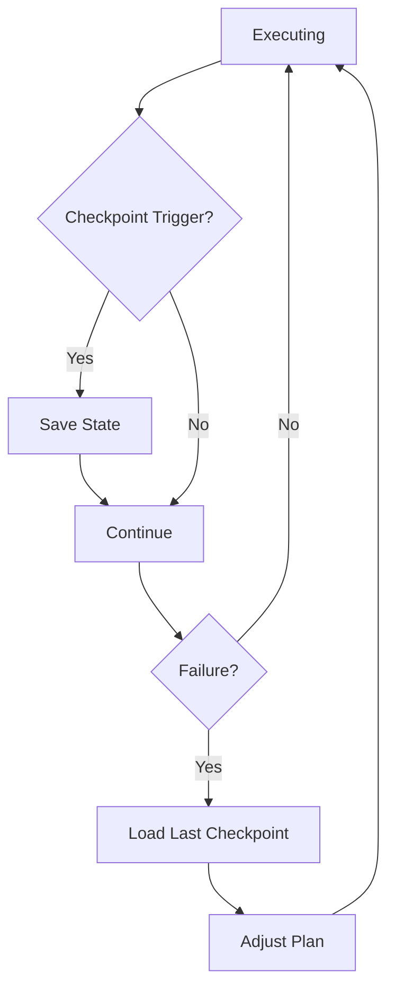

# Runtime Patterns

These patterns govern how an Agentic OS manages execution state, tracks progress, handles failures, and controls resource consumption during live operation.

---

## Active Plan Board

### Intent
Maintain a shared, inspectable representation of the current execution plan that all participants can read and the kernel can update.

### Context
When work is decomposed into multiple steps executed by different workers, no single agent holds the complete picture. Without a shared plan, workers operate blindly, the kernel cannot assess overall progress, and adaptation becomes guesswork.

### Forces
- A shared plan enables coordination but introduces a synchronization point
- Plan detail must be sufficient for tracking but not so detailed that it becomes stale instantly
- Plans change during execution — the board must support mutation

### Structure
The active plan board is a structured document in working memory containing: the goal, current phase, ordered steps with status (pending, in-progress, completed, failed, skipped), dependencies between steps, assigned workers, and intermediate results. The kernel updates the board as work progresses.

### Dynamics
Kernel creates initial plan board → Workers report progress → Kernel updates board → Board reflects reality → Kernel uses board to decide next actions and detect stalls. The board is the single source of truth for execution state.

### Benefits
Transparency. Coordination without tight coupling. Debuggable execution. Human-inspectable progress.

### Tradeoffs
Board maintenance overhead. Stale boards if updates are delayed.

### Failure Modes
Workers that don't report status, leaving the board inaccurate. Overly granular boards that consume more attention than the work itself.

### Related Patterns
[Execution Journal](#execution-journal), [Planner-Executor Split](./13-kernel-patterns.md#planner-executor-split)

---

## Execution Journal

### Intent
Maintain a chronological, append-only record of all significant events during execution for debugging, auditing, and learning.

### Context
When problems occur — a wrong result, a timeout, an unexpected failure — the team needs to reconstruct what happened. In traditional software, we have logs. In agentic systems, we need richer records that capture not just what happened but the reasoning behind decisions.

### Forces
- Comprehensive journals are expensive in storage and attention
- Sparse journals leave gaps that make debugging impossible
- Journal format must balance human readability with machine parseability

### Structure
Each journal entry contains: timestamp, event type (decision, action, observation, error, escalation), acting agent, context summary, inputs, outputs, duration, and links to related entries. Entries are immutable and append-only.

### Dynamics
Every significant event is journaled as it occurs. The kernel can query the journal to detect patterns (repeated failures, escalation spirals, resource exhaustion). Post-execution analysis uses the journal to extract lessons.

### Benefits
Full execution reconstruction. Pattern detection. Learning foundation. Compliance evidence.

### Tradeoffs
Storage growth. Write overhead. Risk of sensitive data in journals.

### Failure Modes
Journal writes that block execution. Journals too verbose to be useful.

### Related Patterns
[Auditable Action](./17-governance-patterns.md#auditable-action), [Active Plan Board](#active-plan-board), [Checkpoints and Rollback](#checkpoints-and-rollback)

---

## Checkpoints and Rollback

### Intent
Create saveable execution states at strategic points so the system can recover from failures by reverting to a known-good state rather than restarting from scratch.

### Context
Long-running agentic tasks — multi-step refactors, research synthesis, complex deployments — accumulate significant work before completion. A failure near the end should not require repeating everything from the beginning.

### Forces
- Frequent checkpoints increase resilience but add overhead
- Checkpoint restoration must include memory, plan state, and intermediate results
- Not all state is easily serializable (e.g., external side effects)

### Structure
A checkpoint captures: the current plan board state, working memory contents, completed step results, and any relevant context. Checkpoints are stored with identifiers and timestamps. On failure, the kernel can load a checkpoint and resume from that point.

### Dynamics
Kernel reaches checkpoint trigger (step completion, time interval, risk boundary) → Serialize state → Store checkpoint → Continue execution. On failure: load most recent valid checkpoint → Adjust plan to skip completed steps → Resume.

### Benefits
Resilient long-running tasks. Reduced waste on failure. Enables experimentation with rollback safety.

### Tradeoffs
Checkpoint serialization cost. Storage requirements. External side effects cannot be rolled back.

### Failure Modes
Checkpoints that capture inconsistent state. Over-reliance on rollback instead of fixing root causes.

### Related Patterns
[Active Plan Board](#active-plan-board), [Failure Containment](#failure-containment), [Execution Journal](#execution-journal)

---

## Failure Containment

### Intent
Prevent a failure in one part of the system from cascading into other parts.

### Context
In a system with multiple concurrent workers, shared memory, and interconnected plans, a single failure can propagate rapidly. A stuck worker can exhaust resources. A corrupted memory entry can mislead other workers. A failed operator can trigger retry storms.

### Forces
- Isolation prevents cascading failure but limits beneficial interaction
- Detection must be fast enough to contain before spread
- Recovery must not introduce new failure modes

### Structure
Each worker process operates within an isolation boundary — its own memory scope, capability set, and resource budget. Failures are detected through timeouts, output validation, and health checks. When a failure is detected, the failing process is terminated or suspended without affecting peer processes.

### Dynamics
Worker fails → Isolation boundary contains the failure → Kernel detects via health check → Kernel decides: retry, replace, skip, or escalate → Sibling processes continue unaffected.

### Benefits
System resilience. Predictable failure scope. Continued operation after partial failure.

### Tradeoffs
Isolation boundaries add overhead. Over-isolation prevents useful cooperation.

### Failure Modes
Failures in shared resources (memory plane, operator fabric) that bypass process boundaries. Detection delays that allow cascading before containment.

### Related Patterns
[Subagent as Process](./14-process-patterns.md#subagent-as-process), [Context Sandbox](./14-process-patterns.md#context-sandbox), [Resource Envelope](#resource-envelope)

---

## Staged Autonomy

### Intent
Incrementally expand an agent's autonomous authority as it demonstrates competence, rather than granting full autonomy from the start.

### Context
New agentic workflows, new operators, and new domains carry uncertainty. We do not know in advance whether the system will behave correctly. Granting full autonomy in uncertain conditions is reckless, but requiring human approval for every action is impractical.

### Forces
- Full autonomy is efficient but risky in untested scenarios
- Full supervision is safe but defeats the purpose of automation
- Trust should be earned through demonstrated competence

### Structure
Define autonomy stages: supervised (human approves every action), guided (human approves only high-risk actions), autonomous (system acts freely within policy), adaptive (system proposes policy changes). Workflows start at supervised and advance based on success metrics.

### Dynamics
New workflow begins at supervised → Track success rate, error rate, escalation rate → When metrics meet threshold, propose promotion → Human approves stage advancement → Repeat. Failures can trigger demotion.

### Benefits
Controlled risk exposure. Trust-building through evidence. Gradual optimization.

### Tradeoffs
Slower initial deployment. Metrics design is critical and non-trivial.

### Failure Modes
Premature promotion. Metrics that don't capture actual risk. Stage demotion that isn't triggered by real incidents.

### Related Patterns
[Risk-Tiered Execution](./17-governance-patterns.md#risk-tiered-execution), [Human Escalation](./17-governance-patterns.md#human-escalation), [Permission Gate](./17-governance-patterns.md#permission-gate)

---

## Resource Envelope

### Intent
Define hard boundaries on the resources any single execution can consume — time, tokens, memory, operator invocations — to prevent runaway processes.

### Context
Agentic systems can enter loops, recursive decompositions, or retry spirals that consume unbounded resources. Unlike traditional programs with fixed execution paths, agents can generate arbitrary amounts of work.

### Forces
- Unbounded execution risks cost explosions and system starvation
- Tight boundaries may terminate legitimate complex work prematurely
- Different tasks have legitimately different resource needs

### Structure
Each process or execution receives a resource envelope: maximum tokens (input + output), maximum wall-clock time, maximum operator invocations, maximum subprocess spawns. The kernel enforces these boundaries. When a boundary is approached, the agent receives a warning. When exceeded, execution is suspended.

### Dynamics
Kernel sets envelope at process creation → Worker executes within envelope → Budget warnings at 80% → Hard stop at 100% → Worker must checkpoint or summarize before termination → Kernel decides whether to allocate additional budget or terminate.

### Benefits
Predictable costs. System stability. Prevention of runaway loops.

### Tradeoffs
Legitimate complex tasks may hit boundaries. Envelope sizing requires experience.

### Failure Modes
Envelopes set too tight, killing valid work. Envelopes set too loose, providing no real protection.

### Related Patterns
[Context Budget Enforcement](#context-budget-enforcement), [Failure Containment](#failure-containment), [Subagent as Process](./14-process-patterns.md#subagent-as-process)

---

## Context Budget Enforcement

### Intent
Actively manage the amount of context (tokens, memory entries, retrieved documents) consumed by any single reasoning step to maintain quality and control costs.

### Context
Language models degrade in quality when context windows are saturated with irrelevant information. More context does not always mean better results — it often means more noise, higher costs, and slower processing.

### Forces
- Agents tend to accumulate context without pruning
- Relevant context is essential for quality; irrelevant context degrades it
- Context costs scale linearly with token count

### Structure
Each reasoning step has a context budget: maximum tokens from memory retrieval, maximum documents from search, maximum history entries. The memory plane enforces these budgets through relevance scoring and truncation. Retrieved context is ranked and only the top entries within budget are provided.

### Dynamics
Agent requests context → Memory plane retrieves candidates → Relevance scoring ranks candidates → Budget enforcement truncates to top-k within token limit → Agent receives curated, high-relevance context.

### Benefits
Higher reasoning quality. Predictable costs. Faster processing. Reduced noise.

### Tradeoffs
Aggressive budgeting may exclude relevant information. Relevance scoring must be calibrated.

### Failure Modes
Budget enforcement that drops critical context. Relevance scoring that favors recency over importance.

### Related Patterns
[Resource Envelope](#resource-envelope), [Memory on Demand](./15-memory-patterns.md#memory-on-demand), [Compression Pipeline](./15-memory-patterns.md#compression-pipeline)

---

## Applicability Guide

Runtime patterns manage execution state, failure recovery, and resource consumption. They become critical as task complexity and autonomy increase.

### Decision Matrix

| Pattern | Apply When | Do Not Apply When |
|---|---|---|
| **Active Plan Board** | Plans are multi-step and need to be inspectable, modifiable, and trackable during execution | Tasks are single-step or follow a fixed script; plan visibility adds no value |
| **Execution Journal** | You need a detailed record of what the system did and why — for debugging, audit, or learning | The system is a stateless query-response service with no need for execution history |
| **Checkpoints and Rollback** | Long-running tasks risk partial failure; you need the ability to resume from a known-good state | Tasks are short enough that restarting from scratch is cheaper than maintaining checkpoint infrastructure |
| **Failure Containment** | Worker failures must not cascade to other workers or corrupt shared state | A single worker handles everything; there is nothing for failures to cascade to |
| **Staged Autonomy** | The system's autonomy should increase over time as it demonstrates reliability; trust must be earned | The system has a fixed, well-understood autonomy level that does not need to evolve |
| **Resource Envelope** | Workers can consume unbounded resources (tokens, time, API calls); budget enforcement is needed | Resource consumption is naturally bounded by the task structure; enforcement adds overhead without protection |
| **Context Budget Enforcement** | Context windows are limited; memory retrieval must be selective; relevance ranking matters | All relevant context fits in the window; or the system does not use retrieved memory |

### Build Order

1. **Execution Journal** — start logging from day one. It is cheap and invaluable for debugging.
2. **Resource Envelope** — add budget limits before your first large-scale test. Without them, a single runaway task can exhaust your API budget.
3. **Context Budget Enforcement** — add as soon as memory retrieval is part of your system. Quality degrades rapidly with irrelevant context.
4. **Active Plan Board** — add when you implement multi-step planning.
5. **Failure Containment** and **Checkpoints** — add when tasks become long-running (minutes, not seconds).
6. **Staged Autonomy** — add when you have enough operational history to calibrate trust levels.
