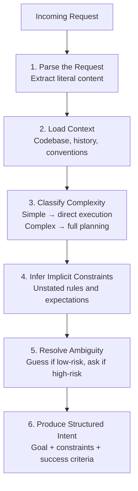

# From Requests to Intent

Most software begins with a well-defined input and ends with a well-defined output. A function takes arguments. An API receives a payload. A CLI parses flags. The contract is crisp: the caller knows what to ask for, and the system knows what to deliver.

Agentic systems break this contract — on purpose.

## The Gap Between What Is Said and What Is Meant

When a human says "fix the login bug," they rarely mean *only* that. They mean: find the bug, understand the root cause, fix it without breaking other things, verify the fix works, and ideally make the surrounding code a little more robust so the same class of bug does not recur. They also mean: do not touch unrelated code, do not refactor the entire auth module, and keep the pull request reviewable.

None of that is in the words "fix the login bug."

In traditional systems, we bridge this gap with specifications, tickets, acceptance criteria — human-written documents that attempt to make implicit intent explicit. In agentic systems, the system itself must bridge the gap. The cognitive kernel must interpret the request, infer the full intent, and construct a plan that serves what was meant, not just what was said.

## Intent Is Not a String

This is the fundamental shift. The input to an agentic system is not a structured command but a *goal* — often underspecified, context-dependent, and laden with implicit expectations.

Intent has layers:

- **Surface intent**: The literal ask. "Write a function that sorts users by last login."
- **Operational intent**: The practical constraints. It should be efficient, handle edge cases, fit the project's style.
- **Strategic intent**: The deeper goal. We are building an admin dashboard and need to identify inactive accounts.
- **Boundary intent**: What should *not* happen. Do not change the database schema. Do not introduce new dependencies.

A capable system does not just parse the surface. It reconstructs as many layers as it can from context — the codebase, recent changes, the user's history, the project's conventions — and asks for clarification only when the ambiguity would lead to meaningfully different outcomes.

## The Intent Interpretation Pipeline

The cognitive kernel processes incoming requests through an interpretation pipeline:

### 1. Parse the Request

Extract the literal content: what action is requested, what artifacts are mentioned, what constraints are stated. This is the easy part.

### 2. Load Context

Gather the relevant surrounding information: the current state of the codebase, recent conversations, active tasks, user preferences, project conventions. Context is what transforms a vague request into a grounded one.

### 3. Classify Complexity

Is this a single-step task or a multi-step workflow? Does it require specialized knowledge? Does it touch sensitive areas? The classification determines how much planning infrastructure the system will deploy. Small tasks get direct execution. Large tasks get full planning.

### 4. Infer Implicit Constraints

What goes without saying? If the user asks to fix a bug in a production service, the implicit constraints include: do not break the build, do not introduce regressions, follow existing patterns, keep changes minimal. These are not stated because they are always true. The system must know them anyway.

### 5. Resolve Ambiguity

When the request is ambiguous and the ambiguity matters, the system must decide: resolve it autonomously using available context, or escalate to the user. The decision depends on the cost of guessing wrong. Low-risk ambiguity can be resolved by best guess. High-risk ambiguity demands clarification.

### 6. Produce a Structured Intent

The output of the pipeline is not the original string — it is a structured representation of the goal: what to achieve, what to avoid, what constraints apply, what success looks like, and what level of autonomy is appropriate.

## The Art of Asking

A system that asks for clarification on every ambiguity is not intelligent — it is annoying. A system that never asks and guesses wrong is not autonomous — it is reckless.

The right balance is contextual. Early in a relationship (when the system has little history with a user), it should ask more. Over time, as it accumulates context about preferences, patterns, and boundaries, it should ask less. This is not just politeness — it is efficiency. Every question interrupts the user's flow. Every wrong guess wastes compute and trust.

The best agentic systems learn to model their operators. They notice that this user always wants verbose logging. That this team prefers small PRs. That this project has strict linting rules. These observations compress future intent interpretation: the system can infer more from less.

## Intent vs. Instruction

There is a useful distinction between *intent* and *instruction*:

- **Intent** is what you want to achieve. "Make the homepage faster."
- **Instruction** is how you want it done. "Add lazy loading to all below-the-fold images."

Agentic systems should accept both, but prefer intent. When given intent, they can choose the best approach given the current context. When given instruction, they execute faithfully but have less room to add value.

The highest-leverage interactions are those where the human provides intent and constraints, and the system provides the plan and execution. This is the division of labor that makes agentic systems worthwhile.

## From Request to Plan

Once intent is structured, the kernel can plan. But the transition from intent to plan is itself non-trivial. The next chapter examines how complex intents are decomposed into executable work.

The key insight here is that intent interpretation is not preprocessing — it is the *first act of intelligence* in the system. Get it wrong, and everything downstream is wasted effort pointed in the wrong direction. Get it right, and even a modest execution engine produces valuable results.

Intent is the operating system's boot sequence. Everything starts here.
