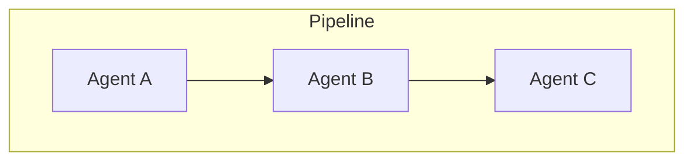
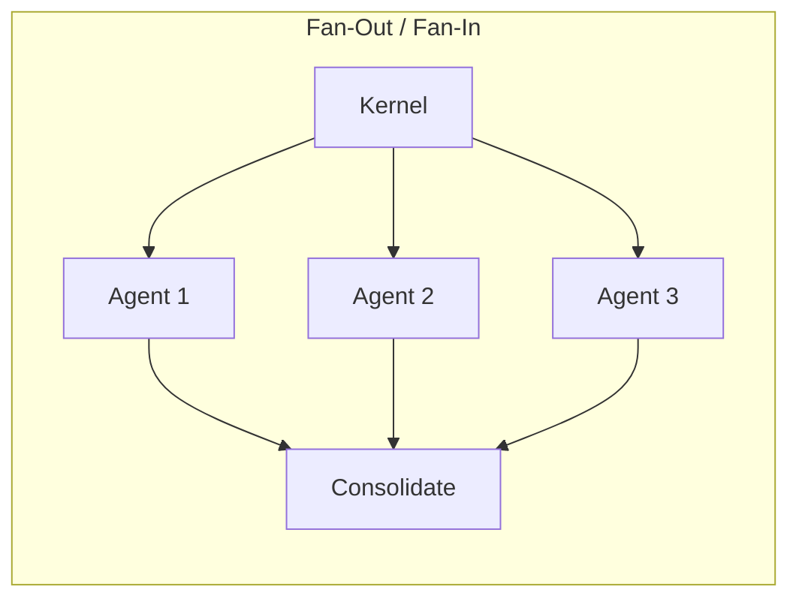
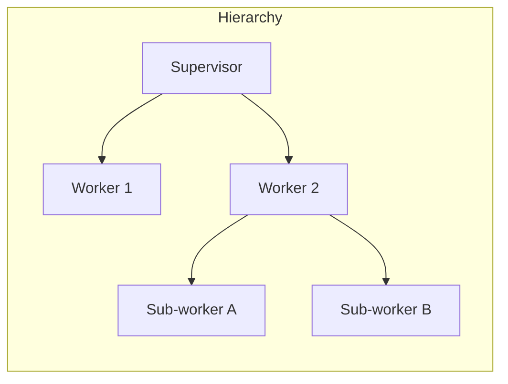
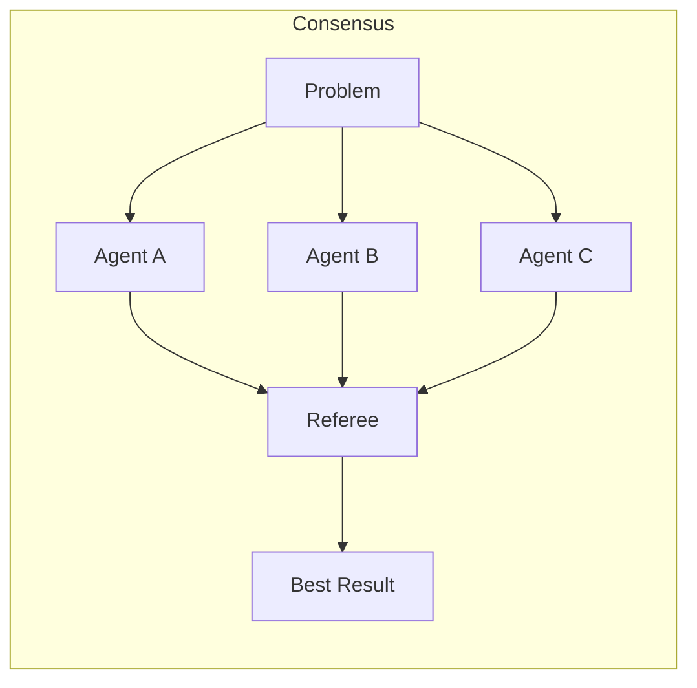
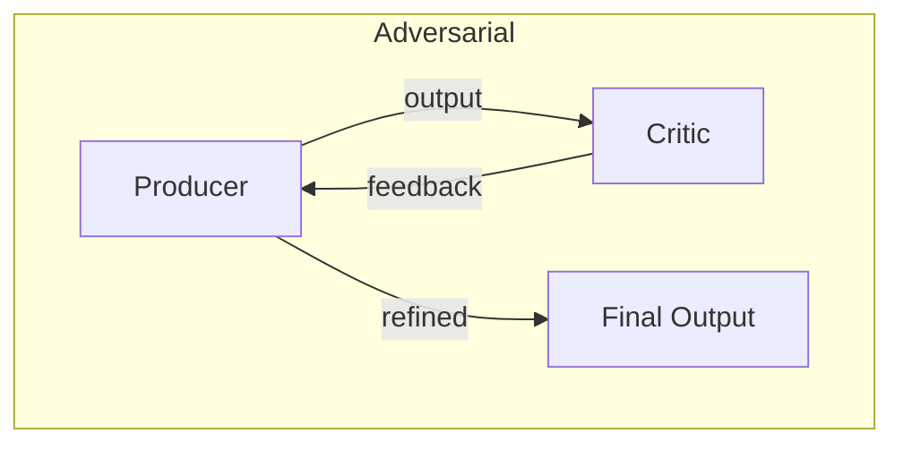

# One Agent, Many Agents, or Many OSs

The simplest agentic system is a single agent: one cognitive kernel, one process, one conversation. It receives a request, reasons about it, acts, and responds. Most chatbot interactions work this way. It is straightforward, easy to understand, and fundamentally limited.

The moment you need parallelism, specialization, or scale, you face an architectural decision that has no universal answer: should you use one agent that does many things, many agents coordinated as a team, or many independent operating systems that federate?

## The Single-Agent Model

A single agent handles everything. It reads the request, plans, executes each step sequentially, and delivers the result. This is adequate when:

- Tasks are simple and self-contained.
- Sequential execution is acceptable.
- The domain is narrow enough for one context window.

The limitation is cognitive: a single agent juggling ten concerns produces worse results than ten agents each focused on one. Context pollution — the mixing of unrelated information in a single context — degrades reasoning quality. A model simultaneously tracking database schema decisions, CSS styling choices, and deployment configuration is a model doing all three poorly.

## The Multi-Agent Model

Multiple agents, each specialized, coordinated by the cognitive kernel. This is the Agentic OS's primary mode for complex work.

### Why Multiple Agents

The argument for multi-agent systems is the same argument for microservices, for modular code, for teams with specialized roles: **separation of concerns produces better results**.

A code-writing agent has a context loaded with the relevant source files, language idioms, and test patterns. A code-reviewing agent has a context loaded with quality standards, common bug patterns, and architectural principles. A documentation agent has a context loaded with writing guidelines and API references. Each agent is excellent at its specialty because it is *only* doing its specialty.

### Coordination Patterns

Multi-agent systems require coordination. The Agentic OS supports several patterns:

**Pipeline**: Agents work in sequence. Agent A's output becomes Agent B's input. The code agent writes the function, the test agent writes the tests, the review agent checks both. Clean, predictable, but sequential.

**Fan-Out / Fan-In**: The kernel dispatches work to multiple agents in parallel, then consolidates the results. Five agents each analyze a different module simultaneously. Fast, but requires careful consolidation.

**Hierarchy**: A supervisor agent manages worker agents. The supervisor plans, delegates, and monitors. Workers execute. This mirrors the kernel-process relationship and scales well to deep task hierarchies.

**Consensus**: Multiple agents tackle the same problem independently, and a referee agent selects or synthesizes the best result. Expensive but robust for high-stakes decisions.

**Adversarial**: One agent produces, another critiques. The coder writes, the reviewer challenges. The planner proposes, the red team attacks. This produces more robust outputs at the cost of more compute.

### The Coordination Tax

Every agent added to a system increases coordination overhead:

- More context must be assembled for each agent.
- More results must be consolidated.
- More failure modes exist (what if agent 3 contradicts agent 2?).
- More communication overhead (encoding and decoding information between agents).

This tax is real and non-trivial. A two-agent system is not twice as good as a single agent — it is potentially better at the task but definitely more expensive to run. The decision to use multiple agents must be justified by the improvement in output quality, not by architectural elegance.

## The Multi-OS Model

Sometimes the right answer is not more agents within one OS, but multiple independent operating systems that collaborate.

### When You Need Multiple OSs

Consider a large organization where different teams use different agentic systems:

- The engineering team has a Coding OS tailored to their stack, conventions, and workflows.
- The research team has a Research OS with access to academic databases, experiment tracking, and publication tools.
- The support team has a Support OS connected to the ticket system, knowledge base, and customer data.

These are not agents within a shared system — they are independent operating systems with their own kernels, memory planes, governance rules, and operators. They have different security boundaries, different data access policies, and different optimization objectives.

### Federation

Multi-OS coordination requires federation: a mechanism for independent systems to discover each other, negotiate capabilities, exchange work, and share results while respecting each system's boundaries.

Federation is harder than multi-agent coordination. Within a single OS, the kernel has authority over all agents. Across OSs, there is no central authority. Coordination must be negotiated.

Key federation challenges:

- **Discovery**: How does OS A know that OS B exists and can help with a particular task?
- **Trust**: How does OS A verify that OS B will handle data responsibly? What governance policies apply at the boundary?
- **Protocol**: What format do inter-OS messages take? How are tasks described, delegated, and results returned?
- **Conflict resolution**: When OS A and OS B have conflicting information or recommendations, who wins?
- **Accountability**: When a federated task fails, which OS is responsible?

### The Organization as OS

At the highest level, you can think of an organization's collection of agentic systems as an OS itself — a meta-OS whose processes are individual OSs, whose memory is the shared knowledge base, and whose governance is the organizational policies.

This is not just an analogy. It is a design pattern. The same principles that govern processes within an OS — isolation, communication channels, resource management, policy enforcement — govern the coordination of multiple OSs within an organization.

## Choosing the Right Model

The choice between one agent, many agents, and many OSs depends on a small set of factors:

| Factor | Single Agent | Multi-Agent | Multi-OS |
|---|---|---|---|
| Task complexity | Low | Medium-High | Very High |
| Domain breadth | Narrow | Wide | Cross-organizational |
| Parallelism need | None | Significant | Independent |
| Security boundaries | One | Shared | Separate |
| Team structure | One person | One team | Multiple teams |
| Governance model | Uniform | Uniform | Heterogeneous |

In practice, most real systems are hybrid. A single-agent interaction for quick questions. Multi-agent orchestration for complex tasks. Multi-OS federation for cross-team workflows.

## The Scaling Challenge

As you move from single agent to multi-agent to multi-OS, every dimension scales:

- **Context management** scales from one window to many coordinated windows to distributed knowledge.
- **Planning** scales from linear plans to parallel task graphs to federated work orders.
- **Governance** scales from local policies to shared policies to negotiated policies.
- **Failure handling** scales from retry to re-plan to cross-system recovery.
- **Cost** scales from one model call to many to distributed billing.

The Agentic OS model handles this scaling because its abstractions — kernel, processes, memory, governance — are fractal. They apply at every level. A process within an OS and an OS within a federation follow the same structural patterns. This is not coincidence; it is the design principle that makes the OS analogy powerful.

## The Right Amount of Agency

More agents is not always better. More coordination is not always smarter. The right architecture is the simplest one that achieves the goal reliably.

A single agent that reliably fixes a bug is better than a five-agent pipeline that does the same thing with more overhead. But a single agent that unreliably designs a distributed system is worse than a multi-agent team where each specialist contributes its expertise.

The Agentic OS does not prescribe a single topology. It provides the infrastructure — the process fabric, the memory plane, the governance plane — that supports any topology. The cognitive kernel chooses the topology at runtime, based on the task at hand. That adaptability is the system's core strength.
