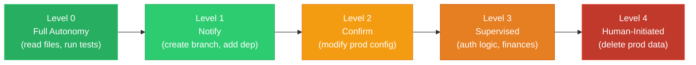
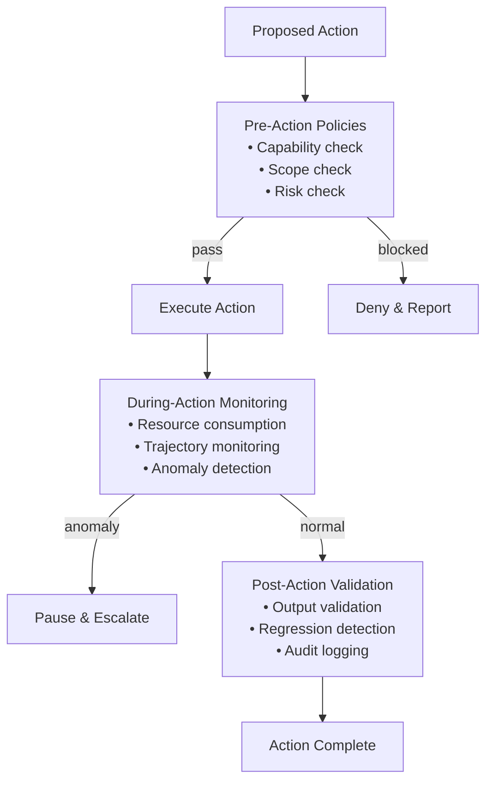

# Safety Without Killing Throughput

The easiest way to make an agentic system safe is to make it useless. Require human approval for every action. Restrict it to read-only operations. Limit it to pre-approved templates. The system will never do anything dangerous — or anything valuable.

The hardest and most important design challenge in agentic systems is achieving safety *and* throughput simultaneously. This chapter examines how the Agentic OS navigates this tension.

## The Safety-Throughput Tradeoff

Safety and throughput are not fundamentally opposed, but they are in tension. Every safety check takes time. Every approval gate blocks execution. Every policy evaluation consumes resources. A system with no safety runs fast and breaks things. A system with maximum safety runs slowly and breaks nothing — including the user's patience.

The goal is not to eliminate this tension but to manage it intelligently: apply heavy safety measures where the risk is high, and lightweight measures where the risk is low. This requires the system to accurately assess risk in real time.

## Risk Assessment

Not all actions carry equal risk. The Agentic OS classifies actions along several dimensions:

### Reversibility

Can the action be undone? Writing a file to a working directory is reversible (delete it). Sending an email is not. Pushing to a feature branch is reversible (force push). Pushing to main is recoverable but costly. Deleting a database table is catastrophic.

Reversible actions can proceed with low overhead. Irreversible actions demand proportionally higher scrutiny.

### Blast Radius

How much damage can a failure cause? A wrong value in a local variable affects one function. A wrong value in a configuration file affects the entire service. A wrong value in a production database affects all users.

Small blast radius permits fast, autonomous action. Large blast radius requires stronger gates.

### Confidence

How certain is the system about the correctness of the action? A rename refactoring supported by static analysis is high-confidence. A complex architectural change based on ambiguous requirements is low-confidence.

High-confidence actions can proceed freely. Low-confidence actions need verification.

### Precedent

Has the system successfully performed this type of action before? A task similar to one completed successfully yesterday carries lower risk than a novel task type. History informs trust.

## The Staged Autonomy Model

The Agentic OS implements safety through staged autonomy: different actions get different levels of oversight based on their risk profile.

### Level 0: Full Autonomy

The system acts without any human involvement. Reserved for low-risk, reversible, high-confidence actions. Reading files, running tests, generating code in a sandbox, formatting documents.

### Level 1: Notify

The system acts and notifies the human afterward. For medium-low risk actions where the human should be aware but does not need to approve. Creating a branch, adding a dependency, modifying test files.

### Level 2: Confirm

The system proposes an action and waits for human confirmation before proceeding. For medium-high risk actions. Modifying production configuration, running database migrations, sending external communications.

### Level 3: Supervised

The system generates a detailed plan and the human reviews and approves each significant step. For high-risk actions in sensitive domains. Changes to authentication logic, financial calculations, data deletion.

### Level 4: Human-Initiated

The system will not take the action on its own, even if asked. The human must perform it and tell the system it was done. For actions with catastrophic and irreversible consequences. Deleting production data, deploying to critical infrastructure, modifying security policies.

The mapping from action to level is not static. It evolves based on the system's track record, the operator's trust profile, and the current environment. A new system starts with many Level 2 actions that gradually move to Level 1 or 0 as trust is established.

## Policy Enforcement Architecture

Safety policies are enforced through the governance plane, using a layered architecture:

### Pre-Action Policies

Before any action is taken, the kernel evaluates it against pre-action policies:

- **Capability check**: Does this agent have the capability to perform this action? A code agent should not send emails. A research agent should not modify production databases.
- **Scope check**: Is this action within the scope of the current task? An agent asked to fix a bug should not refactor the entire module.
- **Risk check**: What is the risk level of this action? Does it exceed the autonomy level for the current context?

### During-Action Monitoring

Some actions are monitored in real time:

- **Resource consumption**: Is the agent consuming more tokens, time, or API calls than expected? Budget overruns may indicate a runaway process.
- **Trajectory monitoring**: Is the agent making progress toward the goal, or has it entered a loop? Repeated similar actions without progress trigger intervention.
- **Anomaly detection**: Is the agent doing something it has never done before in this context? Novel behaviors in sensitive domains may warrant a pause.

### Post-Action Validation

After an action completes, the system validates the result:

- **Output validation**: Does the output meet the expected format and constraints?
- **Regression detection**: Did the action break something that was working? Run tests, check invariants.
- **Audit logging**: Record what was done, why, and what the result was. This log is essential for accountability and debugging.

## Designing for Speed

Safety does not have to mean slow. Several design strategies maintain throughput while preserving safety:

### Parallel Approval Paths

While a risky action waits for human approval, safe actions continue executing. The system does not block on a single gate — it routes around it and returns when the gate opens.

### Speculative Execution

The system begins executing a risky action in a sandbox while waiting for approval. If approved, the sandboxed result is promoted. If rejected, it is discarded. This eliminates the latency of waiting, at the cost of potentially wasted compute.

### Pre-Approved Patterns

For recurring tasks, the system learns which action patterns are always approved and caches the approval. "This operator always approves test file modifications" becomes a permanent Level 0 policy for that action type.

### Batch Approval

Instead of asking for approval on each of ten similar actions, the system presents them as a batch: "I need to modify these 10 configuration files. Here are the changes. Approve all?" One approval, ten actions.

### Trust Escalation

As the system demonstrates reliability, its autonomy increases. An agent that has successfully deployed 50 times without incident may be granted higher autonomy for deployment tasks. Trust is earned, tracked, and revocable.

## The Circuit Breaker

Every agentic system needs a circuit breaker: a mechanism that stops all activity when something goes seriously wrong. This is not a graceful degradation — it is an emergency stop.

Circuit breakers trigger on:

- **Repeated failures**: More than N failures in a time window.
- **Budget exhaustion**: Cost exceeds the allocated maximum.
- **Policy violation**: An action that violates a hard governance rule.
- **Anomaly spike**: A sudden increase in unusual behaviors.
- **External signal**: A human hits the stop button.

When the circuit breaker trips, the system halts all active processes, preserves their state for debugging, and reports to the operator. No further actions are taken until the operator reviews and resets the system.

## Safety as a Feature, Not a Constraint

The deepest insight about safety in agentic systems is that it is not a constraint on the system — it is a feature *of* the system. Users trust systems that are safe. Trust enables higher autonomy. Higher autonomy enables greater throughput.

A system that occasionally breaks things will have its autonomy reduced by its operators — manually, by adding more approval gates, by restricting capabilities. A system that reliably operates safely will have its autonomy expanded. Over time, the safe system is *faster* because it is trusted to do more without supervision.

Safety is not the enemy of throughput. Recklessness is the enemy of throughput, because recklessness destroys trust, and without trust, every action requires a human in the loop.

The Agentic OS builds safety into its architecture — in the governance plane, in the process fabric's capability model, in the kernel's risk assessment — so that it is not an afterthought bolted on but a structural property that enables everything else.
