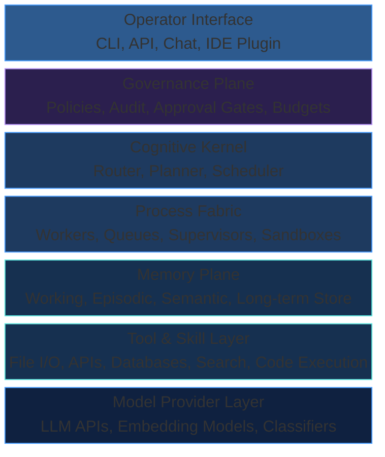
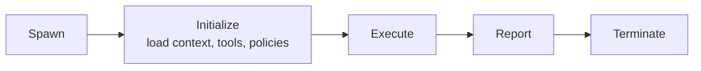
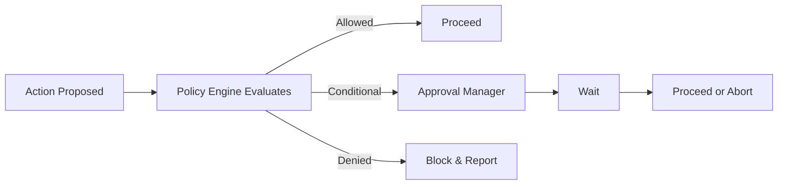

# Reference Architecture

The previous parts of this book described the Agentic OS conceptually — its philosophy, its layers, its patterns, its approach to problem-solving. This part shifts to construction. How do you actually build one?

This chapter presents a reference architecture: a concrete, implementable blueprint for an Agentic OS. It is not the only possible architecture, but it is a coherent one that embodies the principles we have established.

## Overview

The reference architecture has five major subsystems, mirroring the layers described in Part II:



Each subsystem is independent and communicates through well-defined interfaces. You can replace the model provider without touching the kernel. You can swap the memory store without affecting the process fabric. This is not accidental — it is the core design principle.

## The Cognitive Kernel

The kernel is the entry point and coordinator. It receives requests from the operator interface and orchestrates everything else.

### Components

- **Intent Router**: Classifies incoming requests by complexity, domain, and risk. Routes simple requests directly to execution, complex requests to the planner.
- **Planner**: Produces a task graph — a directed acyclic graph of subtasks with dependencies, resource requirements, and success criteria.
- **Scheduler**: Prioritizes and sequences tasks from the plan, considering resource availability, policy constraints, and dependencies.
- **Result Consolidator**: Collects outputs from completed tasks, resolves conflicts, and synthesizes the final result.

### Implementation Notes

The kernel is stateless between requests. All state lives in the memory plane. This means the kernel can be restarted, scaled, or replaced without losing work in progress — the task graph and its state are persisted.

The kernel invokes the language model for reasoning (planning, classification, consolidation) but is not the language model. It is the control logic that decides *when* and *how* to invoke the model.

## The Process Fabric

The process fabric manages the lifecycle of workers — the processes that actually execute tasks.

### Components

- **Worker Pool**: A set of available workers, each capable of executing tasks with specific tools and within specific sandboxes.
- **Process Manager**: Spawns, monitors, and terminates workers. Tracks resource consumption (tokens, time, tool calls) per worker.
- **Sandbox Manager**: Creates isolated execution environments for workers. Each sandbox defines what the worker can access: files, APIs, databases, network endpoints.
- **Communication Bus**: The message-passing infrastructure that connects the kernel to workers and workers to each other when needed.

### Worker Lifecycle



Workers are ephemeral by default. They are created for a specific task, execute it, report results, and are terminated. Long-running workers are possible but are the exception, not the norm.

### Isolation Model

Each worker runs in a scoped sandbox:

- **File access**: Read/write permissions scoped to specific directories.
- **Tool access**: Only the tools needed for the task. A code-writing worker has code tools. A research worker has search tools.
- **Model access**: Budget-limited access to the language model. A worker cannot consume unbounded tokens.
- **Network access**: Whitelisted endpoints only. No unrestricted internet access from workers.

This isolation is not about distrust — it is about focus. A worker with access to everything is a worker distracted by everything.

## The Memory Plane

The memory plane provides persistence and retrieval across all time horizons.

### Memory Tiers

- **Working Memory**: The current context for an active task. Assembled by the kernel when spawning a worker, containing the task description, relevant code, conversation history, and constraints. Limited by context window size.
- **Episodic Memory**: Records of past interactions, decisions, and outcomes. "Last time we deployed this service, we hit a rate limit on the external API." Stored as structured events with timestamps and metadata.
- **Semantic Memory**: Long-term knowledge indexed for retrieval. Project documentation, coding conventions, architectural decisions, API references. Stored as embeddings in a vector database.
- **Procedural Memory**: Learned procedures and patterns. "When fixing a flaky test, first check for race conditions, then timing dependencies, then external service mocks." Stored as retrievable strategies.

### Memory Operations

- **Store**: Write new information to the appropriate tier with metadata (source, confidence, timestamp, scope).
- **Retrieve**: Query memory by relevance, recency, or explicit key. The retrieval system ranks results by a combination of semantic similarity, temporal relevance, and contextual fit.
- **Consolidate**: Periodically compress and merge memories. Five separate episodic memories about the same deployment issue become one consolidated insight.
- **Forget**: Remove memories that are no longer relevant, incorrect, or superseded. Forgetting is as important as remembering — stale knowledge is worse than no knowledge.

## The Governance Plane

The governance plane enforces policies across the entire system.

### Components

- **Policy Engine**: Evaluates actions against a set of rules before, during, and after execution. Policies are declarative: "No worker may delete files outside the project directory." "All database mutations require Level 2 approval."
- **Approval Manager**: Manages the lifecycle of approval requests. When an action requires human approval, the approval manager creates a request, routes it to the appropriate operator, tracks its status, and unblocks the action when approved.
- **Audit Logger**: Records every significant action, decision, and outcome. The audit log is append-only and tamper-evident. It answers: What happened? When? Why? Who authorized it?
- **Budget Controller**: Tracks and enforces resource budgets. Token consumption, API call counts, execution time, monetary cost. When a budget is exhausted, the controller halts the relevant work and reports.

### Policy Evaluation Flow



Policy evaluation happens at multiple points: when the planner creates a task (pre-plan), when a worker is about to execute an action (pre-action), and when a result is produced (post-action).

## The Operator Interface

The operator interface is how humans interact with the system.

### Interface Types

- **Chat Interface**: Natural language conversation. The most accessible but least structured interface.
- **CLI**: Command-line interface for power users and automation. Supports batch operations, scripting, and integration with existing workflows.
- **API**: Programmatic interface for integration with other systems. RESTful or gRPC, with authentication, rate limiting, and versioning.
- **IDE Plugin**: Embedded in the developer's editor. Context-aware — the plugin knows what file is open, what code is selected, what errors exist.

### Interface Responsibilities

All interfaces share the same responsibilities:

- Authenticate the operator and establish their permission level.
- Accept input (request, command, API call) and pass it to the kernel.
- Stream progress back to the operator (plan status, worker output, approval requests).
- Present results in the appropriate format for the interface type.
- Accept feedback and corrections.

The interface does not make decisions. It is a conduit between the human and the kernel.

## The Tool & Skill Layer

Tools are the system's hands — the mechanisms through which it affects the world.

### Tool Categories

- **File operations**: Read, write, create, delete, search files.
- **Code execution**: Run code in sandboxed environments with controlled inputs and outputs.
- **Search**: Full-text search, semantic search, web search.
- **API integration**: HTTP clients for external services, with authentication and rate limiting.
- **Database access**: Query and modify databases within scoped permissions.
- **Communication**: Send messages, create tickets, post comments.

### Tool Registry

Tools are registered in a central registry with metadata:

- **Name and description**: What the tool does, in terms a language model can understand.
- **Schema**: Input and output types, required and optional parameters.
- **Risk level**: What governance policies apply when this tool is used.
- **Cost**: Estimated resource consumption per invocation.
- **Dependencies**: What other tools or services this tool requires.

The tool registry is the mechanism by which the system discovers and selects tools at runtime. When a worker needs to perform an action, it queries the registry for tools matching its need, filtered by its sandbox permissions.

## The Model Provider Layer

The model provider layer abstracts the language models the system uses.

### Abstraction

The system never calls a specific model directly. It calls the model provider with a request specifying:

- **Task type**: Reasoning, generation, classification, embedding.
- **Quality requirements**: High accuracy vs. fast response.
- **Budget constraints**: Maximum tokens, maximum cost.

The model provider selects the appropriate model based on these requirements. A classification task might use a fast, cheap model. A complex planning task might use a large, expensive model. This selection is transparent to the rest of the system.

### Provider Interface

```text
Request(task_type, prompt, constraints) → Response(content, metadata, cost)
```

Metadata includes token counts, model used, latency, and confidence signals. This information feeds back to the budget controller and the kernel's decision-making.

## Putting It Together

A request flows through the architecture as follows:

1. **Operator** submits a request through any interface.
2. **Kernel** receives the request, runs the intent interpretation pipeline.
3. **Kernel** classifies complexity and creates a task graph via the planner.
4. **Governance** evaluates the plan against policies. Flags risky steps.
5. **Scheduler** orders tasks by priority and dependency.
6. **Process fabric** spawns workers for ready tasks, each in a scoped sandbox.
7. **Workers** execute tasks using tools, with model provider calls as needed.
8. **Memory plane** supplies context to workers and stores results.
9. **Governance** monitors execution, gates risky actions.
10. **Kernel** consolidates results from completed workers.
11. **Operator** receives the final result through the interface.

Each step is logged, auditable, and policy-governed. The system is not a black box — it is a transparent pipeline with inspection points at every stage.

## What This Architecture Is Not

This architecture is not a product specification. It does not prescribe technology choices (which database, which queue, which language). It does not mandate a deployment topology (monolith, microservices, serverless). These are implementation decisions that depend on context.

What it provides is a structural guarantee: if your system has these components with these interfaces, it will support the patterns, governance, and operational modes described in this book. The next chapter examines where to draw the boundaries between these components.
