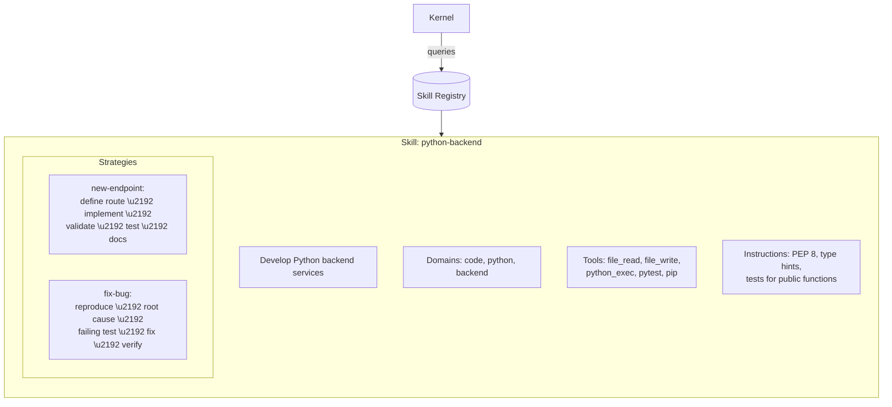

# Skills, Operators, and Reusable Building Blocks

An operating system is only as useful as the programs that run on it. Linux without packages is a curiosity. Windows without applications is an expensive boot screen.

The same is true for the Agentic OS. The kernel, the process fabric, the memory plane, the governance plane — these are infrastructure. What makes the system *useful* are the skills, operators, and building blocks that run on top of this infrastructure.

## Skills

A skill is a packaged capability: a bundle of instructions, tools, and strategies that enables the system to perform a specific type of work.

### Anatomy of a Skill

A skill consists of:

- **Instructions**: Guidance for the language model when performing this type of work. What to prioritize, what to avoid, what patterns to follow, what quality standards to apply.
- **Tools**: The specific tools required. A coding skill needs file access, code execution, and test runners. A research skill needs search, web access, and citation tools.
- **Strategies**: Procedural knowledge about how to approach the work. "When writing unit tests, start with the happy path, then edge cases, then error cases." These are the accumulated best practices for the domain.
- **Validation criteria**: How to verify the skill's output is correct. Code should compile and pass tests. Research should cite sources. Writing should meet style guidelines.

### Skill Registration

Skills are registered in the system's skill registry, which the kernel queries to match capabilities to tasks:

### Skill Composition

Skills can compose. A "full-stack feature" task might invoke the `python-backend` skill for the API, a `react-frontend` skill for the UI, and a `postgres-database` skill for the schema. The kernel selects and combines skills based on the task requirements.

Composition is horizontal (multiple skills for different aspects of one task) and vertical (a high-level skill delegates to lower-level skills). A `deploy` skill might internally use `docker-build`, `kubernetes-apply`, and `health-check` skills.

### Skill Quality

Not all skills are equal. A skill's quality depends on:

- **Instruction clarity**: Vague instructions produce vague results. "Write good code" is not a skill. "Write Python code following PEP 8 with type hints and 80% test coverage" is.
- **Strategy completeness**: Skills with well-defined strategies for common scenarios outperform skills that rely on the model to figure out the approach.
- **Tool fitness**: Skills that provide the right tools — not too many, not too few — enable focused execution.
- **Validation robustness**: Skills with strong validation criteria catch errors early.

## Operators

In the Agentic OS, an operator is a human role — the person or team that interacts with the system. But "operator" also describes a reusable pattern for how humans and systems collaborate.

### Operator Profiles

Different operators have different needs, permissions, and interaction styles. An operator profile captures these:

- **Permissions**: What actions this operator can authorize. What data they can access. What budgets they control.
- **Preferences**: How much detail they want in responses. What format they prefer. How often they want progress updates.
- **Trust level**: How much autonomy the system has when acting on this operator's behalf. New operators start with lower trust. Established operators earn higher trust.
- **Context**: What projects, repositories, and systems this operator works with. This context accelerates intent interpretation.

### Operator Adaptation

The system adapts to its operators over time. It learns:

- That this developer always wants verbose error messages.
- That this manager prefers summaries over details.
- That this team reviews PRs within an hour, so approval gates have a short expected wait time.
- That this operator never approves deletions without seeing a backup confirmation.

These adaptations are stored in the memory plane and applied automatically, reducing friction with every interaction.

## Reusable Building Blocks

Below skills and operators, the system is built from composable building blocks — small, well-defined units of functionality that can be combined to create new capabilities.

### Prompt Templates

Reusable prompt structures for common operations:

- **Analysis template**: "Given {context}, analyze {target} for {criteria}. Report findings as {format}."
- **Generation template**: "Given {requirements} and {constraints}, generate {artifact}. Validate against {criteria}."
- **Review template**: "Review {artifact} against {standards}. List issues by severity. Suggest fixes."

Templates are not rigid scripts — they are starting points that the system customizes based on context. But they encode best practices: the order of information, the type of output, the validation step.

### Workflow Patterns

Reusable orchestration patterns that combine multiple steps:

- **Generate-Test-Fix**: Generate an artifact, test it, fix issues, repeat until tests pass. Used for code, configurations, and data transformations.
- **Research-Synthesize-Present**: Gather information from multiple sources, synthesize findings, present a coherent summary. Used for analysis, due diligence, and decision support.
- **Draft-Review-Revise**: Produce a draft, review against criteria, revise based on feedback. Used for documents, designs, and proposals.
- **Monitor-Alert-Respond**: Continuously observe a system, detect anomalies, trigger appropriate responses. Used for operations, security, and compliance.

### Context Assemblers

Reusable logic for building the right context for a task:

- **Code context assembler**: Given a target file, gather the file itself, its imports, its tests, its recent changes, and the project's coding conventions.
- **Project context assembler**: Gather the project's README, architecture docs, dependency list, and active issues.
- **User context assembler**: Gather the user's preferences, recent interactions, and active tasks.

Context assembly is critical — the quality of the system's output is directly proportional to the quality of the context it receives. Good assemblers produce focused, relevant context. Poor assemblers dump everything into the context window and hope for the best.

### Validators

Reusable validation functions that verify output quality:

- **Code validators**: Compile, lint, type-check, run tests.
- **Document validators**: Check word count, readability score, required sections, citation completeness.
- **Data validators**: Schema conformance, range checks, referential integrity.
- **Security validators**: Check for common vulnerabilities, credential exposure, injection risks.

Validators are the system's quality assurance layer. Every building block that produces output should have a corresponding validator.

## The Package Ecosystem

Skills, templates, workflows, assemblers, and validators are all *packages* — distributable, versioned units of functionality.

### Package Structure

A package contains:

- **Metadata**: Name, version, description, author, dependencies.
- **Assets**: Instructions, prompt templates, tool configurations, validation rules.
- **Tests**: Automated tests that verify the package works correctly.
- **Documentation**: What the package does, how to use it, what it requires.

### Package Lifecycle

Packages are developed, tested, published, installed, and updated independently. A team can develop a custom skill for their specific domain, test it against their codebase, and publish it for others to use. Updates are versioned, so the system can pin to a specific version and upgrade deliberately.

### Composability Principles

For building blocks to compose well, they must follow principles:

- **Single responsibility**: Each block does one thing.
- **Declared dependencies**: A block explicitly states what it needs.
- **Standard interfaces**: Blocks communicate through shared formats and protocols.
- **Self-describing**: A block carries enough metadata for the system to discover and use it without human explanation.

## Building vs. Configuring

The most powerful aspect of this building-block architecture is that most customization is *configuration*, not *code*. 

To add support for a new programming language, you do not modify the kernel. You register a new skill with language-specific instructions, tools, and validators.

To support a new team's workflow, you do not rebuild the process fabric. You define an operator profile with the right permissions, preferences, and trust levels.

To create a new type of analysis, you do not write new orchestration logic. You compose existing templates, workflows, and validators into a new skill.

The infrastructure is general. The building blocks are specific. This separation is what makes the system extensible without being fragile — and reusable without being rigid.
