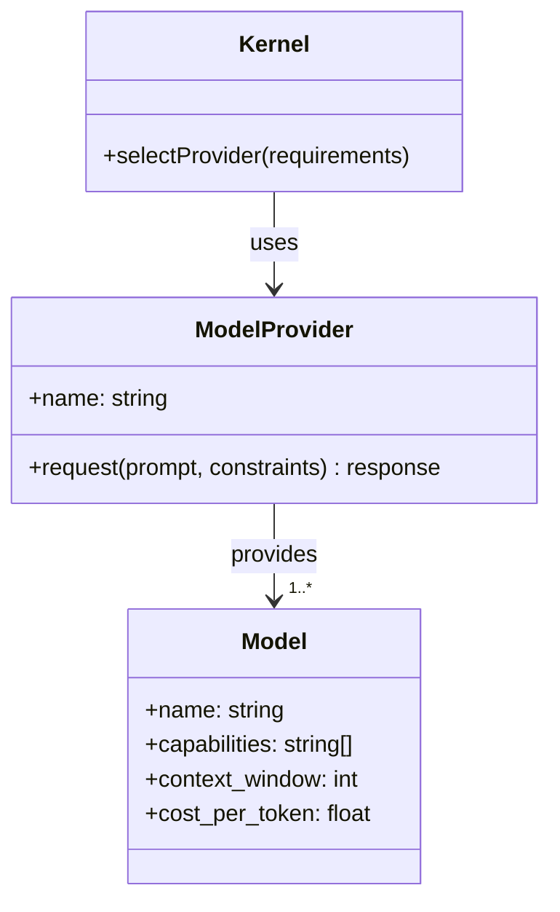
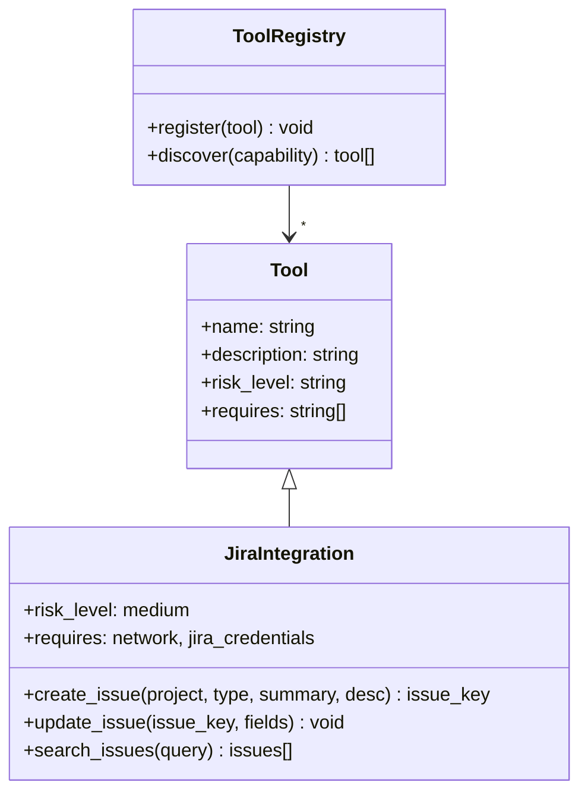
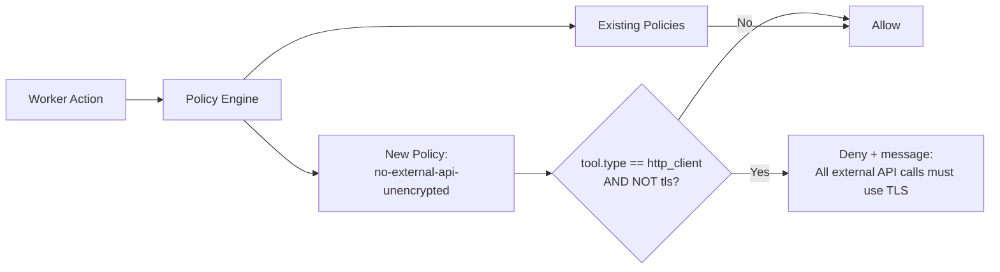

# Extensibility and Evolution

A system that cannot change is a system that is dying. Software, organizations, and ecosystems all follow the same rule: adapt or become irrelevant. The Agentic OS is designed to evolve — not through heroic rewrites but through incremental extension.

This chapter examines the mechanisms that make an Agentic OS extensible and the strategies that allow it to evolve gracefully over time.

## The Extensibility Imperative

Agentic systems face a uniquely aggressive extensibility challenge. Traditional software extends in response to new requirements — quarterly releases, annual roadmaps. Agentic systems must extend in response to new *capabilities* that emerge continuously:

- New models appear monthly, each with different strengths and context sizes.
- New tools and APIs proliferate daily.
- New domains become automatable as capabilities improve.
- New governance requirements emerge as regulations evolve.
- New operators join with different needs and workflows.

A system that requires a rewrite to accommodate a new model or a new tool is not an Agentic OS — it is a demo.

## Extension Points

The reference architecture provides extension points at every layer:

### Model Provider Extensions

Adding a new language model should require nothing more than implementing the provider interface:

The kernel does not know or care which model is running. It knows what capabilities it needs and what budget it has. The model provider layer handles the rest.

### Tool Extensions

New tools plug into the tool registry:

Once registered, the tool is immediately available to workers whose sandboxes grant access to it. No kernel changes, no process fabric changes, no redeployment of the core system.

### Skill Extensions

New skills are packages installed into the skill registry. They bring their own instructions, tool requirements, strategies, and validators. The kernel discovers them through the registry and uses them when task classification matches their domain.

### Policy Extensions

New governance policies are added to the policy engine:

Policies are additive. Adding a new policy does not require modifying existing ones. The policy engine evaluates all applicable policies for each action.

### Memory Extensions

New memory backends can be added without disrupting the memory API. The system might start with a local SQLite-based episodic memory and later switch to a distributed PostgreSQL cluster. The memory API abstraction ensures no worker is affected by the change.

## Evolution Strategies

Extensibility is the mechanism. Evolution strategy governs how the mechanism is used over time.

### Evolutionary Architecture

The Agentic OS follows the principle of evolutionary architecture: the system's structure supports guided, incremental change. Key practices:

- **Fitness functions**: Automated checks that verify the system still meets its design goals after a change. "Latency for simple requests is under 2 seconds." "All production actions are audit-logged." "No worker has access to tools outside its skill definition."
- **Sacrificial architecture**: Some components are designed to be replaced. The first memory implementation is not the last. Build it to be replaced, and replacing it will be painless.
- **Evolutionary pressure**: Track which components change most frequently. Frequent changes indicate either a volatile domain (expected) or poor boundaries (fix it).

### Versioning Strategy

Every extension point supports versioning:

- **Skills** are versioned. A task can pin to a specific version: "Use python-backend v2.3 for this project." New versions are opt-in until proven stable.
- **Policies** are versioned and timestamped. The audit log records which policy version was applied at each decision point.
- **Tools** are versioned. Tool API changes are handled through version negotiation between the tool registry and workers.
- **Model providers** are versioned. Model upgrades are rolled out gradually, with A/B testing against quality benchmarks.

### Migration Patterns

When a component must be replaced rather than extended, the system supports migration:

- **Parallel run**: The old and new components run simultaneously. Results are compared. When the new component matches or exceeds the old, traffic is shifted.
- **Shadow mode**: The new component processes all requests but its results are discarded. Only the old component's results are used. This validates the new component without risk.
- **Gradual rollout**: The new component handles an increasing percentage of requests. Metrics are monitored at each step.
- **Feature flags**: New capabilities are gated behind flags. They can be enabled per operator, per project, or per task type.

## The Plugin Architecture

For maximum extensibility, the Agentic OS supports a plugin model where third parties can extend the system without modifying its core.

### Plugin Types

- **Skill plugins**: Add new domains of expertise.
- **Tool plugins**: Add new integrations and capabilities.
- **Policy plugins**: Add new governance rules for specific compliance regimes.
- **Interface plugins**: Add new ways to interact with the system (Slack bot, email, custom UI).
- **Memory plugins**: Add specialized memory backends (graph databases, time-series stores).

### Plugin Safety

Plugins introduce code from outside the system's trust boundary. Safety measures include:

- **Sandboxing**: Plugins run in isolated environments. A malicious plugin cannot access the kernel's memory or another plugin's data.
- **Capability declaration**: Plugins must declare what resources they need. Undeclared access is denied.
- **Review and audit**: Plugins are reviewed before installation. Their behavior is audited during operation.
- **Revocation**: Plugins can be disabled or removed at any time without affecting the core system.

## Backward Compatibility

Evolution must not break existing functionality. The system maintains backward compatibility through:

- **Interface stability**: Published interfaces do not change within a major version. New capabilities are added as new interfaces, not modifications of existing ones.
- **Deprecation process**: Old interfaces are marked deprecated, supported for a defined period, then removed. Workers using deprecated interfaces receive warnings.
- **Compatibility layers**: When an interface must change, a compatibility layer translates between old and new formats, allowing gradual migration.

## The Cost of Extensibility

Extensibility is not free. Every extension point adds:

- **Indirection**: The code path from request to execution passes through more abstraction layers, making debugging harder.
- **Testing surface**: Each extension point multiplies the test matrix. N tools × M skills × P policies = N×M×P combinations to validate.
- **Documentation burden**: Every extension point must be documented well enough for third parties to use correctly.
- **Performance overhead**: Abstraction layers add latency. Registry lookups take time. Policy evaluations consume compute.

The goal is not maximum extensibility but *appropriate* extensibility. Extension points where change is expected (tools, skills, models) should be deeply extensible. Internal implementation details that are unlikely to change (the kernel loop, the scheduler algorithm) can be simpler and more direct.

## Evolution as a First-Class Concern

In traditional systems, extensibility is an afterthought — the team adds plugin support in version 3 after years of monolithic development. In the Agentic OS, extensibility is a founding principle because the domain demands it.

The landscape of AI models, tools, and applications changes faster than any single system can be rewritten. The only viable strategy is to build a system that expects change and makes change cheap. The Agentic OS does this through standard interfaces, pluggable components, versioned extensions, and evolutionary migration strategies.

The system that survives is not the most capable at launch. It is the one that can absorb new capabilities the fastest.
