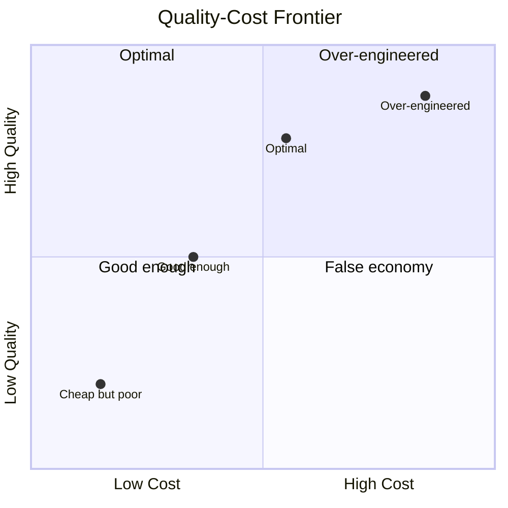

# Performance and Efficiency

Intelligence is expensive. Every model call costs money, every token consumes compute, every tool invocation takes time. An Agentic OS that produces excellent results but takes an hour and fifty dollars to fix a typo is not a useful system. Performance and efficiency are not optimizations to be added later — they are design constraints that shape the architecture from the start.

## The Cost Model

Understanding performance in an agentic system requires understanding where resources are consumed:

### Token Budget

The dominant cost in most agentic systems is language model invocations. Each call consumes input tokens (context) and output tokens (response). The cost equation:

$$
\text{Total cost} = \sum (\text{input\_tokens} \times \text{input\_price} + \text{output\_tokens} \times \text{output\_price})
$$

For a task that involves planning (one call), decomposition (one call), five workers (five calls each for execution and checking), and consolidation (one call), you might be looking at 13+ model calls. If each call uses 10,000 input tokens and 2,000 output tokens, that is 130,000 input tokens and 26,000 output tokens. At current prices, this is dollars, not cents.

### Latency

Sequential model calls dominate latency. A model call might take 2-10 seconds. Thirteen sequential calls take 30-130 seconds. For interactive use, this is painful. For batch processing, it is acceptable.

### Tool Invocation

Some tools are fast (file read: milliseconds). Some are slow (web search: seconds). Some are very slow (code execution with compilation: tens of seconds). Tool latency compounds with the number of steps.

### Coordination Overhead

Every message between the kernel and a worker, every memory retrieval, every policy evaluation adds overhead. In a multi-agent system with dozens of workers, coordination overhead can exceed the cost of actual work.

## Optimization Strategies

### Context Window Efficiency

The most impactful optimization is using context windows efficiently. Every unnecessary token is wasted money and diluted attention.

**Context pruning**: Include only what the worker needs. A worker fixing a bug in one function does not need the entire codebase. It needs the function, its callers, its tests, and the error report. Aggressive pruning reduces cost and improves quality — less noise means better signal.

**Summarization**: For large artifacts that must be referenced, use summaries rather than full text. The codebase summary, not the full codebase. The meeting notes, not the full transcript.

**Tiered context**: Start with minimal context. If the worker requests more (or fails due to insufficient context), expand incrementally. This is the "lazy loading" strategy for context.

**Context caching**: When multiple workers need the same context (e.g., the project's coding conventions), assemble it once and share the result. Many model providers support prompt caching that reduces cost for repeated prefixes.

### Model Selection

Not every task needs the most powerful model.

- **Classification** (routing requests, assessing risk) can use fast, cheap models.
- **Short generation** (variable names, commit messages) can use small models.
- **Complex reasoning** (planning, architecture decisions) needs capable models.
- **Embeddings** (memory retrieval) use embedding-specific models at a fraction of the cost.

The model provider layer should support automatic model selection based on task requirements. The kernel specifies what it needs (reasoning depth, output length, speed priority), and the provider selects appropriately.

### Parallelism

Sequential execution is the enemy of latency. When the task graph allows it, execute in parallel:

- Independent subtasks run simultaneously. If the plan has five independent steps, all five workers execute at once. Wall-clock time: the slowest worker, not the sum of all workers.
- Pre-fetch predictable needs. While a worker is executing, pre-assemble context for the next likely step.
- Speculative execution. Start work on the most likely next step before the current step confirms it is needed. Discard if wrong. This trades compute cost for latency.

### Caching

Many operations in an agentic system are repetitive:

- The same file is read by multiple workers.
- The same tools are invoked with similar parameters.
- The same governance policies are evaluated against similar actions.
- The same memory queries return similar results.

A caching layer at each boundary can eliminate redundant work:

- **Tool result cache**: Cache tool outputs keyed by (tool, parameters, timestamp). Invalidate when the underlying data changes.
- **Memory cache**: Cache frequent memory retrievals. Invalidate on writes.
- **Policy cache**: Cache policy evaluation results for identical (action, context) pairs within a time window.
- **Model cache**: Cache model responses for identical prompts. Useful for deterministic tasks like classification.

### Batching

Instead of invoking a tool once per item, batch:

- Read ten files at once, not ten separate reads.
- Run all tests in one invocation, not one test per invocation.
- Evaluate five policy rules against one action in one pass, not five passes.

Batching reduces round-trip overhead and often enables more efficient processing.

### Early Termination

Not every plan needs to run to completion. The kernel should detect when:

- The goal has been achieved before all steps are complete (remaining steps were contingency paths).
- The result is good enough and further refinement has diminishing returns.
- The task is impossible and continuing wastes resources.

Early termination saves the most expensive resource: time.

## Efficiency Metrics

You cannot optimize what you do not measure. The Agentic OS should track:

- **Tokens per task**: Total input and output tokens consumed for each task type. Trend this over time.
- **Cost per task**: Monetary cost broken down by model calls, tool invocations, and coordination.
- **Latency per task**: Wall-clock time from request to result. Break down into planning, execution, checking, and consolidation phases.
- **Retry rate**: How often steps are retried. High retry rates indicate either poor initial execution or poor error handling.
- **Context utilization**: What percentage of each context window is actually relevant to the task. Low utilization means poor context assembly; the system is paying for tokens the model ignores.
- **Cache hit rate**: How often caches prevent redundant work. Low hit rates mean the cache strategy needs revision.

### Efficiency Dashboards

Operators should have visibility into efficiency metrics:

- Which task types are most expensive?
- Which skills consume the most tokens?
- Where does latency accumulate?
- How does cost correlate with result quality?

This visibility enables informed decisions about where to invest in optimization.

## The Quality-Cost Frontier

Performance optimization in agentic systems is not about minimizing cost — it is about maximizing the quality-to-cost ratio. A system that produces mediocre results cheaply is worse than one that produces excellent results at moderate cost.

The quality-cost frontier describes the tradeoff:

Different tasks have different optimal points on this frontier:

- **Mission-critical code changes**: High quality justifies high cost. Use the best model, thorough validation, multiple review passes.
- **Routine formatting**: Low cost is essential. Use the cheapest model, minimal validation, no review.
- **Exploratory research**: Moderate cost, with the budget allocated to breadth (many searches) rather than depth (expensive model calls).

The kernel's task classifier should map each task to its appropriate quality-cost target.

## Resource Governance

The budget controller in the governance plane enforces resource limits:

- **Per-task budgets**: Maximum tokens and cost per individual task. Prevents runaway processes.
- **Per-session budgets**: Maximum spend per interaction session. Gives operators predictable costs.
- **Per-period budgets**: Maximum spend per day, week, or month. Prevents budget surprises.
- **Burst limits**: Allow short bursts above the per-task limit for complex operations, with a refill rate.

When a budget is exhausted at any level, the system must make an explicit decision: stop the work, request a budget increase from the operator, or proceed with a cheaper approach.

Budget exhaustion should never be silent. The system reports what it could not complete and why, giving the operator the information to decide whether to allocate more resources.

## The Efficiency Flywheel

The most powerful efficiency strategy is the learning loop. As the system operates, it accumulates knowledge that makes future operations cheaper:

- **Learned context**: The system knows which files are relevant to which tasks, reducing context assembly cost.
- **Cached strategies**: The system knows which approach works for which task type, reducing planning cost.
- **Calibrated models**: The system knows which model is needed for which task, avoiding over-provisioning.
- **Refined policies**: The system knows which actions are always safe, reducing governance overhead.

Each task the system successfully completes makes the next similar task cheaper and faster. This is the efficiency flywheel: performance improves with use, not just with engineering effort.

An Agentic OS that lacks these performance mechanisms will work — but it will work _slowly_ and _expensively_. In a world where intelligence is a commodity, the differentiator is not capability but the efficiency with which capability is applied.
