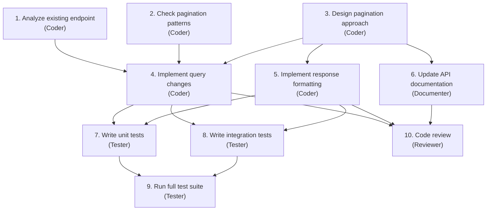
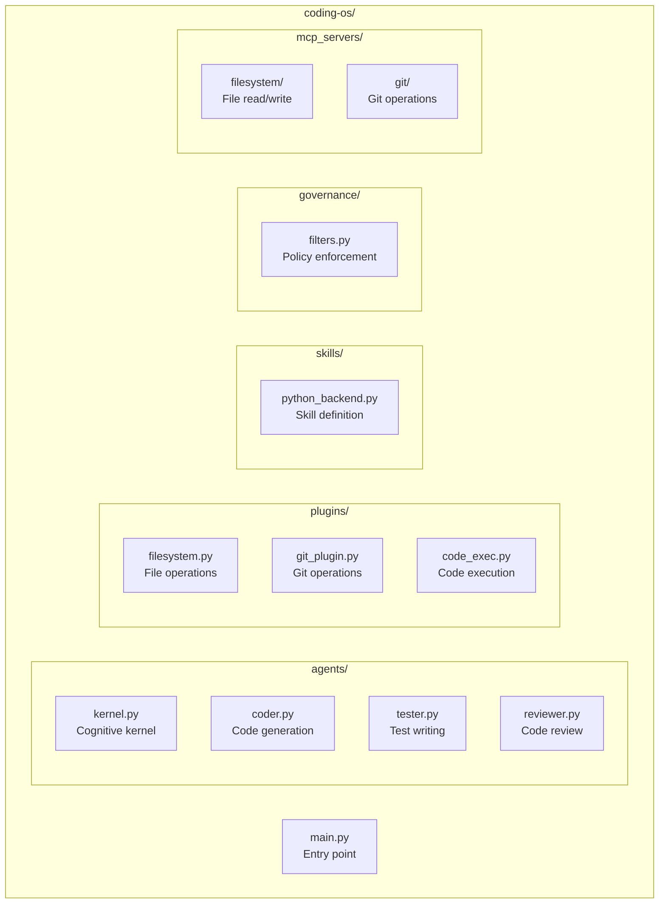

# Coding OS

The most natural application of the Agentic OS model is software development itself. Developers already think in processes, contexts, tools, and workflows. The mental model transfers directly. This chapter walks through a Coding OS — an Agentic OS specialized for building, maintaining, and evolving software.

## The Domain

Software development is uniquely suited for agentic systems because it has:

- **Formal verification**: Code either compiles or it does not. Tests either pass or they do not. There is ground truth.
- **Rich tooling**: Compilers, linters, test runners, debuggers, version control — a deep ecosystem of tools that can be invoked programmatically.
- **Structured artifacts**: Source code, configuration files, schemas, tests — all machine-readable.
- **Clear workflows**: Feature development, bug fixing, code review, deployment — well-defined processes with known steps.
- **Measurable quality**: Test coverage, type safety, lint compliance, performance benchmarks — quantifiable outcomes.

These properties make software development a domain where agentic systems can operate with high autonomy and measurable results.

## Architecture

The Coding OS instantiates the reference architecture with domain-specific components:

### Cognitive Kernel

The kernel understands software development intents:

- "Fix this bug" → Reproduce, diagnose, patch, test, verify.
- "Add this feature" → Understand requirements, design, implement, test, document.
- "Review this PR" → Read changes, check quality, verify tests, assess risk, provide feedback.
- "Refactor this module" → Analyze dependencies, plan changes, execute incrementally, verify behavior preservation.

Each intent maps to a known decomposition strategy with domain-specific success criteria.

### Process Fabric

Workers are specialized by development activity:

- **Coder**: Writes and modifies source code. Has access to file operations, language servers, and code execution.
- **Tester**: Writes and runs tests. Has access to test frameworks, coverage tools, and assertion libraries.
- **Reviewer**: Analyzes code quality. Has access to linting tools, static analysis, and project conventions.
- **Debugger**: Diagnoses failures. Has access to logs, stack traces, breakpoint tools, and runtime inspection.
- **Documenter**: Writes and updates documentation. Has access to doc generators, README templates, and API references.

Each worker type has a scoped sandbox. The coder can write files but not deploy. The reviewer can read but not modify. The tester can execute code in sandboxes but not in production.

### Memory Plane

The Coding OS memory plane includes:

- **Codebase map**: A structural understanding of the project — modules, dependencies, entry points, hot paths. Updated on every significant change.
- **Convention memory**: The project's coding standards, patterns, and anti-patterns. Learned from existing code and explicit configuration.
- **Bug history**: Past bugs, their root causes, and their fixes. Used to inform diagnosis of new bugs ("this module had a race condition last month — check for similar issues").
- **Review history**: Past review feedback and recurring issues. Used to pre-check code before it reaches a human reviewer.
- **Deployment history**: Past deployments, their outcomes, and any incidents. Used to assess risk of new changes.

### Governance

Coding-specific policies:

- **No direct production access**: Workers cannot modify production systems. Deployment requires explicit approval.
- **Test coverage gates**: New code must meet minimum test coverage thresholds.
- **Review requirements**: Changes above a complexity threshold require human review before merge.
- **Dependency policies**: New dependencies must be from approved sources and pass security scanning.
- **Branch protection**: Workers operate on feature branches. Main branch modifications require approval.

## Workflow: Feature Development

A complete feature development workflow in the Coding OS:

### 1. Intent Interpretation

The operator says: "Add pagination to the user list API endpoint."

The kernel interprets:
- Surface intent: Add pagination.
- Operational intent: Modify the existing endpoint, not create a new one. Use cursor-based or offset-based pagination consistent with other endpoints.
- Boundary intent: Do not change the existing response format for non-paginated requests. Maintain backward compatibility.

### 2. Decomposition

The kernel produces a task graph:



Steps 1, 2 run in parallel. Steps 4, 5, 6 run in parallel after 3 completes. Steps 7, 8 run in parallel.

### 3. Execution

Each worker executes its step with focused context:

- The coder analyzing the existing endpoint gets the endpoint file, the router configuration, and the database query layer.
- The coder checking pagination patterns gets examples of pagination from other endpoints in the project.
- The tester writing unit tests gets the implementation, the test framework patterns used in the project, and the success criteria.

### 4. Verification

The check phase runs at multiple levels:

- Does the code compile? (Automated)
- Do the new tests pass? (Automated)
- Do all existing tests still pass? (Automated — regression check)
- Does the implementation match the pagination patterns used elsewhere? (Reviewer)
- Is the documentation accurate? (Reviewer)

### 5. Result

The operator receives a ready-to-merge branch with:
- Implementation across the necessary files.
- Tests with passing results.
- Updated documentation.
- A summary of what was done and why specific decisions were made.

## Workflow: Bug Fixing

Bug fixing follows a different decomposition:

### 1. Reproduction

The debugger worker attempts to reproduce the bug. It reads the bug report, identifies the relevant code path, writes a failing test that demonstrates the bug, and confirms the test fails.

If reproduction fails, the system escalates: "I could not reproduce this bug. Here is what I tried. Can you provide additional context?"

### 2. Diagnosis

With a reliable reproduction, the debugger analyzes the failing test:
- What is the expected behavior?
- What is the actual behavior?
- Where does the code path diverge from expectation?

The debugger uses the bug history memory: "A similar symptom in this module was caused by a missing null check in v2.3."

### 3. Fix

The coder writes the fix, constrained by:
- Minimality: Change as little as possible.
- Safety: Do not introduce new failure modes.
- Consistency: Follow existing patterns.

### 4. Verification

The tester verifies:
- The failing test now passes.
- No existing tests broke.
- Edge cases related to the fix are covered.

### 5. Prevention

The system updates its memory: "Bug in user lookup caused by case-sensitive comparison. Added to convention memory: always use case-insensitive comparison for email fields."

## The IDE Integration

The Coding OS is most powerful when integrated into the developer's IDE:

- **Context awareness**: The system knows what file is open, what line the cursor is on, what errors are highlighted, what branch is checked out.
- **Inline suggestions**: Instead of a separate chat, the system provides suggestions inline — fix proposals next to errors, test suggestions next to new functions.
- **Background operations**: The system runs continuous checks in the background — linting, security scanning, convention compliance — and surfaces issues proactively.
- **Progressive disclosure**: Simple fixes are applied with one click. Complex changes are previewed as diffs. Major refactors are presented as plans for review.

## Metrics

A Coding OS should track its own effectiveness:

- **Fix success rate**: What percentage of bug fixes pass review on the first attempt?
- **Feature completion rate**: What percentage of features are delivered without re-work?
- **Time to resolution**: How long from request to merged PR?
- **Regression rate**: How often do changes introduce new bugs?
- **Cost per task**: How much does it cost (in tokens, model calls, time) to complete each task type?

These metrics feed back into the system's learning loop, improving decomposition strategies, context assembly, and model selection over time.

## What Makes This an OS, Not a Tool

A code generation tool writes code. A Coding OS *develops software*. The difference is the full lifecycle: understanding intent, planning work, coordinating specialists, verifying quality, learning from outcomes, and adapting over time.

The tool answers: "What code should I generate?"
The OS answers: "How should this software be built?"

That is the shift from tool to operating system, applied to the domain where it is most natural.

## Reference Implementation

This section provides a concrete implementation of the Coding OS using the **Microsoft Agent Framework** (Semantic Kernel) in Python, with MCP servers for tool isolation.

### Project Structure



### Plugins (SK Skills)

In Semantic Kernel, capabilities are exposed as **plugins** — classes with `@kernel_function` decorated methods. Each plugin is the equivalent of an operator in the Agentic OS model:

```python
# plugins/filesystem.py
import os
from typing import Annotated
from semantic_kernel.functions import kernel_function

# Governance: restrict to project directory
ALLOWED_ROOT = os.environ.get("PROJECT_ROOT", "/workspace")

class FilesystemPlugin:
    """File operations scoped to the project directory."""

    @kernel_function(description="Read a file from the project directory.")
    def file_read(
        self, path: Annotated[str, "Relative path to the file"]
    ) -> Annotated[str, "File contents"]:
        full_path = os.path.join(ALLOWED_ROOT, path)
        # Security: prevent path traversal
        if not os.path.realpath(full_path).startswith(os.path.realpath(ALLOWED_ROOT)):
            raise PermissionError(f"Access denied: {path} is outside project scope")
        with open(full_path, "r") as f:
            return f.read()

    @kernel_function(description="Write content to a file in the project directory.")
    def file_write(
        self,
        path: Annotated[str, "Relative path to the file"],
        content: Annotated[str, "Content to write"],
    ) -> Annotated[str, "Confirmation message"]:
        full_path = os.path.join(ALLOWED_ROOT, path)
        if not os.path.realpath(full_path).startswith(os.path.realpath(ALLOWED_ROOT)):
            raise PermissionError(f"Access denied: {path} is outside project scope")
        os.makedirs(os.path.dirname(full_path), exist_ok=True)
        with open(full_path, "w") as f:
            f.write(content)
        return f"Written {len(content)} bytes to {path}"

    @kernel_function(description="Search for files matching a glob pattern.")
    def file_search(
        self,
        pattern: Annotated[str, "Glob pattern to search for"],
    ) -> Annotated[list[str], "Matching file paths"]:
        import glob
        matches = glob.glob(
            os.path.join(ALLOWED_ROOT, pattern), recursive=True
        )
        return [os.path.relpath(m, ALLOWED_ROOT) for m in matches[:50]]
```

```python
# plugins/git_plugin.py
import subprocess
from typing import Annotated
from semantic_kernel.functions import kernel_function

class GitPlugin:
    """Git operations for version control."""

    @kernel_function(description="Get the diff of current changes.")
    def git_diff(
        self, ref: Annotated[str, "Git reference to diff against"] = "HEAD"
    ) -> Annotated[str, "The diff output"]:
        result = subprocess.run(
            ["git", "diff", ref], capture_output=True, text=True, timeout=30
        )
        return result.stdout[:10000]

    @kernel_function(description="Get recent commit history.")
    def git_log(
        self, count: Annotated[int, "Number of commits"] = 10
    ) -> Annotated[str, "Commit log"]:
        result = subprocess.run(
            ["git", "log", f"-{count}", "--oneline"],
            capture_output=True, text=True,
        )
        return result.stdout

    @kernel_function(description="Create and checkout a new branch.")
    def git_create_branch(
        self, name: Annotated[str, "Branch name"]
    ) -> Annotated[str, "Confirmation"]:
        subprocess.run(["git", "checkout", "-b", name], check=True)
        return f"Created and checked out branch: {name}"
```

### Agents (Subagents as ChatCompletionAgent)

Each worker in the Agentic OS maps to a `ChatCompletionAgent` with scoped plugins and instructions:

```python
# agents/coder.py
from semantic_kernel.agents import ChatCompletionAgent
from semantic_kernel.connectors.ai.open_ai import AzureChatCompletion

def create_coder_agent(service: AzureChatCompletion) -> ChatCompletionAgent:
    """Create a coder agent with file and code execution capabilities."""
    from plugins.filesystem import FilesystemPlugin
    from plugins.code_exec import CodeExecPlugin

    return ChatCompletionAgent(
        service=service,
        name="Coder",
        instructions="""You are a code implementation specialist.
You write clean, tested, production-ready code.
Follow the project's existing patterns and conventions.

Rules:
- Read existing code before modifying it
- Follow PEP 8 and use type hints
- Keep changes minimal and focused
- Never modify files outside your task scope""",
        plugins=[FilesystemPlugin(), CodeExecPlugin()],
    )
```

```python
# agents/tester.py
from semantic_kernel.agents import ChatCompletionAgent

def create_tester_agent(service) -> ChatCompletionAgent:
    """Create a tester agent — can read files and run tests, not write prod code."""
    from plugins.filesystem import FilesystemPlugin
    from plugins.code_exec import CodeExecPlugin

    return ChatCompletionAgent(
        service=service,
        name="Tester",
        instructions="""You are a test specialist. You write and run tests.
Write tests using pytest. Cover happy path, edge cases, and error cases.
Never modify production code — only test files.""",
        # Capability scoping: tester gets file read + code exec, scoped to tests
        plugins=[FilesystemPlugin(), CodeExecPlugin()],
    )
```

```python
# agents/reviewer.py
from semantic_kernel.agents import ChatCompletionAgent

def create_reviewer_agent(service) -> ChatCompletionAgent:
    """Create a reviewer agent — read-only access, no file writes."""
    from plugins.filesystem import FilesystemPlugin
    from plugins.git_plugin import GitPlugin

    return ChatCompletionAgent(
        service=service,
        name="Reviewer",
        instructions="""You are a code review specialist.
Review code for quality, security, correctness, and style.
Identify issues by severity: critical, major, minor.
Never modify code — only review and report findings.""",
        # Capability scoping: reviewer gets read-only tools
        plugins=[FilesystemPlugin(), GitPlugin()],
    )
```

### Cognitive Kernel: Sequential Orchestration

The kernel coordinates agents using Semantic Kernel's orchestration patterns. For a feature workflow (code → test → review), a `SequentialOrchestration` maps directly to the Planner-Executor pattern:

```python
# agents/kernel.py
import asyncio
from semantic_kernel.agents import ChatCompletionAgent, SequentialOrchestration
from semantic_kernel.agents.runtime import InProcessRuntime
from semantic_kernel.connectors.ai.open_ai import AzureChatCompletion

from agents.coder import create_coder_agent
from agents.tester import create_tester_agent
from agents.reviewer import create_reviewer_agent

async def run_feature_workflow(request: str) -> str:
    """
    Cognitive kernel: orchestrate coder → tester → reviewer
    using Semantic Kernel's SequentialOrchestration.
    """
    # Model provider layer
    service = AzureChatCompletion(
        deployment_name="gpt-4.1",
        endpoint="https://your-endpoint.openai.azure.com/",
    )

    # Create specialized agents (subagents with scoped capabilities)
    coder = create_coder_agent(service)
    tester = create_tester_agent(service)
    reviewer = create_reviewer_agent(service)

    # Sequential orchestration: Coder → Tester → Reviewer
    # Maps to the Pipeline coordination pattern (Ch. 23)
    orchestration = SequentialOrchestration(
        members=[coder, tester, reviewer],
    )

    # Start the in-process runtime
    runtime = InProcessRuntime()
    await runtime.start()

    # Invoke the orchestration with the user's request
    result = await orchestration.invoke(
        task=request,
        runtime=runtime,
    )
    output = await result.get()

    await runtime.stop_when_idle()
    return output


# For more complex tasks, use GroupChatOrchestration for adversarial patterns
async def run_review_cycle(request: str) -> str:
    """
    Adversarial pattern: Coder and Reviewer iterate until quality is met.
    Maps to GroupChatOrchestration (Ch. 23 Adversarial topology).
    """
    from semantic_kernel.agents import GroupChatOrchestration
    from semantic_kernel.agents.strategies import (
        KernelFunctionSelectionStrategy,
        KernelFunctionTerminationStrategy,
    )
    from semantic_kernel import Kernel

    service = AzureChatCompletion(
        deployment_name="gpt-4.1",
        endpoint="https://your-endpoint.openai.azure.com/",
    )
    coder = create_coder_agent(service)
    reviewer = create_reviewer_agent(service)

    # The manager kernel decides turn-taking and termination
    manager_kernel = Kernel()
    manager_kernel.add_service(service)

    orchestration = GroupChatOrchestration(
        members=[coder, reviewer],
        manager=manager_kernel,
        # Terminate when reviewer approves
        max_rounds=6,
    )

    runtime = InProcessRuntime()
    await runtime.start()
    result = await orchestration.invoke(task=request, runtime=runtime)
    output = await result.get()
    await runtime.stop_when_idle()
    return output
```

### Governance: SK Function Filters

Semantic Kernel provides **filters** — interceptors that wrap function calls. This is the natural implementation of the Governance Plane's middleware pattern:

```python
# governance/filters.py
import time
import logging
from semantic_kernel.filters import FunctionInvocationContext
from semantic_kernel import Kernel

logger = logging.getLogger("governance")

# Capability scoping per agent
AGENT_CAPABILITIES = {
    "Coder": {"file_read", "file_write", "file_search", "code_exec",
              "git_diff", "git_create_branch"},
    "Tester": {"file_read", "file_search", "code_exec"},
    "Reviewer": {"file_read", "file_search", "git_diff", "git_log"},
}

class GovernanceFilter:
    """
    SK Function Filter that enforces governance policies.
    Maps to the Permission Gate and Auditable Action patterns.
    """

    def __init__(self):
        self.audit_log = []
        self.budget_remaining = 50000  # tokens

    async def on_function_invocation(
        self, context: FunctionInvocationContext, next
    ):
        function_name = context.function.name
        agent_name = context.arguments.get("agent_name", "unknown")

        # Pre-action: Capability check
        allowed = AGENT_CAPABILITIES.get(agent_name, set())
        if function_name not in allowed and allowed:
            logger.warning(f"DENIED: {agent_name} cannot use {function_name}")
            context.result = "Permission denied: insufficient capabilities"
            return

        # Pre-action: Budget check
        if self.budget_remaining <= 0:
            logger.warning("DENIED: Budget exhausted")
            context.result = "Budget exhausted"
            return

        # Execute the function
        start = time.time()
        await next(context)
        elapsed = time.time() - start

        # Post-action: Audit logging
        self.audit_log.append({
            "timestamp": time.time(),
            "agent": agent_name,
            "function": function_name,
            "elapsed_ms": int(elapsed * 1000),
        })
        logger.info(f"AUDIT: {agent_name} → {function_name} ({elapsed:.2f}s)")


def apply_governance(kernel: Kernel):
    """Register governance filters on a kernel instance."""
    gov = GovernanceFilter()
    kernel.add_filter("function_invocation", gov.on_function_invocation)
    return gov
```

### Skill Definition

Skills package domain knowledge as reusable configurations:

```python
# skills/python_backend.py
"""
A Skill in the Agentic OS is a bundle of instructions, plugin selections,
and strategies. In Semantic Kernel, this maps to a combination of:
- Agent instructions (system prompt)
- Plugin selection (which kernel_functions are available)
- Prompt templates (reusable patterns)
"""

PYTHON_BACKEND_SKILL = {
    "name": "python-backend",
    "description": "Develop Python backend services",
    "agent_instructions": """
Follow PEP 8. Use type hints on all public functions.
Write tests for all public functions using pytest.
Prefer composition over inheritance.
Handle errors explicitly — no bare except clauses.
Use Pydantic for data validation at API boundaries.
    """,
    "plugins": ["FilesystemPlugin", "CodeExecPlugin", "GitPlugin"],
    "strategies": {
        "new_endpoint": [
            "Read existing router to understand patterns",
            "Define Pydantic request/response models",
            "Implement the route handler",
            "Add input validation",
            "Write unit tests",
            "Update API documentation",
        ],
        "fix_bug": [
            "Read the bug report and identify the relevant code",
            "Write a failing test that reproduces the bug",
            "Fix the code to make the test pass",
            "Run the full test suite to check for regressions",
        ],
    },
}
```

### Running It

```python
# main.py
import asyncio
from agents.kernel import run_feature_workflow

async def main():
    result = await run_feature_workflow(
        "Add pagination to the user list API endpoint"
    )
    print(result)

if __name__ == "__main__":
    asyncio.run(main())
```

### MCP Integration

MCP servers provide tool isolation. Connect agents to MCP tools via Semantic Kernel's MCP integration:

```json
{
  "mcpServers": {
    "filesystem": {
      "command": "python",
      "args": ["mcp_servers/filesystem/server.py"],
      "env": { "PROJECT_ROOT": "/workspace/my-project" }
    },
    "git": {
      "command": "python",
      "args": ["mcp_servers/git/server.py"]
    }
  }
}
```

This implementation demonstrates the core patterns: the **kernel** (SK orchestration with Sequential and GroupChat patterns), **workers** (`ChatCompletionAgent` subagents with scoped plugins), **plugins** (`@kernel_function` decorated methods as operators), **skills** (packaged instructions and strategies), and **governance** (SK function filters for capability checks, budget enforcement, and audit logging).

---

> **Try it yourself**: The complete Coding OS — agents, skills, instructions, MCP config, and a sample To-Do API project with a hands-on tutorial — is available at [`implementations/coding-os/`](https://github.com/marcelaldecoa/TheAgenticOS/tree/main/implementations/coding-os). Copy the `.github/` folder into your project and start using `@coder`, `@tester`, `@reviewer`, `/fix-bug`, and `/new-feature` immediately.
