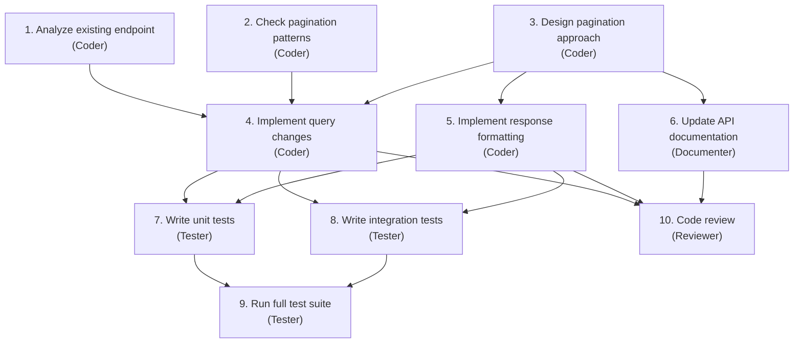

# Coding OS

The most natural application of the Agentic OS model is software development itself. Developers already think in processes, contexts, tools, and workflows. The mental model transfers directly. This chapter walks through a Coding OS — an Agentic OS specialized for building, maintaining, and evolving software.

## The Domain

Software development is uniquely suited for agentic systems because it has:

- **Formal verification**: Code either compiles or it does not. Tests either pass or they do not. There is ground truth.
- **Rich tooling**: Compilers, linters, test runners, debuggers, version control — a deep ecosystem of tools that can be invoked programmatically.
- **Structured artifacts**: Source code, configuration files, schemas, tests — all machine-readable.
- **Clear workflows**: Feature development, bug fixing, code review, deployment — well-defined processes with known steps.
- **Measurable quality**: Test coverage, type safety, lint compliance, performance benchmarks — quantifiable outcomes.

These properties make software development a domain where agentic systems can operate with high autonomy and measurable results.

## Architecture

The Coding OS instantiates the reference architecture with domain-specific components:

### Cognitive Kernel

The kernel understands software development intents:

- "Fix this bug" → Reproduce, diagnose, patch, test, verify.
- "Add this feature" → Understand requirements, design, implement, test, document.
- "Review this PR" → Read changes, check quality, verify tests, assess risk, provide feedback.
- "Refactor this module" → Analyze dependencies, plan changes, execute incrementally, verify behavior preservation.

Each intent maps to a known decomposition strategy with domain-specific success criteria.

### Process Fabric

Workers are specialized by development activity:

- **Coder**: Writes and modifies source code. Has access to file operations, language servers, and code execution.
- **Tester**: Writes and runs tests. Has access to test frameworks, coverage tools, and assertion libraries.
- **Reviewer**: Analyzes code quality. Has access to linting tools, static analysis, and project conventions.
- **Debugger**: Diagnoses failures. Has access to logs, stack traces, breakpoint tools, and runtime inspection.
- **Documenter**: Writes and updates documentation. Has access to doc generators, README templates, and API references.

Each worker type has a scoped sandbox. The coder can write files but not deploy. The reviewer can read but not modify. The tester can execute code in sandboxes but not in production.

### Memory Plane

The Coding OS memory plane includes:

- **Codebase map**: A structural understanding of the project — modules, dependencies, entry points, hot paths. Updated on every significant change.
- **Convention memory**: The project's coding standards, patterns, and anti-patterns. Learned from existing code and explicit configuration.
- **Bug history**: Past bugs, their root causes, and their fixes. Used to inform diagnosis of new bugs ("this module had a race condition last month — check for similar issues").
- **Review history**: Past review feedback and recurring issues. Used to pre-check code before it reaches a human reviewer.
- **Deployment history**: Past deployments, their outcomes, and any incidents. Used to assess risk of new changes.

### Governance

Coding-specific policies:

- **No direct production access**: Workers cannot modify production systems. Deployment requires explicit approval.
- **Test coverage gates**: New code must meet minimum test coverage thresholds.
- **Review requirements**: Changes above a complexity threshold require human review before merge.
- **Dependency policies**: New dependencies must be from approved sources and pass security scanning.
- **Branch protection**: Workers operate on feature branches. Main branch modifications require approval.

## Workflow: Feature Development

A complete feature development workflow in the Coding OS:

### 1. Intent Interpretation

The operator says: "Add pagination to the user list API endpoint."

The kernel interprets:
- Surface intent: Add pagination.
- Operational intent: Modify the existing endpoint, not create a new one. Use cursor-based or offset-based pagination consistent with other endpoints.
- Boundary intent: Do not change the existing response format for non-paginated requests. Maintain backward compatibility.

### 2. Decomposition

The kernel produces a task graph:

Steps 1, 2 run in parallel. Steps 4, 5, 6 run in parallel after 3 completes. Steps 7, 8 run in parallel.

### 3. Execution

Each worker executes its step with focused context:

- The coder analyzing the existing endpoint gets the endpoint file, the router configuration, and the database query layer.
- The coder checking pagination patterns gets examples of pagination from other endpoints in the project.
- The tester writing unit tests gets the implementation, the test framework patterns used in the project, and the success criteria.

### 4. Verification

The check phase runs at multiple levels:

- Does the code compile? (Automated)
- Do the new tests pass? (Automated)
- Do all existing tests still pass? (Automated — regression check)
- Does the implementation match the pagination patterns used elsewhere? (Reviewer)
- Is the documentation accurate? (Reviewer)

### 5. Result

The operator receives a ready-to-merge branch with:
- Implementation across the necessary files.
- Tests with passing results.
- Updated documentation.
- A summary of what was done and why specific decisions were made.

## Workflow: Bug Fixing

Bug fixing follows a different decomposition:

### 1. Reproduction

The debugger worker attempts to reproduce the bug. It reads the bug report, identifies the relevant code path, writes a failing test that demonstrates the bug, and confirms the test fails.

If reproduction fails, the system escalates: "I could not reproduce this bug. Here is what I tried. Can you provide additional context?"

### 2. Diagnosis

With a reliable reproduction, the debugger analyzes the failing test:
- What is the expected behavior?
- What is the actual behavior?
- Where does the code path diverge from expectation?

The debugger uses the bug history memory: "A similar symptom in this module was caused by a missing null check in v2.3."

### 3. Fix

The coder writes the fix, constrained by:
- Minimality: Change as little as possible.
- Safety: Do not introduce new failure modes.
- Consistency: Follow existing patterns.

### 4. Verification

The tester verifies:
- The failing test now passes.
- No existing tests broke.
- Edge cases related to the fix are covered.

### 5. Prevention

The system updates its memory: "Bug in user lookup caused by case-sensitive comparison. Added to convention memory: always use case-insensitive comparison for email fields."

## The IDE Integration

The Coding OS is most powerful when integrated into the developer's IDE:

- **Context awareness**: The system knows what file is open, what line the cursor is on, what errors are highlighted, what branch is checked out.
- **Inline suggestions**: Instead of a separate chat, the system provides suggestions inline — fix proposals next to errors, test suggestions next to new functions.
- **Background operations**: The system runs continuous checks in the background — linting, security scanning, convention compliance — and surfaces issues proactively.
- **Progressive disclosure**: Simple fixes are applied with one click. Complex changes are previewed as diffs. Major refactors are presented as plans for review.

## Metrics

A Coding OS should track its own effectiveness:

- **Fix success rate**: What percentage of bug fixes pass review on the first attempt?
- **Feature completion rate**: What percentage of features are delivered without re-work?
- **Time to resolution**: How long from request to merged PR?
- **Regression rate**: How often do changes introduce new bugs?
- **Cost per task**: How much does it cost (in tokens, model calls, time) to complete each task type?

These metrics feed back into the system's learning loop, improving decomposition strategies, context assembly, and model selection over time.

## What Makes This an OS, Not a Tool

A code generation tool writes code. A Coding OS *develops software*. The difference is the full lifecycle: understanding intent, planning work, coordinating specialists, verifying quality, learning from outcomes, and adapting over time.

The tool answers: "What code should I generate?"
The OS answers: "How should this software be built?"

That is the shift from tool to operating system, applied to the domain where it is most natural.
