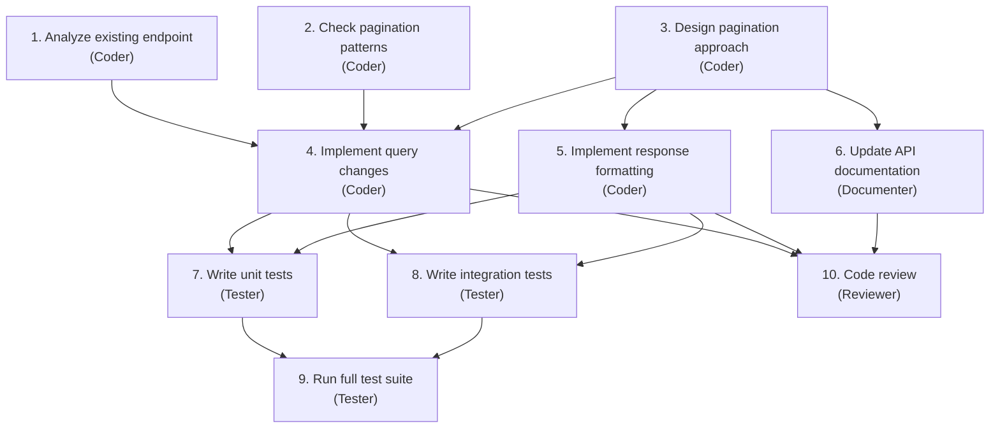

# Coding OS

The most natural application of the Agentic OS model is software development itself. Developers already think in processes, contexts, tools, and workflows. The mental model transfers directly. This chapter walks through a Coding OS — an Agentic OS specialized for building, maintaining, and evolving software.

## The Domain

Software development is uniquely suited for agentic systems because it has:

- **Formal verification**: Code either compiles or it does not. Tests either pass or they do not. There is ground truth.
- **Rich tooling**: Compilers, linters, test runners, debuggers, version control — a deep ecosystem of tools that can be invoked programmatically.
- **Structured artifacts**: Source code, configuration files, schemas, tests — all machine-readable.
- **Clear workflows**: Feature development, bug fixing, code review, deployment — well-defined processes with known steps.
- **Measurable quality**: Test coverage, type safety, lint compliance, performance benchmarks — quantifiable outcomes.

These properties make software development a domain where agentic systems can operate with high autonomy and measurable results.

## Architecture

The Coding OS instantiates the reference architecture with domain-specific components:

### Cognitive Kernel

The kernel understands software development intents:

- "Fix this bug" → Reproduce, diagnose, patch, test, verify.
- "Add this feature" → Understand requirements, design, implement, test, document.
- "Review this PR" → Read changes, check quality, verify tests, assess risk, provide feedback.
- "Refactor this module" → Analyze dependencies, plan changes, execute incrementally, verify behavior preservation.

Each intent maps to a known decomposition strategy with domain-specific success criteria.

### Process Fabric

Workers are specialized by development activity:

- **Coder**: Writes and modifies source code. Has access to file operations, language servers, and code execution.
- **Tester**: Writes and runs tests. Has access to test frameworks, coverage tools, and assertion libraries.
- **Reviewer**: Analyzes code quality. Has access to linting tools, static analysis, and project conventions.
- **Debugger**: Diagnoses failures. Has access to logs, stack traces, breakpoint tools, and runtime inspection.
- **Documenter**: Writes and updates documentation. Has access to doc generators, README templates, and API references.

Each worker type has a scoped sandbox. The coder can write files but not deploy. The reviewer can read but not modify. The tester can execute code in sandboxes but not in production.

### Memory Plane

The Coding OS memory plane includes:

- **Codebase map**: A structural understanding of the project — modules, dependencies, entry points, hot paths. Updated on every significant change.
- **Convention memory**: The project's coding standards, patterns, and anti-patterns. Learned from existing code and explicit configuration.
- **Bug history**: Past bugs, their root causes, and their fixes. Used to inform diagnosis of new bugs ("this module had a race condition last month — check for similar issues").
- **Review history**: Past review feedback and recurring issues. Used to pre-check code before it reaches a human reviewer.
- **Deployment history**: Past deployments, their outcomes, and any incidents. Used to assess risk of new changes.

### Governance

Coding-specific policies:

- **No direct production access**: Workers cannot modify production systems. Deployment requires explicit approval.
- **Test coverage gates**: New code must meet minimum test coverage thresholds.
- **Review requirements**: Changes above a complexity threshold require human review before merge.
- **Dependency policies**: New dependencies must be from approved sources and pass security scanning.
- **Branch protection**: Workers operate on feature branches. Main branch modifications require approval.

## Workflow: Feature Development

A complete feature development workflow in the Coding OS:

### 1. Intent Interpretation

The operator says: "Add pagination to the user list API endpoint."

The kernel interprets:
- Surface intent: Add pagination.
- Operational intent: Modify the existing endpoint, not create a new one. Use cursor-based or offset-based pagination consistent with other endpoints.
- Boundary intent: Do not change the existing response format for non-paginated requests. Maintain backward compatibility.

### 2. Decomposition

The kernel produces a task graph:



Steps 1, 2 run in parallel. Steps 4, 5, 6 run in parallel after 3 completes. Steps 7, 8 run in parallel.

### 3. Execution

Each worker executes its step with focused context:

- The coder analyzing the existing endpoint gets the endpoint file, the router configuration, and the database query layer.
- The coder checking pagination patterns gets examples of pagination from other endpoints in the project.
- The tester writing unit tests gets the implementation, the test framework patterns used in the project, and the success criteria.

### 4. Verification

The check phase runs at multiple levels:

- Does the code compile? (Automated)
- Do the new tests pass? (Automated)
- Do all existing tests still pass? (Automated — regression check)
- Does the implementation match the pagination patterns used elsewhere? (Reviewer)
- Is the documentation accurate? (Reviewer)

### 5. Result

The operator receives a ready-to-merge branch with:
- Implementation across the necessary files.
- Tests with passing results.
- Updated documentation.
- A summary of what was done and why specific decisions were made.

## Workflow: Bug Fixing

Bug fixing follows a different decomposition:

### 1. Reproduction

The debugger worker attempts to reproduce the bug. It reads the bug report, identifies the relevant code path, writes a failing test that demonstrates the bug, and confirms the test fails.

If reproduction fails, the system escalates: "I could not reproduce this bug. Here is what I tried. Can you provide additional context?"

### 2. Diagnosis

With a reliable reproduction, the debugger analyzes the failing test:
- What is the expected behavior?
- What is the actual behavior?
- Where does the code path diverge from expectation?

The debugger uses the bug history memory: "A similar symptom in this module was caused by a missing null check in v2.3."

### 3. Fix

The coder writes the fix, constrained by:
- Minimality: Change as little as possible.
- Safety: Do not introduce new failure modes.
- Consistency: Follow existing patterns.

### 4. Verification

The tester verifies:
- The failing test now passes.
- No existing tests broke.
- Edge cases related to the fix are covered.

### 5. Prevention

The system updates its memory: "Bug in user lookup caused by case-sensitive comparison. Added to convention memory: always use case-insensitive comparison for email fields."

## The IDE Integration

The Coding OS is most powerful when integrated into the developer's IDE:

- **Context awareness**: The system knows what file is open, what line the cursor is on, what errors are highlighted, what branch is checked out.
- **Inline suggestions**: Instead of a separate chat, the system provides suggestions inline — fix proposals next to errors, test suggestions next to new functions.
- **Background operations**: The system runs continuous checks in the background — linting, security scanning, convention compliance — and surfaces issues proactively.
- **Progressive disclosure**: Simple fixes are applied with one click. Complex changes are previewed as diffs. Major refactors are presented as plans for review.

## Metrics

A Coding OS should track its own effectiveness:

- **Fix success rate**: What percentage of bug fixes pass review on the first attempt?
- **Feature completion rate**: What percentage of features are delivered without re-work?
- **Time to resolution**: How long from request to merged PR?
- **Regression rate**: How often do changes introduce new bugs?
- **Cost per task**: How much does it cost (in tokens, model calls, time) to complete each task type?

These metrics feed back into the system's learning loop, improving decomposition strategies, context assembly, and model selection over time.

## What Makes This an OS, Not a Tool

A code generation tool writes code. A Coding OS *develops software*. The difference is the full lifecycle: understanding intent, planning work, coordinating specialists, verifying quality, learning from outcomes, and adapting over time.

The tool answers: "What code should I generate?"
The OS answers: "How should this software be built?"

That is the shift from tool to operating system, applied to the domain where it is most natural.

## Reference Implementation

This section provides a concrete implementation of the Coding OS using LangGraph, MCP, and the starter stack from Appendix A.

### Project Structure

```text
coding-os/
├── agents/
│   ├── kernel.py          # Cognitive kernel (LangGraph graph)
│   ├── coder.py           # Code generation worker
│   ├── tester.py          # Test writing worker
│   └── reviewer.py        # Code review worker
├── skills/
│   └── python_backend.py  # Python backend skill definition
├── memory/
│   └── store.py           # Memory plane (pgvector + PostgreSQL)
├── governance/
│   └── middleware.py       # Policy enforcement middleware
├── mcp_servers/
│   ├── filesystem/        # File read/write MCP server
│   └── git/               # Git operations MCP server
├── tools/
│   └── registry.py        # Tool registry and capability scoping
└── main.py                # Entry point
```

### State Definition

The shared state is the Operational State Board — every worker reads and writes to it:

```python
from typing import TypedDict, Literal, Annotated
from langgraph.graph import add_messages

class CodingOSState(TypedDict):
    # Intent
    request: str
    intent: dict  # structured intent from kernel
    complexity: Literal["simple", "compound", "complex"]

    # Plan
    plan: list[dict]       # task graph: [{id, task, worker, depends_on, status}]
    current_step: int

    # Execution
    messages: Annotated[list, add_messages]
    files_modified: list[str]
    test_results: dict
    review_findings: list[str]

    # Governance
    autonomy_level: int    # 0-4
    budget_remaining: int  # tokens
    approval_pending: bool

    # Result
    result: str
    status: Literal["planning", "executing", "reviewing", "complete", "failed"]
```

### Cognitive Kernel

The kernel is a LangGraph graph that routes, plans, delegates, and consolidates:

```python
from langgraph.graph import StateGraph, START, END
from langgraph.prebuilt import ToolNode
from langchain_core.messages import SystemMessage, HumanMessage
import litellm

KERNEL_INSTRUCTIONS = """You are the cognitive kernel of a Coding OS.
Your job is to interpret intent, create plans, and coordinate workers.
You do NOT write code yourself — you delegate to specialized workers.

For each request:
1. Classify complexity (simple, compound, complex)
2. Produce a plan: a list of steps with worker assignments
3. Steps: analyze, implement, test, review
4. Each step has: id, task description, worker type, dependencies
"""

def classify_and_plan(state: CodingOSState) -> dict:
    """Intent Router + Planner: classify request and produce task graph."""
    response = litellm.completion(
        model="claude-sonnet-4-20250514",
        messages=[
            {"role": "system", "content": KERNEL_INSTRUCTIONS},
            {"role": "user", "content": f"Request: {state['request']}\n\n"
             "Respond with JSON: {complexity, intent, plan}"}
        ],
        response_format={"type": "json_object"},
        max_tokens=2000,
    )
    parsed = json.loads(response.choices[0].message.content)
    return {
        "complexity": parsed["complexity"],
        "intent": parsed["intent"],
        "plan": parsed["plan"],
        "current_step": 0,
        "status": "executing",
    }

def route_by_complexity(state: CodingOSState) -> str:
    """Intent Router: skip planning for simple tasks."""
    if state["complexity"] == "simple":
        return "execute_simple"
    return "execute_plan"

def execute_simple(state: CodingOSState) -> dict:
    """Direct execution for simple tasks (no decomposition)."""
    from agents.coder import run_coder
    result = run_coder(state["request"], state["intent"])
    return {"result": result, "status": "complete"}

def execute_plan_step(state: CodingOSState) -> dict:
    """Execute the next step in the task graph."""
    plan = state["plan"]
    step_idx = state["current_step"]

    if step_idx >= len(plan):
        return {"status": "reviewing"}

    step = plan[step_idx]
    worker_map = {
        "coder": "agents.coder",
        "tester": "agents.tester",
        "reviewer": "agents.reviewer",
    }
    # Dynamic dispatch to the appropriate worker
    module = importlib.import_module(worker_map[step["worker"]])
    result = module.run(step["task"], state)

    plan[step_idx]["status"] = "complete"
    plan[step_idx]["result"] = result
    return {"plan": plan, "current_step": step_idx + 1}

def should_continue_plan(state: CodingOSState) -> str:
    if state["status"] == "reviewing":
        return "review"
    if state["budget_remaining"] <= 0:
        return "budget_exceeded"
    return "next_step"

def consolidate(state: CodingOSState) -> dict:
    """Result Consolidator: merge all worker outputs."""
    outputs = [s["result"] for s in state["plan"] if "result" in s]
    return {
        "result": "\n\n".join(outputs),
        "status": "complete",
    }

# Build the graph
graph = StateGraph(CodingOSState)
graph.add_node("classify_and_plan", classify_and_plan)
graph.add_node("execute_simple", execute_simple)
graph.add_node("execute_plan_step", execute_plan_step)
graph.add_node("review", review_node)
graph.add_node("consolidate", consolidate)

graph.add_edge(START, "classify_and_plan")
graph.add_conditional_edges("classify_and_plan", route_by_complexity, {
    "execute_simple": "execute_simple",
    "execute_plan": "execute_plan_step",
})
graph.add_conditional_edges("execute_plan_step", should_continue_plan, {
    "next_step": "execute_plan_step",
    "review": "review",
    "budget_exceeded": "consolidate",
})
graph.add_edge("execute_simple", END)
graph.add_edge("review", "consolidate")
graph.add_edge("consolidate", END)

coding_os = graph.compile()
```

### Coder Worker (Subagent)

Each worker is a scoped process with its own system prompt, tools, and constraints:

```python
# agents/coder.py
from langchain_core.messages import SystemMessage
from tools.registry import get_tools_for_worker

CODER_INSTRUCTIONS = """You are a code implementation specialist.
You write clean, tested, production-ready code.
Follow the project's existing patterns and conventions.

Rules:
- Read existing code before modifying it
- Follow the language's idioms and style guide
- Keep changes minimal and focused
- Never modify files outside your task scope
"""

def run(task: str, state: dict) -> str:
    """Execute a coding task within a scoped sandbox."""
    # Capability scoping: coder gets file + code tools, NOT deploy tools
    tools = get_tools_for_worker("coder")  # [file_read, file_write, code_exec]

    response = litellm.completion(
        model="claude-sonnet-4-20250514",
        messages=[
            {"role": "system", "content": CODER_INSTRUCTIONS},
            {"role": "user", "content": f"Task: {task}\n\n"
             f"Context: {json.dumps(state.get('intent', {}))}"},
        ],
        tools=tools,
        max_tokens=4000,  # Resource envelope
    )
    # Tool call loop with governance middleware
    return execute_tool_calls(response, tools, state)
```

### MCP Server: Filesystem

Tools are exposed as MCP servers — each running as an independent process with scoped permissions:

```python
# mcp_servers/filesystem/server.py
from mcp.server import Server
from mcp.types import Tool, TextContent
import os

server = Server("filesystem")

# Governance: restrict to project directory
ALLOWED_ROOT = os.environ.get("PROJECT_ROOT", "/workspace")

@server.tool()
async def file_read(path: str) -> str:
    """Read a file from the project directory."""
    full_path = os.path.join(ALLOWED_ROOT, path)
    # Security: prevent path traversal
    if not os.path.realpath(full_path).startswith(os.path.realpath(ALLOWED_ROOT)):
        raise PermissionError(f"Access denied: {path} is outside project scope")
    with open(full_path, "r") as f:
        return f.read()

@server.tool()
async def file_write(path: str, content: str) -> str:
    """Write content to a file in the project directory."""
    full_path = os.path.join(ALLOWED_ROOT, path)
    if not os.path.realpath(full_path).startswith(os.path.realpath(ALLOWED_ROOT)):
        raise PermissionError(f"Access denied: {path} is outside project scope")
    os.makedirs(os.path.dirname(full_path), exist_ok=True)
    with open(full_path, "w") as f:
        f.write(content)
    return f"Written {len(content)} bytes to {path}"

@server.tool()
async def file_search(pattern: str, directory: str = ".") -> list[str]:
    """Search for files matching a glob pattern."""
    import glob
    full_dir = os.path.join(ALLOWED_ROOT, directory)
    if not os.path.realpath(full_dir).startswith(os.path.realpath(ALLOWED_ROOT)):
        raise PermissionError("Access denied")
    matches = glob.glob(os.path.join(full_dir, pattern), recursive=True)
    return [os.path.relpath(m, ALLOWED_ROOT) for m in matches[:50]]

if __name__ == "__main__":
    server.run()
```

### MCP Server: Git Operations

```python
# mcp_servers/git/server.py
from mcp.server import Server
import subprocess

server = Server("git")

@server.tool()
async def git_diff(ref: str = "HEAD") -> str:
    """Get the diff of current changes against a reference."""
    result = subprocess.run(
        ["git", "diff", ref], capture_output=True, text=True, timeout=30
    )
    return result.stdout[:10000]  # Truncate to avoid context overflow

@server.tool()
async def git_log(count: int = 10) -> str:
    """Get recent commit history."""
    result = subprocess.run(
        ["git", "log", f"-{count}", "--oneline"], capture_output=True, text=True
    )
    return result.stdout

@server.tool()
async def git_create_branch(name: str) -> str:
    """Create and checkout a new branch."""
    subprocess.run(["git", "checkout", "-b", name], check=True)
    return f"Created and checked out branch: {name}"

if __name__ == "__main__":
    server.run()
```

### Tool Registry with Capability Scoping

```python
# tools/registry.py
"""
Maps the Operator Fabric's tool registry pattern:
each worker type gets only the tools it needs.
"""

WORKER_CAPABILITIES = {
    "coder": ["file_read", "file_write", "file_search", "code_exec",
              "git_diff", "git_create_branch"],
    "tester": ["file_read", "file_write", "code_exec", "test_run"],
    "reviewer": ["file_read", "git_diff", "git_log"],  # read-only
    "documenter": ["file_read", "file_write", "file_search"],
}

def get_tools_for_worker(worker_type: str) -> list[dict]:
    """Return tool schemas scoped to a worker's capabilities."""
    allowed = WORKER_CAPABILITIES.get(worker_type, [])
    return [tool for tool in ALL_TOOLS if tool["name"] in allowed]
```

### Skill Definition: Python Backend

Skills package domain knowledge — instructions, tool selections, and strategies:

```python
# skills/python_backend.py
SKILL = {
    "name": "python-backend",
    "description": "Develop Python backend services",
    "domains": ["code", "python", "backend"],
    "instructions": """
        Follow PEP 8. Use type hints on all public functions.
        Write tests for all public functions using pytest.
        Prefer composition over inheritance.
        Handle errors explicitly — no bare except clauses.
        Use Pydantic for data validation at API boundaries.
        Log at INFO level for business events, DEBUG for internals.
    """,
    "tools": ["file_read", "file_write", "code_exec", "test_run"],
    "strategies": {
        "new_endpoint": {
            "steps": [
                "Read existing router to understand patterns",
                "Define Pydantic request/response models",
                "Implement the route handler",
                "Add input validation",
                "Write unit tests",
                "Update API documentation",
            ]
        },
        "fix_bug": {
            "steps": [
                "Read the bug report and identify the relevant code",
                "Write a failing test that reproduces the bug",
                "Fix the code to make the test pass",
                "Run the full test suite to check for regressions",
                "Document the root cause in the commit message",
            ]
        },
    },
    "validators": {
        "code": ["python -m py_compile {file}", "ruff check {file}"],
        "tests": ["pytest {test_file} -v"],
    },
}
```

### Governance Middleware

```python
# governance/middleware.py
import time
import logging
from dataclasses import dataclass, field

logger = logging.getLogger("governance")

@dataclass
class AuditEntry:
    timestamp: float
    worker: str
    action: str
    tool: str
    args: dict
    result: str
    budget_consumed: int

@dataclass
class GovernanceContext:
    worker_type: str
    allowed_tools: list[str]
    autonomy_level: int = 0
    budget_remaining: int = 50000  # tokens
    audit_log: list[AuditEntry] = field(default_factory=list)

    def before_tool_call(self, tool_name: str, args: dict) -> bool:
        """Pre-action policy enforcement."""
        # Capability check
        if tool_name not in self.allowed_tools:
            logger.warning(f"DENIED: {self.worker_type} cannot use {tool_name}")
            return False

        # Risk-tiered check: file_write on non-test files needs Level 1+
        if tool_name == "file_write" and not args.get("path", "").startswith("test"):
            if self.autonomy_level < 1:
                logger.info(f"APPROVAL REQUIRED: {tool_name} on {args.get('path')}")
                return False  # Would trigger human-in-the-loop in production

        # Budget check
        if self.budget_remaining <= 0:
            logger.warning("DENIED: Budget exhausted")
            return False

        return True

    def after_tool_call(self, tool_name: str, args: dict, result: str, tokens: int):
        """Post-action audit and budget tracking."""
        self.budget_remaining -= tokens
        entry = AuditEntry(
            timestamp=time.time(),
            worker=self.worker_type,
            action="tool_call",
            tool=tool_name,
            args=args,
            result=result[:200],  # truncate for audit
            budget_consumed=tokens,
        )
        self.audit_log.append(entry)
        logger.info(f"AUDIT: {self.worker_type} → {tool_name} ({tokens} tokens)")
```

### Running It

```python
# main.py
from agents.kernel import coding_os

result = coding_os.invoke({
    "request": "Add pagination to the user list API endpoint",
    "autonomy_level": 1,
    "budget_remaining": 50000,
    "approval_pending": False,
    "files_modified": [],
    "test_results": {},
    "review_findings": [],
    "messages": [],
})

print(result["status"])  # "complete"
print(result["result"])  # consolidated output from all workers
```

### MCP Client Configuration

Connect the Coding OS to its MCP servers via a standard configuration:

```json
{
  "mcpServers": {
    "filesystem": {
      "command": "python",
      "args": ["mcp_servers/filesystem/server.py"],
      "env": { "PROJECT_ROOT": "/workspace/my-project" }
    },
    "git": {
      "command": "python",
      "args": ["mcp_servers/git/server.py"]
    }
  }
}
```

This implementation demonstrates the core patterns: the **kernel** (LangGraph graph with routing, planning, delegation), **workers** (scoped subagents with capability-limited tool access), **MCP servers** (isolated tool processes with security boundaries), **skills** (packaged domain knowledge), and **governance** (middleware with capability checks, budget enforcement, and audit logging).
