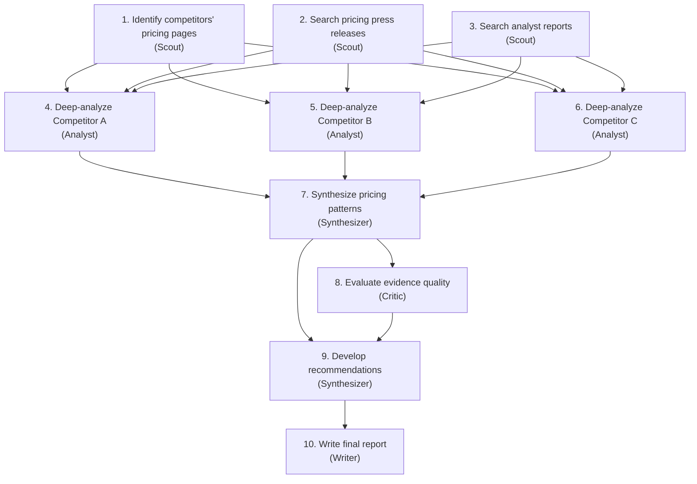

# Research OS

Software development has compilers to verify output. Research has no compiler. The artifacts are documents, analyses, and recommendations — things that require judgment to evaluate. This makes a Research OS fundamentally different from a Coding OS, and the differences reveal important truths about the Agentic OS model.

## The Domain

Research — whether academic, market, competitive, or technical — involves:

- **Open-ended exploration**: The answer is not known in advance. The process of searching shapes the question.
- **Source evaluation**: Not all information is equal. Sources have varying credibility, recency, and relevance.
- **Synthesis**: The value is not in individual facts but in the connections between them.
- **Argumentation**: Research produces claims supported by evidence. The structure of the argument matters as much as the content.
- **Uncertainty**: Research deals in probabilities, not certainties. "The evidence suggests..." not "The answer is..."

These properties demand different architectural choices than the Coding OS, while still fitting within the same Agentic OS framework.

## Architecture

### Cognitive Kernel

The Research OS kernel handles intents like:

- "What are the leading approaches to X?" → Survey, compare, synthesize.
- "Is Y a good strategy for our situation?" → Analyze Y, assess fit, identify risks.
- "Summarize the state of the art in Z." → Comprehensive literature review with structured synthesis.
- "Find evidence for or against claim W." → Balanced investigation with source evaluation.

The kernel classifies research tasks by:

- **Breadth**: How many areas need to be covered?
- **Depth**: How deeply must each area be examined?
- **Stance**: Neutral survey, argument construction, or critical analysis?
- **Time sensitivity**: Is this about current state, historical trends, or future predictions?

### Process Fabric

Research workers are specialized differently:

- **Scout**: Performs broad search across sources. Identifies potentially relevant documents, papers, articles, datasets. Optimized for recall — find everything that might be relevant.
- **Analyst**: Deep-reads individual sources. Extracts key claims, evidence, methodology, limitations. Optimized for precision — miss nothing important in a single document.
- **Synthesizer**: Combines findings from multiple analysts. Identifies patterns, contradictions, gaps. Produces structured summaries.
- **Critic**: Evaluates the quality of evidence. Checks for bias, methodological flaws, outdated information, missing perspectives.
- **Writer**: Produces the final research artifact — report, brief, memo, or presentation — incorporating all findings with proper attribution.

### Memory Plane

Research memory has domain-specific tiers:

- **Source registry**: Every source encountered, with metadata: URL, author, date, credibility assessment, key claims extracted. Prevents re-reading the same source and enables proper citation.
- **Claim graph**: A network of claims and their supporting evidence. Claim A is supported by sources 1, 2, 3. Claim B contradicts claim A based on source 4. This graph is the intellectual product of the research process.
- **Method memory**: Which research strategies worked for which types of questions. "For competitive analysis, start with industry reports, then company filings, then expert opinions."
- **Knowledge base**: Accumulated domain knowledge from past research. Concepts, relationships, definitions that do not need to be re-discovered.

### Governance

Research-specific policies:

- **Source credibility thresholds**: Claims based on unverified sources must be flagged. Peer-reviewed sources have higher weight than blog posts.
- **Bias detection**: If the research draws heavily from one perspective, the system flags the imbalance and seeks counterpoints.
- **Citation requirements**: Every factual claim in the output must link to a source. Unsourced claims are flagged.
- **Recency policies**: For time-sensitive topics, sources older than a threshold are flagged or excluded.
- **Hallucination guard**: The system must distinguish between information retrieved from sources and information generated by the model. Generated inferences are marked as such.

## Workflow: Competitive Analysis

### 1. Intent Interpretation

"Analyze our top three competitors' pricing strategies and recommend how we should position."

The kernel interprets:
- Who are the top three competitors? (Check memory; if unknown, ask the operator.)
- What aspects of pricing? (Tiers, discount strategies, freemium models, enterprise pricing.)
- What is "positioning"? (Where to price relative to competitors, not the exact price point.)
- Implicit: Use current data. Consider our strengths and weaknesses. Be actionable.

### 2. Decomposition



### 3. The Scout Phase

Scouts cast a wide net. They search multiple sources — company websites, news articles, industry reports, social media discussions, review platforms. Each result is logged in the source registry with metadata.

The critical discipline: scouts do not evaluate. They collect. Evaluation is the analyst's job. This separation prevents premature filtering — a source that looks irrelevant to a scout might contain a crucial data point that an analyst would catch.

### 4. The Analysis Phase

Analysts read each source carefully and extract structured information:

```text
Source: Competitor A Pricing Page (accessed 2026-04-01)
Claims:
  - Three tiers: Free, Pro ($29/mo), Enterprise (custom)
  - Free tier limited to 3 users
  - Pro includes API access
  - Enterprise requires annual commitment
Confidence: High (primary source)
Limitations: Does not show negotiated enterprise pricing
```

Each analyst works independently with focused context — they see only the sources relevant to their assigned competitor.

### 5. Synthesis

The synthesizer receives all analyst outputs and produces a comparative view:

- Where do pricing models converge? (All three have freemium tiers.)
- Where do they diverge? (Only Competitor B offers monthly enterprise billing.)
- What patterns emerge? (The market is moving toward usage-based pricing.)
- What gaps exist? (No competitor publicly prices their data API.)

### 6. The Critic's Role

The critic checks the synthesis against the evidence:

- Is the claim "the market is moving toward usage-based pricing" supported? (Supported by Competitor B's recent change and two analyst reports. Contradicted by Competitor C's fixed pricing.)
- Are any conclusions based on weak sources? (The blog post about Competitor A's discounting strategy is from an anonymous author — flag as low confidence.)
- Are alternative interpretations considered? (The freemium convergence might be survivorship bias — failed competitors without free tiers are not in the data.)

### 7. Output

The writer produces a structured report:

- Executive summary with key findings.
- Detailed comparative analysis with evidence links.
- Confidence assessments for each major claim.
- Positioning recommendations with supporting rationale.
- Gaps and limitations section — what the research could not determine.

## The Hallucination Problem

Research is the domain where hallucination is most dangerous. A coding error produces a compile failure. A research hallucination produces a plausible-sounding falsehood that might inform real decisions.

The Research OS addresses this through:

- **Source grounding**: Every claim must trace to a retrieved source. Claims that the model generates without source support are labeled as inferences, not findings.
- **Confidence scoring**: Each claim carries a confidence score based on source quality and corroboration. A claim supported by three independent credible sources scores higher than one supported by a single blog post.
- **Explicit uncertainty**: The system uses calibrated language. "The evidence strongly suggests..." vs. "One source indicates..." vs. "No evidence was found for..."
- **Verification loops**: Key claims are verified through independent searches. If the system cannot find corroborating sources, the claim is downgraded or flagged.

## What Makes This an OS, Not a Search Engine

A search engine returns links. A research assistant summarizes pages. A Research OS *conducts research*: it formulates search strategies, evaluates evidence, builds arguments, identifies gaps, and produces structured knowledge.

The OS abstraction matters because research is a process, not a query. It has phases (scout, analyze, synthesize, critique), requires memory (source registry, claim graph), and benefits from governance (citation requirements, bias detection). These are not features bolted onto a search box — they are structural properties of a system designed for research.

## Reference Implementation

The Research OS uses the same infrastructure as the Coding OS — LangGraph for orchestration, MCP for tools — but with research-specific workers, memory, and governance.

### State Definition

```python
from typing import TypedDict, Literal, Annotated
from langgraph.graph import add_messages

class Source(TypedDict):
    url: str
    title: str
    author: str
    date: str
    credibility: Literal["high", "medium", "low", "unverified"]
    claims: list[str]

class ResearchState(TypedDict):
    query: str
    intent: dict
    research_type: Literal["survey", "analysis", "investigation"]

    # Memory: Source Registry
    sources: list[Source]
    # Memory: Claim Graph
    claims: dict[str, dict]  # claim_id → {text, supporting_sources, confidence}

    # Plan
    plan: list[dict]
    current_step: int

    # Workers
    messages: Annotated[list, add_messages]
    scout_results: list[dict]
    analyst_outputs: list[dict]
    synthesis: str
    critique: str

    # Governance
    budget_remaining: int
    status: str
```

### Kernel: Research Orchestration Graph

```python
from langgraph.graph import StateGraph, START, END

def classify_research(state: ResearchState) -> dict:
    """Classify the research request and plan the investigation."""
    response = litellm.completion(
        model="claude-sonnet-4-20250514",
        messages=[{
            "role": "system",
            "content": "You are a research planner. Classify the query and "
                       "produce a research plan with scout, analysis, and "
                       "synthesis phases. Output JSON."
        }, {
            "role": "user",
            "content": state["query"]
        }],
        response_format={"type": "json_object"},
    )
    parsed = json.loads(response.choices[0].message.content)
    return {
        "intent": parsed["intent"],
        "research_type": parsed["type"],
        "plan": parsed["plan"],
        "current_step": 0,
        "status": "scouting",
    }

def scout(state: ResearchState) -> dict:
    """Scout worker: cast a wide net across sources."""
    tools = get_tools_for_worker("scout")  # [web_search, fetch_page]
    response = litellm.completion(
        model="gpt-4.1",  # Fast model for breadth
        messages=[{
            "role": "system",
            "content": "You are a research scout. Search broadly for relevant "
                       "sources. Return structured results with URL, title, "
                       "relevance assessment. Do NOT evaluate — just collect."
        }, {
            "role": "user",
            "content": f"Research query: {state['query']}\n"
                       f"Focus areas: {json.dumps(state['intent'])}"
        }],
        tools=tools,
        max_tokens=3000,
    )
    return {"scout_results": parse_scout_results(response), "status": "analyzing"}

def analyze_source(state: ResearchState) -> dict:
    """Analyst worker: deep-read sources and extract structured claims."""
    # Fan-out: one analyst per source (in practice, batched)
    analyses = []
    for source in state["scout_results"][:10]:  # Budget: top 10 sources
        response = litellm.completion(
            model="claude-sonnet-4-20250514",  # Strong reasoning for analysis
            messages=[{
                "role": "system",
                "content": "You are a research analyst. Read this source and "
                           "extract: key claims, evidence quality, methodology "
                           "used, limitations. Be precise. Cite specific passages."
            }, {
                "role": "user",
                "content": f"Source: {source['title']}\nURL: {source['url']}\n"
                           f"Content: {source['content'][:8000]}"
            }],
            max_tokens=2000,
        )
        analyses.append({
            "source": source,
            "analysis": response.choices[0].message.content,
        })
    return {"analyst_outputs": analyses, "status": "synthesizing"}

def synthesize(state: ResearchState) -> dict:
    """Synthesizer worker: combine findings into structured knowledge."""
    response = litellm.completion(
        model="claude-sonnet-4-20250514",
        messages=[{
            "role": "system",
            "content": "You are a research synthesizer. Combine analyst findings "
                       "into a coherent synthesis. Identify patterns, contradictions, "
                       "and gaps. Every claim must cite its source. Mark confidence "
                       "levels: strong (3+ corroborating sources), moderate (1-2), "
                       "or weak (single unverified source)."
        }, {
            "role": "user",
            "content": f"Query: {state['query']}\n\n"
                       f"Analyst outputs:\n{json.dumps(state['analyst_outputs'], indent=2)}"
        }],
        max_tokens=4000,
    )
    return {"synthesis": response.choices[0].message.content, "status": "critiquing"}

def critique(state: ResearchState) -> dict:
    """Critic worker: check for bias, gaps, and weak evidence."""
    response = litellm.completion(
        model="claude-sonnet-4-20250514",
        messages=[{
            "role": "system",
            "content": "You are a research critic. Review this synthesis for:\n"
                       "1. Claims based on weak or single sources\n"
                       "2. Perspectives that are underrepresented\n"
                       "3. Logical gaps or unsupported inferences\n"
                       "4. Potential biases in source selection\n"
                       "Be specific. Flag each issue with severity."
        }, {
            "role": "user",
            "content": state["synthesis"]
        }],
        max_tokens=2000,
    )
    return {"critique": response.choices[0].message.content, "status": "complete"}

# Build the graph
graph = StateGraph(ResearchState)
graph.add_node("classify", classify_research)
graph.add_node("scout", scout)
graph.add_node("analyze", analyze_source)
graph.add_node("synthesize", synthesize)
graph.add_node("critique", critique)

graph.add_edge(START, "classify")
graph.add_edge("classify", "scout")
graph.add_edge("scout", "analyze")
graph.add_edge("analyze", "synthesize")
graph.add_edge("synthesize", "critique")
graph.add_edge("critique", END)

research_os = graph.compile()
```

### MCP Server: Web Research

```python
# mcp_servers/web_research/server.py
from mcp.server import Server
import httpx
from readability import Document  # newspaper3k or readability-lxml

server = Server("web-research")

@server.tool()
async def web_search(query: str, max_results: int = 10) -> list[dict]:
    """Search the web and return structured results."""
    # Uses a search API (SerpAPI, Brave Search, Tavily, etc.)
    async with httpx.AsyncClient() as client:
        response = await client.get(
            "https://api.tavily.com/search",
            params={"query": query, "max_results": max_results},
            headers={"Authorization": f"Bearer {TAVILY_API_KEY}"},
        )
        results = response.json()["results"]
        return [{"url": r["url"], "title": r["title"],
                 "snippet": r["content"]} for r in results]

@server.tool()
async def fetch_page(url: str) -> dict:
    """Fetch and extract the main content from a web page."""
    async with httpx.AsyncClient(follow_redirects=True, timeout=15) as client:
        response = await client.get(url)
        doc = Document(response.text)
        return {
            "url": url,
            "title": doc.title(),
            "content": doc.summary()[:10000],  # Truncate for context budget
        }

if __name__ == "__main__":
    server.run()
```

### Governance: Hallucination Guard

Research-specific governance adds citation verification and confidence scoring:

```python
# governance/research_policies.py

def verify_citations(synthesis: str, sources: list[dict]) -> list[str]:
    """Post-action validation: check that all claims cite real sources."""
    known_urls = {s["url"] for s in sources}
    issues = []

    # Extract citations from synthesis (simplified — use regex or LLM in practice)
    cited_urls = extract_urls(synthesis)
    for url in cited_urls:
        if url not in known_urls:
            issues.append(f"Citation not in source registry: {url}")

    # Check for unsourced claims (claims without any citation nearby)
    unsourced = find_unsourced_claims(synthesis)
    for claim in unsourced:
        issues.append(f"Unsourced claim: '{claim[:80]}...' — mark as inference")

    return issues

def check_source_bias(sources: list[dict]) -> list[str]:
    """During-action monitoring: flag source imbalance."""
    issues = []
    domains = [urlparse(s["url"]).netloc for s in sources]
    domain_counts = Counter(domains)

    for domain, count in domain_counts.items():
        if count > len(sources) * 0.4:
            issues.append(
                f"Source bias: {count}/{len(sources)} sources from {domain}"
            )
    return issues
```

This implementation shows the research-specific patterns: **scout-analyze-synthesize-critique pipeline**, **source registry as episodic memory**, **citation governance**, and **model selection** (fast model for scouting, strong model for analysis and synthesis).
