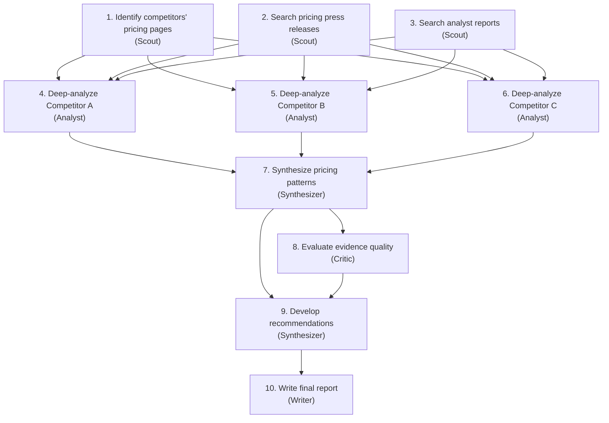
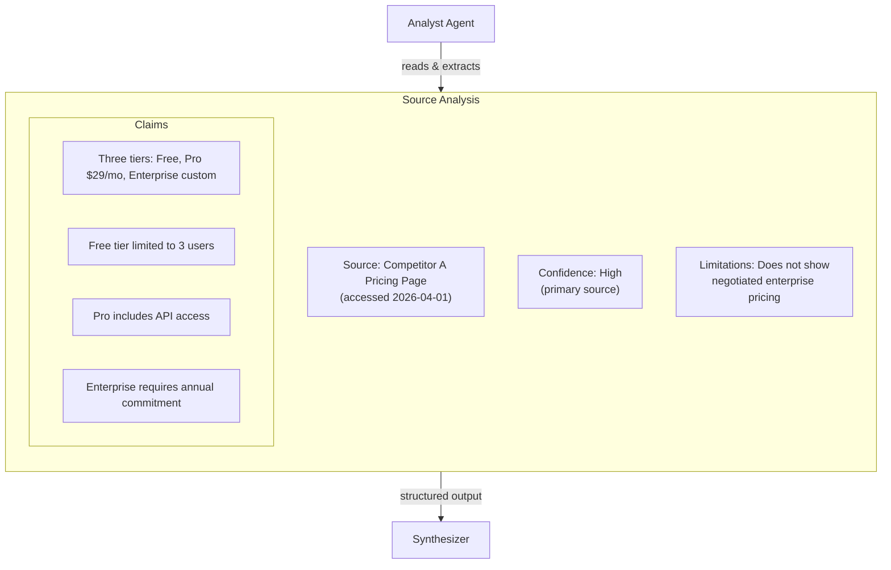

# Research OS

Software development has compilers to verify output. Research has no compiler. The artifacts are documents, analyses, and recommendations — things that require judgment to evaluate. This makes a Research OS fundamentally different from a Coding OS, and the differences reveal important truths about the Agentic OS model.

## The Domain

Research — whether academic, market, competitive, or technical — involves:

- **Open-ended exploration**: The answer is not known in advance. The process of searching shapes the question.
- **Source evaluation**: Not all information is equal. Sources have varying credibility, recency, and relevance.
- **Synthesis**: The value is not in individual facts but in the connections between them.
- **Argumentation**: Research produces claims supported by evidence. The structure of the argument matters as much as the content.
- **Uncertainty**: Research deals in probabilities, not certainties. "The evidence suggests..." not "The answer is..."

These properties demand different architectural choices than the Coding OS, while still fitting within the same Agentic OS framework.

## Architecture

### Cognitive Kernel

The Research OS kernel handles intents like:

- "What are the leading approaches to X?" → Survey, compare, synthesize.
- "Is Y a good strategy for our situation?" → Analyze Y, assess fit, identify risks.
- "Summarize the state of the art in Z." → Comprehensive literature review with structured synthesis.
- "Find evidence for or against claim W." → Balanced investigation with source evaluation.

The kernel classifies research tasks by:

- **Breadth**: How many areas need to be covered?
- **Depth**: How deeply must each area be examined?
- **Stance**: Neutral survey, argument construction, or critical analysis?
- **Time sensitivity**: Is this about current state, historical trends, or future predictions?

### Process Fabric

Research workers are specialized differently:

- **Scout**: Performs broad search across sources. Identifies potentially relevant documents, papers, articles, datasets. Optimized for recall — find everything that might be relevant.
- **Analyst**: Deep-reads individual sources. Extracts key claims, evidence, methodology, limitations. Optimized for precision — miss nothing important in a single document.
- **Synthesizer**: Combines findings from multiple analysts. Identifies patterns, contradictions, gaps. Produces structured summaries.
- **Critic**: Evaluates the quality of evidence. Checks for bias, methodological flaws, outdated information, missing perspectives.
- **Writer**: Produces the final research artifact — report, brief, memo, or presentation — incorporating all findings with proper attribution.

### Memory Plane

Research memory has domain-specific tiers:

- **Source registry**: Every source encountered, with metadata: URL, author, date, credibility assessment, key claims extracted. Prevents re-reading the same source and enables proper citation.
- **Claim graph**: A network of claims and their supporting evidence. Claim A is supported by sources 1, 2, 3. Claim B contradicts claim A based on source 4. This graph is the intellectual product of the research process.
- **Method memory**: Which research strategies worked for which types of questions. "For competitive analysis, start with industry reports, then company filings, then expert opinions."
- **Knowledge base**: Accumulated domain knowledge from past research. Concepts, relationships, definitions that do not need to be re-discovered.

### Governance

Research-specific policies:

- **Source credibility thresholds**: Claims based on unverified sources must be flagged. Peer-reviewed sources have higher weight than blog posts.
- **Bias detection**: If the research draws heavily from one perspective, the system flags the imbalance and seeks counterpoints.
- **Citation requirements**: Every factual claim in the output must link to a source. Unsourced claims are flagged.
- **Recency policies**: For time-sensitive topics, sources older than a threshold are flagged or excluded.
- **Hallucination guard**: The system must distinguish between information retrieved from sources and information generated by the model. Generated inferences are marked as such.

## Workflow: Competitive Analysis

### 1. Intent Interpretation

"Analyze our top three competitors' pricing strategies and recommend how we should position."

The kernel interprets:
- Who are the top three competitors? (Check memory; if unknown, ask the operator.)
- What aspects of pricing? (Tiers, discount strategies, freemium models, enterprise pricing.)
- What is "positioning"? (Where to price relative to competitors, not the exact price point.)
- Implicit: Use current data. Consider our strengths and weaknesses. Be actionable.

### 2. Decomposition



### 3. The Scout Phase

Scouts cast a wide net. They search multiple sources — company websites, news articles, industry reports, social media discussions, review platforms. Each result is logged in the source registry with metadata.

The critical discipline: scouts do not evaluate. They collect. Evaluation is the analyst's job. This separation prevents premature filtering — a source that looks irrelevant to a scout might contain a crucial data point that an analyst would catch.

### 4. The Analysis Phase

Analysts read each source carefully and extract structured information:



Each analyst works independently with focused context — they see only the sources relevant to their assigned competitor.

### 5. Synthesis

The synthesizer receives all analyst outputs and produces a comparative view:

- Where do pricing models converge? (All three have freemium tiers.)
- Where do they diverge? (Only Competitor B offers monthly enterprise billing.)
- What patterns emerge? (The market is moving toward usage-based pricing.)
- What gaps exist? (No competitor publicly prices their data API.)

### 6. The Critic's Role

The critic checks the synthesis against the evidence:

- Is the claim "the market is moving toward usage-based pricing" supported? (Supported by Competitor B's recent change and two analyst reports. Contradicted by Competitor C's fixed pricing.)
- Are any conclusions based on weak sources? (The blog post about Competitor A's discounting strategy is from an anonymous author — flag as low confidence.)
- Are alternative interpretations considered? (The freemium convergence might be survivorship bias — failed competitors without free tiers are not in the data.)

### 7. Output

The writer produces a structured report:

- Executive summary with key findings.
- Detailed comparative analysis with evidence links.
- Confidence assessments for each major claim.
- Positioning recommendations with supporting rationale.
- Gaps and limitations section — what the research could not determine.

## The Hallucination Problem

Research is the domain where hallucination is most dangerous. A coding error produces a compile failure. A research hallucination produces a plausible-sounding falsehood that might inform real decisions.

The Research OS addresses this through:

- **Source grounding**: Every claim must trace to a retrieved source. Claims that the model generates without source support are labeled as inferences, not findings.
- **Confidence scoring**: Each claim carries a confidence score based on source quality and corroboration. A claim supported by three independent credible sources scores higher than one supported by a single blog post.
- **Explicit uncertainty**: The system uses calibrated language. "The evidence strongly suggests..." vs. "One source indicates..." vs. "No evidence was found for..."
- **Verification loops**: Key claims are verified through independent searches. If the system cannot find corroborating sources, the claim is downgraded or flagged.

## What Makes This an OS, Not a Search Engine

A search engine returns links. A research assistant summarizes pages. A Research OS *conducts research*: it formulates search strategies, evaluates evidence, builds arguments, identifies gaps, and produces structured knowledge.

The OS abstraction matters because research is a process, not a query. It has phases (scout, analyze, synthesize, critique), requires memory (source registry, claim graph), and benefits from governance (citation requirements, bias detection). These are not features bolted onto a search box — they are structural properties of a system designed for research.

## Reference Implementation

The Research OS uses the Microsoft Agent Framework (Semantic Kernel) with specialized agents for each research phase and MCP servers for web access.

### Plugins: Web Research

```python
# plugins/web_research.py
from typing import Annotated
from semantic_kernel.functions import kernel_function
import httpx

class WebResearchPlugin:
    """Web search and content extraction for research agents."""

    @kernel_function(description="Search the web for a query.")
    async def web_search(
        self,
        query: Annotated[str, "Search query"],
        max_results: Annotated[int, "Max results to return"] = 10,
    ) -> Annotated[str, "Search results as JSON"]:
        async with httpx.AsyncClient() as client:
            response = await client.get(
                "https://api.tavily.com/search",
                params={"query": query, "max_results": max_results},
                headers={"Authorization": f"Bearer {TAVILY_API_KEY}"},
            )
            results = response.json()["results"]
            return json.dumps([
                {"url": r["url"], "title": r["title"], "snippet": r["content"]}
                for r in results
            ])

    @kernel_function(description="Fetch and extract content from a web page.")
    async def fetch_page(
        self, url: Annotated[str, "URL to fetch"]
    ) -> Annotated[str, "Extracted page content"]:
        from readability import Document
        async with httpx.AsyncClient(follow_redirects=True, timeout=15) as client:
            response = await client.get(url)
            doc = Document(response.text)
            return json.dumps({
                "url": url, "title": doc.title(),
                "content": doc.summary()[:10000],
            })
```

### Agents: Research Specialists

```python
# agents/research_agents.py
from semantic_kernel.agents import ChatCompletionAgent
from plugins.web_research import WebResearchPlugin

def create_scout_agent(service) -> ChatCompletionAgent:
    return ChatCompletionAgent(
        service=service,
        name="Scout",
        instructions="""You are a research scout. Search broadly for sources.
Return structured results. Do NOT evaluate or analyze — just collect.
Cover multiple source types: academic, industry, news, official.""",
        plugins=[WebResearchPlugin()],
    )

def create_analyst_agent(service) -> ChatCompletionAgent:
    return ChatCompletionAgent(
        service=service,
        name="Analyst",
        instructions="""You are a research analyst. For each source provided:
1. Extract key claims with exact quotes
2. Assess evidence quality (methodology, data, credibility)
3. Note limitations and potential biases
4. Rate confidence: high, medium, low
Be precise. Cite specific passages.""",
    )

def create_synthesizer_agent(service) -> ChatCompletionAgent:
    return ChatCompletionAgent(
        service=service,
        name="Synthesizer",
        instructions="""You are a research synthesizer. Combine analyst findings:
1. Identify patterns across sources
2. Flag contradictions with evidence from both sides
3. Note gaps where evidence is missing
4. Score confidence: strong (3+ sources), moderate (1-2), weak (single)
Every claim must cite its source.""",
    )

def create_critic_agent(service) -> ChatCompletionAgent:
    return ChatCompletionAgent(
        service=service,
        name="Critic",
        instructions="""You are a research critic. Review the synthesis for:
1. Claims based on weak or single sources
2. Underrepresented perspectives
3. Logical gaps or unsupported inferences
4. Source selection bias
Flag each issue with severity (critical, major, minor).""",
    )
```

### Kernel: Sequential Research Pipeline

```python
# agents/kernel.py
import asyncio
from semantic_kernel.agents import SequentialOrchestration
from semantic_kernel.agents.runtime import InProcessRuntime
from semantic_kernel.connectors.ai.open_ai import AzureChatCompletion

async def run_research(query: str) -> str:
    """Scout → Analyst → Synthesizer → Critic pipeline."""
    service = AzureChatCompletion(
        deployment_name="gpt-4.1",
        endpoint="https://your-endpoint.openai.azure.com/",
    )

    scout = create_scout_agent(service)
    analyst = create_analyst_agent(service)
    synthesizer = create_synthesizer_agent(service)
    critic = create_critic_agent(service)

    orchestration = SequentialOrchestration(
        members=[scout, analyst, synthesizer, critic],
    )

    runtime = InProcessRuntime()
    await runtime.start()

    result = await orchestration.invoke(task=query, runtime=runtime)
    output = await result.get()

    await runtime.stop_when_idle()
    return output
```

### Governance: Citation Verification

```python
# governance/research_policies.py
from semantic_kernel.filters import FunctionInvocationContext

async def citation_filter(context: FunctionInvocationContext, next):
    """Post-action filter: verify citations in synthesizer output."""
    await next(context)

    # Only check synthesizer and critic outputs
    agent_name = context.arguments.get("agent_name", "")
    if agent_name in ("Synthesizer", "Critic"):
        result = str(context.result)
        unsourced = find_unsourced_claims(result)
        if unsourced:
            context.result = (
                result + "\n\n⚠️ GOVERNANCE WARNING: "
                + f"{len(unsourced)} claims lack source citations."
            )
```

This implementation shows the research-specific patterns: **sequential orchestration** (scout → analyst → synthesizer → critic), **web research plugin** (search + page extraction as `@kernel_function`), **citation governance** (SK filter that checks outputs), and **role separation** (scout collects, analyst evaluates, synthesizer connects, critic challenges).

---

> **Try it yourself**: The complete Research OS — agents (`@scout`, `@analyst`, `@synthesizer`, `@critic`), skills (`/competitive-analysis`, `/literature-review`), citation standards, and tutorial — is available at [`implementations/research-os/`](https://github.com/marcelaldecoa/TheAgenticOS/tree/main/implementations/research-os).

