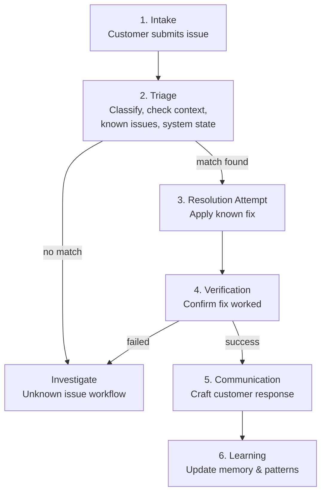

# Support OS

Support is a domain defined by urgency, repetition, and empathy. Customers have problems they need solved now. Many of those problems are variations of the same underlying issues. And every interaction happens against the backdrop of a relationship — a customer's history, their frustration level, their value to the business.

A Support OS turns these characteristics from challenges into advantages.

## The Domain

Customer support has properties that map well to the Agentic OS model:

- **High volume, high repetition**: A significant percentage of support requests are variations of known issues. An OS with memory can recognize and resolve them faster each time.
- **Clear resolution criteria**: A support case is open or closed. The customer's problem is solved or it is not. This gives the system unambiguous feedback.
- **Rich context**: Customer data, product state, account history, past interactions, known issues, documentation — there is abundant context to inform resolution.
- **Escalation hierarchy**: Simple issues are resolved by frontline support. Complex issues escalate to specialists. Critical issues escalate to engineering. This maps naturally to the staged autonomy model.
- **Time sensitivity**: Support latency directly impacts customer satisfaction. Speed matters, but accuracy matters more — a fast wrong answer is worse than a slightly slower correct one.

## Architecture

### Cognitive Kernel

The Support OS kernel handles intents like:

- "I can't log in" → Authentication troubleshooting workflow.
- "My data is missing" → Data integrity investigation.
- "How do I configure X?" → Documentation retrieval and guided walkthrough.
- "Your service is down" → Incident correlation and status communication.
- "I want a refund" → Policy evaluation and fulfillment.

The kernel classifies support requests by:

- **Category**: Account, billing, technical, feature request, complaint.
- **Urgency**: Service down (critical), functionality broken (high), inconvenience (medium), question (low).
- **Complexity**: Known issue with known fix (simple), known issue with variable fix (moderate), unknown issue (complex).
- **Sentiment**: Frustrated, neutral, satisfied. This affects communication style, not resolution strategy.

### Process Fabric

Support workers:

- **Triage Agent**: Classifies the request, checks for known issues, gathers initial context. Fast — completes in seconds.
- **Resolver**: Applies known solutions to known problems. Has access to the knowledge base, troubleshooting scripts, and account tools.
- **Investigator**: Diagnoses unknown problems. Has access to logs, system state, and diagnostic tools. Operates with more autonomy and time.
- **Communicator**: Crafts customer-facing responses. Adapts tone and detail level to the customer's context and sentiment.
- **Escalator**: When a case exceeds the system's capability, prepares the escalation package — summary, investigation results, customer context — for a human agent.

### Memory Plane

Support-specific memory:

- **Customer memory**: Each customer's history — past issues, resolutions, preferences, sentiment trends. "This customer had a billing issue last month that took three interactions to resolve. Handle with extra care."
- **Issue knowledge base**: Known issues, their symptoms, root causes, and resolutions. Indexed by symptoms for fast matching. "Error code 4012 → API rate limit exceeded → suggest upgrading plan or implementing backoff."
- **Resolution patterns**: What worked and what did not. "For login issues on mobile, resetting the session token resolves 78% of cases. Password reset resolves another 15%."
- **Product state**: Current system status, known outages, recent deployments, feature flags. "The payment service was deployed 2 hours ago — check for related issues."

### Governance

Support-specific policies:

- **Data access scoping**: Workers can view customer data relevant to the issue but cannot export it, share it across cases, or retain it beyond the interaction.
- **Action limits**: The system can reset sessions and resend verification emails autonomously. It cannot modify billing, issue refunds above a threshold, or access personal data without specific authorization.
- **Escalation triggers**: Cases exceeding N minutes without resolution auto-escalate. Cases involving data loss auto-escalate. Cases from enterprise accounts get priority routing.
- **Tone policies**: Responses must be professional, empathetic, and solution-oriented. No blame, no jargon, no conditional language that promises outcomes ("this will definitely fix it").
- **Privacy compliance**: All interactions are GDPR/CCPA-compliant. Customer data is not used for training. Conversations are retained per retention policy.

## Workflow: Technical Support Case



### 1. Intake

A customer submits: "My dashboard has been showing 'loading' for the past hour. I've tried refreshing and clearing cache."

### 2. Triage

The triage agent processes in parallel:

- **Classify**: Technical issue, high urgency, moderate complexity.
- **Customer context**: Enterprise account, 2 years, 3 prior tickets (all resolved), no current sentiment flags.
- **Known issue check**: Search the knowledge base for "dashboard loading" symptoms. Match found: Known issue #847 — dashboard timeout when data exceeds 10K rows, deployed fix in v3.2.1, but some accounts may need cache invalidation.
- **System state check**: No current outages. Dashboard service healthy. But: a data migration ran 3 hours ago that may have affected row counts.

### 3. Resolution Attempt

The resolver has a match with high confidence:

- Known issue #847 applies.
- The customer's account has 12K data rows (confirmed via account tools).
- Cache invalidation is the likely fix.

The resolver executes the cache invalidation (Level 0 autonomy — this is a safe, reversible operation) and prepares a verification step.

### 4. Verification

The resolver checks: Is the dashboard now loading? It queries the customer's session state. Dashboard loaded successfully in 2.3 seconds.

### 5. Communication

The communicator crafts the response:

> "Hi [Name], I've identified and resolved the issue with your dashboard. It was caused by a data processing update that affected the dashboard cache for accounts with large datasets like yours. I've cleared the affected cache, and your dashboard should now load normally.
>
> If you experience this again, please let us know — we're monitoring to ensure it doesn't recur.
>
> Is there anything else I can help with?"

Note what happens here: the communicator does not say "we ran cache invalidation on your account" (too technical). It does not say "it was a known bug" (undermines confidence). It gives enough explanation to be satisfying, frames the resolution positively, and invites continued engagement.

### 6. Learning

The system updates its memory:

- Customer memory: "Dashboard loading issue resolved via cache invalidation. Related to data migration. Time to resolution: 47 seconds."
- Resolution patterns: Known issue #847 resolution success rate updated.
- Product state: "Data migration affected N accounts with large datasets. Cache invalidation required."

## Workflow: Unknown Issue

When the triage agent finds no known issue match, the workflow shifts:

### 1. Investigation

The investigator gets the case with a broader toolkit:

- Access to application logs for the customer's account.
- Access to system metrics around the reported time.
- Access to recent deployment history.
- Access to similar past cases (even if they are not exact matches).

The investigator forms hypotheses and tests them:

1. Check logs for errors → Found: timeout on database query at 14:23.
2. Check database performance → Found: slow query on the analytics table.
3. Check recent schema changes → Found: missing index added in last migration but not applied to this shard.

### 2. Escalation Decision

The investigator has identified the root cause (missing index), but applying the fix (running the migration on the affected shard) exceeds the system's autonomy level. This is a Level 3 action — it requires human engineering approval.

### 3. Escalation Package

The escalator prepares a handoff for the engineering team:

- **Summary**: Customer dashboard timeout caused by missing database index on shard 7.
- **Evidence**: Log timestamps, slow query plan, migration history showing shard 7 was skipped.
- **Proposed fix**: Run pending migration on shard 7. Estimated impact: 2 minutes of read-only mode on the shard.
- **Customer context**: Enterprise account, high priority. Customer informed that engineering is investigating.
- **Suggested customer response**: Draft communication ready for review.

The human engineer gets everything needed to act — diagnosis, evidence, proposed fix, and customer context — in one package. Their job is to verify and approve, not to re-investigate.

## The Human-AI Handoff

The Support OS is designed around seamless human-AI collaboration:

- **AI handles**: Triage, known issue resolution, data gathering, response drafting.
- **Humans handle**: Novel problems, judgment calls, policy exceptions, relationship-sensitive situations.
- **The handoff includes**: Full context, investigation results, customer history, and draft communications. The human agent never starts from zero.

The system tracks which cases humans handle and why. Over time, if 80% of human handoffs for a particular issue type result in the same resolution, that resolution becomes a known pattern and the system handles it autonomously.

## Metrics

- **First-contact resolution rate**: Cases resolved without human involvement.
- **Mean time to resolution**: From intake to confirmed resolution.
- **Escalation rate**: Percentage of cases requiring human involvement, trending over time.
- **Customer satisfaction**: Post-interaction ratings correlated with resolution type (AI vs. human vs. hybrid).
- **Knowledge base growth**: New known issues added per week, resolution pattern accuracy.

## What Makes This an OS, Not a Chatbot

A support chatbot matches keywords to canned responses. A Support OS *resolves problems*: it triages, investigates, applies fixes, verifies results, communicates appropriately, learns from outcomes, and knows when to involve a human.

The OS model provides what chatbots lack: memory across interactions (the customer's history), process management (investigation workflows), governance (data access policies, escalation rules), and learning (resolution pattern improvement). These are not chatbot features — they are system properties that emerge from the OS architecture.

## Reference Implementation

The Support OS integrates with ticketing systems, knowledge bases, and customer data — all through MCP servers with strict data access governance.

### State Definition

```python
class SupportState(TypedDict):
    # Intake
    ticket_id: str
    customer_message: str

    # Triage
    category: Literal["account", "billing", "technical", "feature_request"]
    urgency: Literal["critical", "high", "medium", "low"]
    sentiment: Literal["frustrated", "neutral", "satisfied"]

    # Customer memory (loaded from DB)
    customer: dict  # {id, name, plan, tenure, past_tickets, sentiment_trend}

    # Known issue match
    known_issue: dict | None  # {id, symptoms, resolution, confidence}

    # Investigation
    investigation_log: list[str]
    root_cause: str | None

    # Resolution
    resolution: str | None
    actions_taken: list[str]
    response_draft: str

    # Governance
    autonomy_level: int
    data_classification: Literal["public", "internal", "confidential"]
    escalation_required: bool
    status: str
```

### Kernel: Support Triage and Resolution

```python
from langgraph.graph import StateGraph, START, END
from langgraph.checkpoint.postgres import PostgresSaver

def triage(state: SupportState) -> dict:
    """Triage agent: classify, load customer context, check known issues."""
    # Load customer memory from database
    customer = load_customer(state["ticket_id"])

    # Check known issues
    known_issue = search_known_issues(state["customer_message"])

    # Classify with LLM
    response = litellm.completion(
        model="gpt-4.1-mini",  # Fast model for classification
        messages=[{
            "role": "system",
            "content": "Classify this support ticket. Output JSON with: "
                       "category, urgency, sentiment."
        }, {
            "role": "user",
            "content": f"Customer ({customer['plan']} plan, "
                       f"{customer['tenure']} tenure):\n{state['customer_message']}"
        }],
        response_format={"type": "json_object"},
        max_tokens=200,
    )
    classification = json.loads(response.choices[0].message.content)

    return {
        "customer": customer,
        "known_issue": known_issue,
        **classification,
        "status": "resolving" if known_issue else "investigating",
        "data_classification": "confidential",  # customer data present
    }

def route_after_triage(state: SupportState) -> str:
    if state["known_issue"] and state["known_issue"]["confidence"] > 0.8:
        return "resolve_known"
    if state["urgency"] == "critical":
        return "escalate"
    return "investigate"

def resolve_known_issue(state: SupportState) -> dict:
    """Apply known resolution — may involve tool calls."""
    issue = state["known_issue"]
    actions = []

    # Execute resolution steps (e.g., cache invalidation)
    for step in issue.get("resolution_steps", []):
        if step["type"] == "api_call":
            result = execute_support_action(step, state)
            actions.append(f"{step['description']}: {result}")
        elif step["type"] == "manual":
            return {"escalation_required": True, "status": "awaiting_approval"}

    return {
        "resolution": issue["resolution"],
        "actions_taken": actions,
        "status": "verifying",
    }

def investigate(state: SupportState) -> dict:
    """Investigator worker: diagnose unknown issues using logs and tools."""
    tools = get_tools_for_worker("investigator")
    # investigator gets: log_search, system_metrics, account_tools
    # investigator does NOT get: customer_data_export, billing_modify

    response = litellm.completion(
        model="claude-sonnet-4-20250514",  # Strong reasoning for diagnosis
        messages=[{
            "role": "system",
            "content": "You are a support investigator. Diagnose the issue "
                       "using available tools. Form hypotheses and test them. "
                       "Log each step of your investigation."
        }, {
            "role": "user",
            "content": f"Ticket: {state['customer_message']}\n"
                       f"Customer: {state['customer']['plan']} plan\n"
                       f"No known issue match. Investigate."
        }],
        tools=tools,
        max_tokens=4000,
    )
    # Parse investigation results
    return {
        "investigation_log": extract_investigation_steps(response),
        "root_cause": extract_root_cause(response),
        "status": "escalate" if needs_engineering(response) else "verifying",
    }

def craft_response(state: SupportState) -> dict:
    """Communicator worker: write customer-facing response."""
    response = litellm.completion(
        model="claude-sonnet-4-20250514",
        messages=[{
            "role": "system",
            "content": "Write a support response. Be empathetic, clear, and "
                       "solution-focused. No jargon. No blame. No promises "
                       "you can't keep. Adapt tone to customer sentiment.\n"
                       f"Customer sentiment: {state['sentiment']}\n"
                       f"Customer tenure: {state['customer']['tenure']}"
        }, {
            "role": "user",
            "content": f"Issue: {state['customer_message']}\n"
                       f"Resolution: {state['resolution']}\n"
                       f"Actions taken: {state['actions_taken']}"
        }],
        max_tokens=500,
    )
    return {"response_draft": response.choices[0].message.content}

def escalate(state: SupportState) -> dict:
    """Prepare escalation package for human agent or engineering."""
    package = {
        "ticket_id": state["ticket_id"],
        "summary": state["root_cause"] or state["customer_message"],
        "investigation_log": state["investigation_log"],
        "customer_context": {
            "plan": state["customer"]["plan"],
            "tenure": state["customer"]["tenure"],
            "past_tickets": state["customer"]["past_tickets"][-3:],
        },
        "suggested_response": state.get("response_draft", ""),
    }
    # Send to human queue (Slack, PagerDuty, internal tool)
    send_escalation(package)
    return {"status": "escalated", "escalation_required": True}

# Build the graph with persistent checkpoints for long-running cases
checkpointer = PostgresSaver.from_conn_string(DATABASE_URL)

graph = StateGraph(SupportState)
graph.add_node("triage", triage)
graph.add_node("resolve_known", resolve_known_issue)
graph.add_node("investigate", investigate)
graph.add_node("verify", verify_resolution)
graph.add_node("respond", craft_response)
graph.add_node("escalate", escalate)
graph.add_node("learn", update_knowledge_base)

graph.add_edge(START, "triage")
graph.add_conditional_edges("triage", route_after_triage, {
    "resolve_known": "resolve_known",
    "investigate": "investigate",
    "escalate": "escalate",
})
graph.add_edge("resolve_known", "verify")
graph.add_edge("investigate", "verify")
graph.add_edge("verify", "respond")
graph.add_edge("respond", "learn")
graph.add_edge("learn", END)
graph.add_edge("escalate", END)

support_os = graph.compile(checkpointer=checkpointer)
```

### MCP Server: Customer & Ticketing

```python
# mcp_servers/support/server.py
from mcp.server import Server

server = Server("support-tools")

@server.tool()
async def search_known_issues(symptoms: str) -> list[dict]:
    """Search the knowledge base for matching known issues."""
    # Vector search over known issue descriptions
    results = await kb_vector_store.similarity_search(symptoms, k=5)
    return [{"id": r.metadata["issue_id"], "title": r.metadata["title"],
             "resolution": r.metadata["resolution"],
             "confidence": r.metadata["score"]} for r in results]

@server.tool()
async def get_customer_context(ticket_id: str) -> dict:
    """Load customer context for a ticket (scoped, no PII export)."""
    customer = await db.get_customer_for_ticket(ticket_id)
    return {
        "plan": customer.plan,
        "tenure": customer.tenure_months,
        "past_tickets_count": len(customer.tickets),
        "recent_tickets": [
            {"date": t.created, "category": t.category, "resolved": t.resolved}
            for t in customer.tickets[-5:]
        ],
        # Governance: PII fields are NOT included
    }

@server.tool()
async def invalidate_cache(account_id: str, cache_type: str) -> str:
    """Invalidate a specific cache for a customer account."""
    # Level 0 autonomy: safe, reversible operation
    await cache_service.invalidate(account_id, cache_type)
    return f"Cache '{cache_type}' invalidated for account {account_id}"

@server.tool()
async def search_logs(query: str, account_id: str,
                      hours: int = 24) -> list[dict]:
    """Search application logs for a customer account."""
    # Governance: scoped to the customer's account, time-bounded
    logs = await log_service.search(
        query=query, account_id=account_id,
        start_time=datetime.now() - timedelta(hours=hours),
    )
    return [{"timestamp": l.ts, "level": l.level,
             "message": l.message[:200]} for l in logs[:50]]
```

Key patterns demonstrated: **triage routing** (fast model for classification, strong model for investigation), **known-issue memory** (vector search over past resolutions), **escalation packaging** (structured handoff to humans with full context), **data governance** (customer PII scoped out of tool responses), and **persistent state** (PostgreSQL checkpointer for long-running cases that may wait for human approval).
