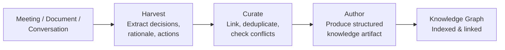
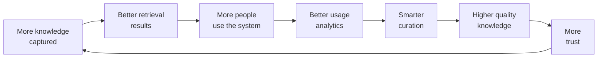

# Knowledge OS

Every organization has more knowledge than it can use. Documents are written and never read. Decisions are made and their rationale forgotten. Expertise lives in people's heads and leaves when they do. Lessons are learned and re-learned.

A Knowledge OS does not just store information — it makes organizational knowledge *operational*: findable, connectable, maintainable, and applicable at the moment it is needed.

## The Domain

Knowledge management has historically failed because it treats knowledge as a storage problem. Create a wiki, fill it with documents, hope people search before they ask. The result is always the same: the wiki becomes a graveyard of outdated pages.

The Agentic OS model reframes knowledge management as an *active process*:

- **Capture**: Automatically extract knowledge from where it is created — conversations, documents, code, decisions — rather than requiring manual entry.
- **Connect**: Link related knowledge across sources and domains. The architecture decision from six months ago is related to the bug report from last week.
- **Maintain**: Continuously validate, update, and retire knowledge. Detect when information becomes stale.
- **Deliver**: Surface knowledge at the moment it is needed, in the context where it is useful, without requiring the user to search.

## Architecture

### Cognitive Kernel

The Knowledge OS kernel handles intents like:

- "What is our policy on X?" → Policy retrieval with applicability assessment.
- "Why did we decide to use Y?" → Decision archaeology — tracing back through documents, discussions, and commits.
- "What do we know about Z?" → Comprehensive knowledge assembly from multiple sources.
- "Document this decision." → Capture structured knowledge from context.
- "Is our documentation on W still accurate?" → Validation against current state.

### Process Fabric

Knowledge workers:

- **Harvester**: Monitors information sources — chat channels, document repositories, code commits, meeting notes — and extracts knowledge artifacts. Runs continuously in the background.
- **Curator**: Evaluates harvested knowledge for quality, relevance, and novelty. Deduplicates, categorizes, and links to related knowledge.
- **Validator**: Periodically checks existing knowledge against current reality. Is this API documentation still accurate? Does this process still work? Are these guidelines still followed?
- **Retriever**: Finds and assembles knowledge in response to queries. Goes beyond keyword search — understands the question's intent and assembles a comprehensive answer from multiple sources.
- **Author**: Produces structured knowledge artifacts — documentation, guides, FAQs, onboarding materials — from raw knowledge.

### Memory Plane

The Knowledge OS memory plane *is* the product. Unlike other OS variants where memory supports the work, here memory *is* the work.

- **Document store**: The canonical repository of structured documents — policies, procedures, architecture decisions, technical specifications.
- **Knowledge graph**: A network of concepts, relationships, and facts extracted from all sources. "Service A depends on Service B" is a relationship. "We chose PostgreSQL because of JSONB support" is a decision node linked to the technology node.
- **Provenance layer**: Every piece of knowledge tracks its origin: who created it, when, from what source, and how confident the system is in its accuracy. Provenance enables trust assessment.
- **Freshness index**: A timestamp-and-signal system that tracks how likely each piece of knowledge is to be current. Documentation updated last week is probably fresh. Documentation last modified two years ago and referencing a deprecated API version is probably stale.
- **Usage analytics**: What knowledge is accessed frequently? What knowledge is never accessed? What questions are asked that have no answer in the knowledge base? These signals guide curation priorities.

### Governance

Knowledge-specific policies:

- **Classification**: Knowledge is classified by sensitivity (public, internal, confidential, restricted) and access is scoped accordingly.
- **Retention**: Knowledge follows retention policies. Temporary project notes expire. Architectural decisions are retained permanently.
- **Accuracy accountability**: Knowledge artifacts have owners. When a validator finds stale content, the owner is notified.
- **Source authority**: For conflicting information, the system applies a priority order — official documentation overrides chat conversations, which override individual notes.
- **Redaction**: Sensitive information (credentials, personal data, financial details) is detected and redacted before knowledge is stored or shared.

## Workflow: Knowledge Capture



### The Meeting That Produces Knowledge

A team holds an architecture review meeting. In a traditional organization, the knowledge from this meeting lives in the attendees' memories and maybe a sparse set of meeting notes that no one reads.

In a Knowledge OS:

### 1. Harvest

The harvester processes the meeting transcript (or notes) and extracts:

- **Decisions**: "We decided to use event sourcing for the order service."
- **Rationale**: "Because we need complete audit trails and the ability to replay events for debugging."
- **Alternatives considered**: "We considered CRUD with audit tables but rejected it because of the complexity of retroactive corrections."
- **Action items**: "Alex will prototype the event store by next sprint."
- **Open questions**: "We need to determine the event retention policy."

### 2. Curate

The curator:

- Links the decision to the order service node in the knowledge graph.
- Links the rationale to the compliance requirements node (audit trails).
- Checks for conflicts: Does this decision contradict any existing architecture guidelines? (None found.)
- Identifies related knowledge: The team evaluated event sourcing for the payment service six months ago and decided against it — link both decisions so future readers see the full picture.

### 3. Author

The author produces an Architecture Decision Record (ADR):

```markdown
# ADR-047: Event Sourcing for Order Service

## Status: Accepted
## Date: 2026-04-03

## Context
The order service requires complete audit trails for regulatory compliance
and the ability to replay events for debugging production issues.

## Decision
We will use event sourcing as the persistence strategy for the order service.

## Alternatives Considered
- CRUD with audit tables: Rejected due to complexity of retroactive corrections.

## Consequences
- Complete event history available for audit and debugging.
- Increased storage requirements for event streams.
- Team will need to learn event sourcing patterns.

## Related
- ADR-031: CRUD chosen for payment service (different requirements).
- Compliance requirement CR-12: Complete transaction audit trail.
```

This ADR is automatically filed, indexed, and linked in the knowledge graph. No one had to manually write or file it.

## Workflow: Knowledge Retrieval

### The Question That Finds Its Answer

A new engineer asks: "Why does the order service use event sourcing instead of a regular database?"

### 1. Intent Interpretation

The retriever understands this is a "why" question about an architectural decision, not a "how" question about implementation.

### 2. Knowledge Assembly

The retriever:

- Finds ADR-047 (primary answer).
- Finds the related ADR-031 about the payment service (contrast — helps explain why the choice differs between services).
- Finds the compliance requirement CR-12 (underlying driver).
- Finds the team's event sourcing guidelines (practical context for the new engineer).

### 3. Response

The system produces a contextualized answer:

> "The order service uses event sourcing (decided in ADR-047, April 2026) primarily because of regulatory requirements for complete audit trails (CR-12). The team considered CRUD with audit tables but found retroactive corrections too complex with that approach.
>
> Note that the payment service uses traditional CRUD (ADR-031) because it had different requirements — simpler state transitions and no retroactive correction needs.
>
> For implementation details, see the Event Sourcing Guidelines in the engineering handbook."

This is not a search result. It is an answer — synthesized from multiple sources, contextualized for the question, with provenance.

## Workflow: Knowledge Maintenance

### The Document That Ages

The validator runs a periodic sweep and flags:

- **API documentation v2.1**: Last updated 14 months ago. The API is now on v3.0. Multiple endpoints have changed. **Status: Stale. Owner notified.**
- **Onboarding guide**: References a Slack channel that was archived 6 months ago. **Status: Partially stale. Specific section flagged.**
- **Deployment runbook**: References a CI/CD pipeline that was replaced last quarter. **Status: Stale. High priority — operational document.**
- **Architecture overview**: All referenced services still exist. Dependency graph matches current reality. **Status: Current.**

The validator does not just check dates — it cross-references knowledge against the current state of the systems, repositories, and configurations it can access.

## The Knowledge Flywheel

The Knowledge OS creates a reinforcing cycle:



1. More knowledge captured → better retrieval results.
2. Better retrieval results → more people use the system.
3. More usage → better usage analytics → smarter curation.
4. Smarter curation → higher quality knowledge → more trust.
5. More trust → more knowledge contributed → back to step 1.

This flywheel is why the OS model matters. A static knowledge base has no flywheel — it degrades over time. An active Knowledge OS improves over time because every interaction makes the system smarter about what knowledge matters, how it connects, and when it is needed.

## What Makes This an OS, Not a Wiki

A wiki stores pages. A Knowledge OS *manages knowledge*: it captures it from where it is created, connects it across domains, maintains it against drift, delivers it where it is needed, and learns from usage.

The OS provides what wikis lack: active processes (harvesting, curation, validation), structured memory (knowledge graphs, provenance, freshness), governance (classification, retention, accuracy), and adaptation (usage-driven curation, automated maintenance). The wiki asks humans to do all of this manually. The Knowledge OS automates the lifecycle while keeping humans in control of what matters — the knowledge itself.

## Reference Implementation

The Knowledge OS centers on the memory plane — here, memory *is* the product. The implementation emphasizes ingestion pipelines, graph storage, and freshness validation.

### State Definition

```python
class KnowledgeArtifact(TypedDict):
    id: str
    title: str
    content: str
    source: str           # origin: "meeting", "commit", "document", "conversation"
    source_url: str
    author: str
    created_at: str
    confidence: float     # 0.0-1.0
    classification: Literal["public", "internal", "confidential"]
    tags: list[str]
    linked_artifacts: list[str]  # IDs of related artifacts

class KnowledgeState(TypedDict):
    # Input
    raw_input: str
    input_type: Literal["meeting_notes", "document", "code_change", "query"]

    # Processing
    extracted_artifacts: list[KnowledgeArtifact]
    conflicts: list[dict]
    validation_results: list[dict]

    # Output
    result: str
    status: str
```

### Knowledge Graph: PostgreSQL + pgvector

The knowledge graph uses PostgreSQL for structured relationships and pgvector for semantic retrieval:

```python
# memory/knowledge_store.py
import asyncpg
from pgvector.asyncpg import register_vector

class KnowledgeStore:
    """The memory plane for the Knowledge OS."""

    async def store_artifact(self, artifact: KnowledgeArtifact):
        """Store a knowledge artifact with embedding for semantic search."""
        embedding = await embed(artifact["content"])
        await self.pool.execute("""
            INSERT INTO knowledge_artifacts
                (id, title, content, source, source_url, author,
                 created_at, confidence, classification, tags, embedding)
            VALUES ($1,$2,$3,$4,$5,$6,$7,$8,$9,$10,$11)
            ON CONFLICT (id) DO UPDATE
            SET content=$3, confidence=$8, updated_at=NOW()
        """, artifact["id"], artifact["title"], artifact["content"],
             artifact["source"], artifact["source_url"], artifact["author"],
             artifact["created_at"], artifact["confidence"],
             artifact["classification"], artifact["tags"], embedding)

    async def link_artifacts(self, from_id: str, to_id: str,
                             relation: str):
        """Create a relationship in the knowledge graph."""
        await self.pool.execute("""
            INSERT INTO knowledge_links (from_id, to_id, relation)
            VALUES ($1, $2, $3) ON CONFLICT DO NOTHING
        """, from_id, to_id, relation)

    async def search(self, query: str, classification_max: str = "internal",
                     limit: int = 10) -> list[dict]:
        """Semantic search with classification-based access control."""
        embedding = await embed(query)
        classification_levels = {"public": 0, "internal": 1, "confidential": 2}
        max_level = classification_levels[classification_max]

        rows = await self.pool.fetch("""
            SELECT id, title, content, source, confidence,
                   1 - (embedding <=> $1) AS similarity
            FROM knowledge_artifacts
            WHERE classification_level <= $2
            ORDER BY embedding <=> $1
            LIMIT $3
        """, embedding, max_level, limit)
        return [dict(r) for r in rows]

    async def find_stale(self, max_age_days: int = 90) -> list[dict]:
        """Find artifacts that may be stale (for validation worker)."""
        rows = await self.pool.fetch("""
            SELECT id, title, source_url, updated_at,
                   NOW() - updated_at AS age
            FROM knowledge_artifacts
            WHERE updated_at < NOW() - INTERVAL '$1 days'
            ORDER BY age DESC LIMIT 50
        """, max_age_days)
        return [dict(r) for r in rows]
```

### Harvester Worker (Background Process)

The harvester runs continuously, monitoring sources for new knowledge:

```python
# agents/harvester.py
"""
Background worker that monitors information sources
and extracts knowledge artifacts.
"""

HARVESTER_INSTRUCTIONS = """You extract structured knowledge from raw content.
For each piece of content, identify:
- Decisions made and their rationale
- Facts and data points with sources
- Action items and owners
- Open questions
- Relationships to existing knowledge

Output as JSON array of knowledge artifacts.
Each artifact must have: title, content, tags, confidence.
"""

async def harvest_meeting_notes(notes: str,
                                meeting_meta: dict) -> list[KnowledgeArtifact]:
    """Extract knowledge from meeting notes."""
    response = await litellm.acompletion(
        model="gpt-4.1",
        messages=[
            {"role": "system", "content": HARVESTER_INSTRUCTIONS},
            {"role": "user", "content": f"Meeting: {meeting_meta['title']}\n"
                                        f"Date: {meeting_meta['date']}\n"
                                        f"Attendees: {meeting_meta['attendees']}\n\n"
                                        f"Notes:\n{notes}"}
        ],
        response_format={"type": "json_object"},
    )
    artifacts = json.loads(response.choices[0].message.content)["artifacts"]

    # Enrich with provenance
    for a in artifacts:
        a["source"] = "meeting"
        a["source_url"] = meeting_meta.get("url", "")
        a["author"] = "harvester"
        a["created_at"] = meeting_meta["date"]
    return artifacts

async def harvest_code_change(commit: dict) -> list[KnowledgeArtifact]:
    """Extract knowledge from a code commit (architectural decisions, etc.)."""
    if not is_significant_commit(commit):  # Skip trivial commits
        return []

    response = await litellm.acompletion(
        model="gpt-4.1-mini",  # Fast model for filtering
        messages=[
            {"role": "system",
             "content": "Does this commit contain architectural decisions, "
                        "API changes, or configuration changes worth documenting? "
                        "If yes, extract them. If no, return empty artifacts."},
            {"role": "user",
             "content": f"Commit: {commit['message']}\n"
                        f"Files: {commit['files_changed']}\n"
                        f"Diff summary: {commit['diff'][:3000]}"}
        ],
        response_format={"type": "json_object"},
    )
    return json.loads(response.choices[0].message.content).get("artifacts", [])
```

### Validator Worker (Periodic)

```python
# agents/validator.py
"""Periodic worker that checks knowledge freshness."""

async def validate_artifact(artifact: dict,
                            store: KnowledgeStore) -> dict:
    """Check if a knowledge artifact is still accurate."""
    # Different validation strategies by source type
    if artifact["source"] == "api_docs":
        # Fetch current API and compare
        current = await fetch_current_api(artifact["source_url"])
        response = await litellm.acompletion(
            model="gpt-4.1-mini",
            messages=[{
                "role": "system",
                "content": "Compare the stored documentation with the current "
                           "state. Is the documentation still accurate? "
                           "Output: {status: 'current'|'stale'|'partially_stale', "
                           "issues: [...], suggested_update: '...'}"
            }, {
                "role": "user",
                "content": f"Stored:\n{artifact['content'][:2000]}\n\n"
                           f"Current:\n{current[:2000]}"
            }],
            response_format={"type": "json_object"},
        )
        return json.loads(response.choices[0].message.content)

    elif artifact["source"] == "meeting":
        # Check if referenced entities still exist
        refs = extract_references(artifact["content"])  # service names, URLs, etc.
        broken = [r for r in refs if not await check_reference(r)]
        return {
            "status": "stale" if broken else "current",
            "issues": [f"Broken reference: {r}" for r in broken],
        }

    return {"status": "unknown", "issues": ["No validation strategy for this source"]}
```

### MCP Server: Knowledge Operations

```python
# mcp_servers/knowledge/server.py
from mcp.server import Server

server = Server("knowledge")

@server.tool()
async def knowledge_search(query: str,
                           scope: str = "internal") -> list[dict]:
    """Search the knowledge base with access-controlled results."""
    return await store.search(query, classification_max=scope)

@server.tool()
async def knowledge_store_artifact(
    title: str, content: str, source: str,
    tags: list[str], classification: str = "internal"
) -> str:
    """Store a new knowledge artifact."""
    artifact_id = generate_id()
    await store.store_artifact({
        "id": artifact_id, "title": title, "content": content,
        "source": source, "tags": tags,
        "classification": classification,
        "confidence": 0.8,  # default for manually stored
    })
    return f"Stored artifact {artifact_id}: {title}"

@server.tool()
async def knowledge_find_related(artifact_id: str) -> list[dict]:
    """Find artifacts related to a given artifact via the knowledge graph."""
    return await store.get_linked(artifact_id, max_depth=2)

@server.tool()
async def knowledge_get_stale(max_age_days: int = 90) -> list[dict]:
    """List potentially stale artifacts for review."""
    return await store.find_stale(max_age_days)
```

Key patterns: **harvester as background process** (continuous knowledge capture), **knowledge graph with pgvector** (structured relations + semantic search), **classification-based access control** (governance at the memory boundary), **validation worker** (proactive freshness checks), and **MCP server for knowledge operations** (standardized tool interface for all consumers).
