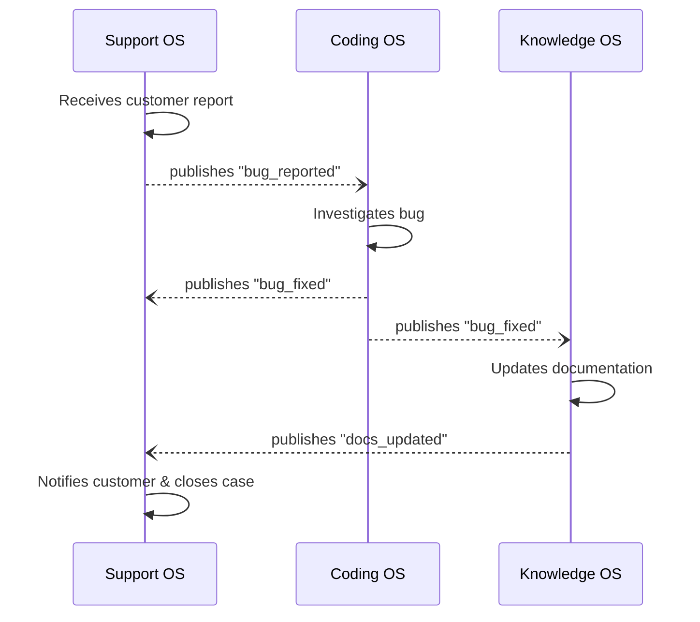
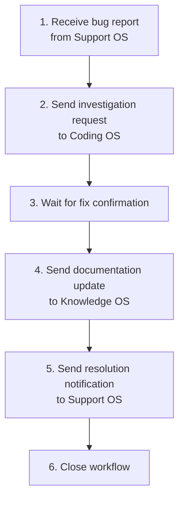
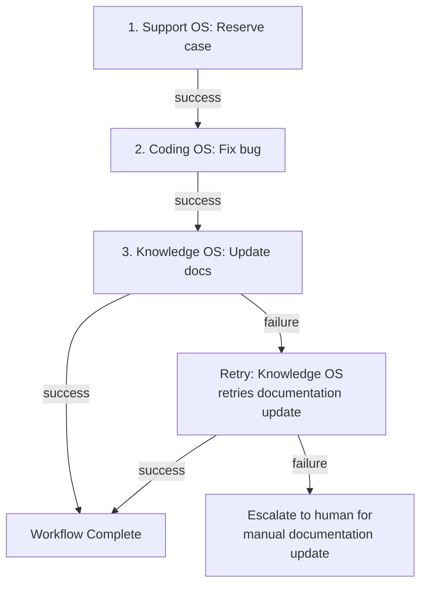

# Multi-OS Coordination

The previous chapters described individual operating systems — each optimized for a single domain. But real organizations do not operate in single domains. A customer support case reveals a bug that requires engineering. A research finding changes the product strategy that changes the codebase that changes the documentation. Work flows across boundaries.

This chapter examines what happens when multiple Agentic OSs must work together.

## The Coordination Problem

Each Agentic OS is designed for independence: its own kernel, its own memory, its own governance, its own process fabric. This independence is a strength — it allows each OS to optimize for its domain without compromise. But it creates a problem when work crosses domains.

Consider this scenario: A customer reports that the export feature produces corrupted CSV files. This involves:

- **Support OS**: Receives the report, triages, gathers customer context.
- **Coding OS**: Investigates the bug, writes a fix, runs tests.
- **Knowledge OS**: Updates the known issues documentation and the troubleshooting guide.

Three operating systems, one workflow. How do they coordinate?

## Federation Architecture

Multi-OS coordination follows a federation model: independent systems that collaborate through negotiated protocols.

### The Federation Bus

The federation bus is the communication layer between operating systems. It carries:

- **Work requests**: "Support OS to Coding OS: investigate CSV export corruption. Here is the customer report, reproduction steps, and relevant account data."
- **Status updates**: "Coding OS to Support OS: bug identified. Fix in progress. Estimated resolution: 2 hours."
- **Results**: "Coding OS to Support OS: fix deployed. Here is the change summary and verification results."
- **Knowledge events**: "Coding OS to Knowledge OS: new known issue — CSV export corruption caused by encoding mismatch in v3.2. Resolution: patch v3.2.1."

### Message Format

Inter-OS messages use a standard format:

```text
Message:
  from: support-os
  to: coding-os
  type: work_request
  priority: high
  payload:
    intent: "Investigate and fix CSV export corruption"
    context:
      customer_report: "..."
      reproduction_steps: "..."
      affected_versions: ["3.2.0"]
    constraints:
      data_classification: "customer_data_redacted"
      time_expectation: "urgent"
    callback:
      on_status_change: "support-os/cases/4521/status"
      on_completion: "support-os/cases/4521/resolution"
```

The message carries enough context for the receiving OS to act without knowing the sender's internal state. It specifies constraints (data classification, urgency) that map to the receiver's governance policies. And it includes callbacks so the sender is notified of progress.

### Capability Discovery

Before OS A can send work to OS B, it must know what OS B can do. Capability discovery operates through a registry:

```text
Registry:
  coding-os:
    capabilities: [bug_investigation, feature_development, code_review, deployment]
    accepts: [work_request, information_request]
    SLA: { bug_investigation: "4 hours", feature_development: "1-5 days" }
    governance: { data_classification: "up to confidential", approval_required: "for production changes" }
  
  knowledge-os:
    capabilities: [documentation_update, knowledge_retrieval, knowledge_validation]
    accepts: [knowledge_event, query]
    SLA: { documentation_update: "1 hour", knowledge_retrieval: "seconds" }
    governance: { data_classification: "up to internal" }
```

Each OS publishes its capabilities, accepted message types, service level expectations, and governance constraints. Senders can discover what is available, what it costs, and what rules apply — without knowing the receiver's internal architecture.

## Coordination Patterns

### Request-Response

The simplest pattern. OS A sends a work request, OS B processes it, OS B sends the result back. The Support OS requests a bug fix, the Coding OS delivers it.

This works for well-defined, self-contained work. It fails when the work requires ongoing collaboration.

### Event-Driven

OSs publish events when significant things happen. Other OSs subscribe to relevant events and react.

- Coding OS publishes: "Deployment completed: v3.2.1 with CSV fix."
- Support OS subscribes: Updates open cases related to the CSV bug.
- Knowledge OS subscribes: Updates documentation and known issues.

Event-driven coordination is loosely coupled — publishers do not know who subscribes. This makes it easy to add new consumers without modifying producers.

### Choreography

Multiple OSs collaborate through a series of events without a central coordinator. Each OS knows its role and reacts to events from others:



Choreography works when the workflow is well-known and each participant's role is clear. It becomes fragile when workflows are complex or when failures require coordinated recovery.

### Orchestration

A coordinator OS (or a dedicated federation orchestrator) manages the workflow. It sends requests to each OS, monitors progress, handles failures, and ensures the workflow completes.



Orchestration is more robust for complex workflows — the orchestrator maintains the overall state and can handle failures (retry, skip, escalate) with full visibility into the workflow's progress.

### Saga Pattern

For long-running, multi-OS workflows that may partially fail, the saga pattern provides compensating actions:



Each step has a compensating action defined. If a step fails, previous steps are compensated if necessary, or the workflow adapts. The key insight: not every failure requires rollback. A bug fix is valuable even if the documentation update fails. The saga pattern acknowledges partial success.

## Cross-OS Governance

When work crosses OS boundaries, governance becomes complex. Each OS has its own policies, but the inter-OS workflow needs additional governance.

### Data Classification at Boundaries

Customer data from the Support OS may be classified as confidential. The Coding OS may have a policy that confidential data does not enter debug logs. The federation layer must enforce data classification as information crosses boundaries.

Rules:
- Data classification travels with the data.
- The receiving OS must honor the classification or reject the data.
- Data can be reclassified at boundaries (e.g., redacted to lower classification) but never silently upgraded.

### Cross-OS Audit

The audit trail must span OS boundaries. When the Support OS triggers a bug fix in the Coding OS that triggers a documentation update in the Knowledge OS, the complete chain must be traceable.

Each OS maintains its internal audit log. The federation layer maintains a cross-OS correlation ID that links related entries across logs:

```text
Correlation ID: fed-2026-04-03-4521
  Support OS: Case opened, escalated to engineering [timestamp]
  Coding OS: Investigation started, bug found, fix deployed [timestamps]
  Knowledge OS: Documentation updated, known issue added [timestamp]
  Support OS: Customer notified, case closed [timestamp]
```

### Cross-OS Authorization

When OS A asks OS B to perform an action, who authorizes it? Options:

- **Delegated authority**: OS A's operator authorized the work. OS B trusts OS A's authorization within defined limits.
- **Independent authorization**: OS B requires its own operator to approve, regardless of OS A's request. Used for high-risk actions.
- **Policy-based**: Pre-agreed policies determine which requests are auto-approved and which require explicit authorization. "Bug fixes with severity ≥ high are auto-approved. Feature requests require Coding OS operator approval."

## Failure Handling

Multi-OS failures are harder than single-OS failures because the failure may be in the communication, not in any individual OS.

### Communication Failures

- **Timeout**: OS A sent a request but OS B did not respond. Is OS B down, or just slow? The federation layer implements exponential backoff with a deadline.
- **Message loss**: The request was lost in transit. The federation layer uses at-least-once delivery with idempotency checks.
- **Partial response**: OS B sent results but the connection dropped midway. The federation layer uses chunked responses with resume capability.

### Semantic Failures

- **Misunderstood request**: OS A asked for X but OS B interpreted it as Y. The standard message format and capability registry reduce this risk, but it cannot be eliminated. Verification steps — where OS A checks OS B's interpretation before execution — catch misunderstandings early.
- **Conflicting actions**: Two OSs take actions that conflict. The Coding OS deploys a fix while the Support OS tells the customer the issue is still under investigation. Coordination timestamps and status synchronization prevent this.

## The Organization as a System

Zoom out far enough, and the collection of coordinated Agentic OSs *is* an organization's operational intelligence. The federation layer is the nervous system connecting specialized organs.

This perspective reveals design principles:

- **Specialize deeply, coordinate loosely.** Each OS should be excellent at its domain and minimally dependent on others. Loose coupling through events and standard messages.
- **Fail independently, recover collectively.** A failure in the Knowledge OS should not bring down the Coding OS. But recovery from a cross-OS workflow failure requires coordination.
- **Share knowledge, not state.** OSs share knowledge events ("a bug was fixed"), not internal state ("this is my current task graph"). This preserves independence.
- **Govern at every boundary.** Trust between OSs is not implicit. Every data exchange, every work request, every status update passes through governance checks.

## When Not to Federate

Federation adds complexity. Before creating multiple OSs, ask:

- **Is the domain separation real?** If the same team does support and coding, one OS with multiple skill sets may be simpler than two federated OSs.
- **Is the data separation necessary?** If all OSs need the same data with the same access policies, the federation boundary creates friction without value.
- **Is independent evolution needed?** If the systems change on different schedules with different teams, federation is justified. If one team builds everything, a monolithic OS with good internal boundaries may be better.

Federation is the right architecture when the organizational structure, security boundaries, and evolution timelines genuinely differ across domains. It is the wrong architecture when it is chosen for elegance rather than necessity.

## Reference Implementation

Multi-OS coordination requires a federation layer that connects independent operating systems. This implementation uses a message bus, a capability registry, and cross-OS workflow orchestration.

### Federation Bus

The federation bus is a lightweight message broker that routes work between OSs. In practice, this can be a message queue (Redis Streams, RabbitMQ, Kafka) or a simple HTTP API:

```python
# federation/bus.py
"""
Federation bus: routes messages between independent Agentic OSs.
Each OS registers its capabilities and subscribes to relevant events.
"""
import asyncio
import json
import uuid
from datetime import datetime
from dataclasses import dataclass, field
from enum import Enum

class MessageType(Enum):
    WORK_REQUEST = "work_request"
    STATUS_UPDATE = "status_update"
    RESULT = "result"
    EVENT = "event"

@dataclass
class FederationMessage:
    id: str
    correlation_id: str  # links related messages across OSs
    from_os: str
    to_os: str
    type: MessageType
    priority: str  # "critical", "high", "medium", "low"
    payload: dict
    timestamp: str = field(default_factory=lambda: datetime.utcnow().isoformat())
    data_classification: str = "internal"

class FederationBus:
    def __init__(self):
        self.subscribers: dict[str, asyncio.Queue] = {}
        self.audit_log: list[FederationMessage] = []

    def register_os(self, os_name: str):
        """Register an OS to receive messages."""
        self.subscribers[os_name] = asyncio.Queue()

    async def send(self, message: FederationMessage):
        """Send a message to a specific OS."""
        # Governance: validate data classification at boundary
        self._enforce_data_policy(message)

        # Audit: log every cross-OS message
        self.audit_log.append(message)

        if message.to_os in self.subscribers:
            await self.subscribers[message.to_os].put(message)
        else:
            raise ValueError(f"Unknown OS: {message.to_os}")

    async def broadcast_event(self, from_os: str, event_type: str,
                               payload: dict):
        """Publish an event to all subscribed OSs."""
        for os_name, queue in self.subscribers.items():
            if os_name != from_os:
                msg = FederationMessage(
                    id=str(uuid.uuid4()),
                    correlation_id=str(uuid.uuid4()),
                    from_os=from_os,
                    to_os=os_name,
                    type=MessageType.EVENT,
                    priority="medium",
                    payload={"event_type": event_type, **payload},
                )
                self.audit_log.append(msg)
                await queue.put(msg)

    async def receive(self, os_name: str) -> FederationMessage:
        """Wait for the next message for an OS."""
        return await self.subscribers[os_name].get()

    def _enforce_data_policy(self, msg: FederationMessage):
        """Cross-OS governance: enforce data classification rules."""
        receiver_clearance = OS_REGISTRY.get(
            msg.to_os, {}
        ).get("max_data_classification", "internal")
        classification_levels = {"public": 0, "internal": 1, "confidential": 2}
        if classification_levels.get(msg.data_classification, 0) > \
           classification_levels.get(receiver_clearance, 0):
            raise PermissionError(
                f"Data classification '{msg.data_classification}' exceeds "
                f"receiver '{msg.to_os}' clearance '{receiver_clearance}'"
            )
```

### Capability Registry

Each OS publishes its capabilities so others can discover what help is available:

```python
# federation/registry.py

OS_REGISTRY = {
    "coding-os": {
        "capabilities": ["bug_investigation", "feature_development",
                          "code_review", "deployment"],
        "accepts": ["work_request", "information_request"],
        "sla": {"bug_investigation": "4h", "feature_development": "1-5d"},
        "max_data_classification": "confidential",
        "endpoint": "http://coding-os:8000/federation",
    },
    "support-os": {
        "capabilities": ["ticket_triage", "known_issue_resolution",
                          "customer_communication"],
        "accepts": ["work_request", "event"],
        "sla": {"ticket_triage": "30s", "known_issue_resolution": "5m"},
        "max_data_classification": "confidential",
        "endpoint": "http://support-os:8000/federation",
    },
    "knowledge-os": {
        "capabilities": ["documentation_update", "knowledge_retrieval",
                          "knowledge_validation"],
        "accepts": ["work_request", "event"],
        "sla": {"documentation_update": "1h", "knowledge_retrieval": "5s"},
        "max_data_classification": "internal",  # no customer PII
        "endpoint": "http://knowledge-os:8000/federation",
    },
}

def find_os_for_capability(capability: str) -> str | None:
    """Discover which OS can handle a given capability."""
    for os_name, info in OS_REGISTRY.items():
        if capability in info["capabilities"]:
            return os_name
    return None
```

### Cross-OS Workflow: Bug Report to Resolution

The complete workflow from Chapter 34's choreography pattern, implemented as a concrete orchestration:

```python
# federation/workflows/bug_resolution.py
"""
Cross-OS workflow: Customer reports a bug → Support triages →
Coding fixes → Knowledge updates docs → Support closes case.
"""

async def bug_resolution_workflow(bus: FederationBus, ticket: dict):
    """Orchestrate a bug resolution across three OSs."""
    correlation_id = str(uuid.uuid4())

    # 1. Support OS: Triage the ticket
    await bus.send(FederationMessage(
        id=str(uuid.uuid4()),
        correlation_id=correlation_id,
        from_os="orchestrator",
        to_os="support-os",
        type=MessageType.WORK_REQUEST,
        priority="high",
        payload={
            "action": "triage",
            "ticket": ticket,
        },
    ))
    triage_result = await bus.receive("orchestrator")

    # 2. If it's a bug, send to Coding OS
    if triage_result.payload.get("category") == "technical":
        await bus.send(FederationMessage(
            id=str(uuid.uuid4()),
            correlation_id=correlation_id,
            from_os="orchestrator",
            to_os="coding-os",
            type=MessageType.WORK_REQUEST,
            priority=triage_result.payload["urgency"],
            payload={
                "action": "investigate_and_fix",
                "bug_report": triage_result.payload["summary"],
                "reproduction_steps": triage_result.payload.get("repro_steps"),
                # Governance: redact customer PII before sending to coding-os
                "customer_context": redact_pii(triage_result.payload["customer"]),
            },
            data_classification="internal",  # PII removed
        ))
        fix_result = await bus.receive("orchestrator")

        # 3. Update documentation via Knowledge OS
        if fix_result.payload.get("status") == "fixed":
            await bus.send(FederationMessage(
                id=str(uuid.uuid4()),
                correlation_id=correlation_id,
                from_os="orchestrator",
                to_os="knowledge-os",
                type=MessageType.WORK_REQUEST,
                priority="medium",
                payload={
                    "action": "update_known_issues",
                    "issue": {
                        "title": fix_result.payload["title"],
                        "symptoms": triage_result.payload["summary"],
                        "root_cause": fix_result.payload["root_cause"],
                        "resolution": fix_result.payload["fix_summary"],
                        "affected_versions": fix_result.payload["versions"],
                    },
                },
            ))

            # 4. Notify Support OS of resolution
            await bus.send(FederationMessage(
                id=str(uuid.uuid4()),
                correlation_id=correlation_id,
                from_os="orchestrator",
                to_os="support-os",
                type=MessageType.RESULT,
                priority="high",
                payload={
                    "action": "close_ticket",
                    "ticket_id": ticket["id"],
                    "resolution": fix_result.payload["fix_summary"],
                    "customer_message_draft": fix_result.payload.get("message"),
                },
            ))

    # 5. Log the complete cross-OS trace
    log_correlation(correlation_id, bus.audit_log)
```

### Cross-OS Audit Trail

```python
# federation/audit.py

def log_correlation(correlation_id: str, audit_log: list):
    """Build a cross-OS audit trail from the federation bus log."""
    related = [m for m in audit_log if m.correlation_id == correlation_id]
    trace = {
        "correlation_id": correlation_id,
        "started_at": related[0].timestamp if related else None,
        "completed_at": related[-1].timestamp if related else None,
        "os_involved": list(set(m.from_os for m in related) |
                            set(m.to_os for m in related)),
        "message_count": len(related),
        "events": [
            {
                "timestamp": m.timestamp,
                "from": m.from_os,
                "to": m.to_os,
                "type": m.type.value,
                "action": m.payload.get("action", m.payload.get("event_type")),
            }
            for m in related
        ],
    }
    # Persist to audit store
    store_audit_trace(trace)
    return trace
```

### Federation MCP Server

Each OS exposes its federation interface as an MCP server, enabling other OSs to interact through the standard protocol:

```python
# mcp_servers/federation/server.py
from mcp.server import Server

server = Server("federation-gateway")

@server.tool()
async def request_capability(
    target_os: str, capability: str, payload: dict,
    priority: str = "medium"
) -> dict:
    """Send a work request to another OS via the federation bus."""
    target = find_os_for_capability(capability)
    if not target:
        return {"error": f"No OS provides capability: {capability}"}

    msg = FederationMessage(
        id=str(uuid.uuid4()),
        correlation_id=str(uuid.uuid4()),
        from_os=THIS_OS_NAME,
        to_os=target,
        type=MessageType.WORK_REQUEST,
        priority=priority,
        payload={"capability": capability, **payload},
    )
    await bus.send(msg)
    result = await asyncio.wait_for(
        bus.receive(THIS_OS_NAME), timeout=300  # 5-minute timeout
    )
    return result.payload

@server.tool()
async def discover_capabilities(domain: str = "") -> list[dict]:
    """Discover available capabilities across all registered OSs."""
    results = []
    for os_name, info in OS_REGISTRY.items():
        caps = info["capabilities"]
        if domain:
            caps = [c for c in caps if domain.lower() in c.lower()]
        if caps:
            results.append({
                "os": os_name,
                "capabilities": caps,
                "sla": {k: v for k, v in info["sla"].items() if k in caps},
            })
    return results
```

Key patterns demonstrated: **federation bus** (message-based cross-OS communication with audit), **capability registry** (service discovery across OSs), **cross-OS workflow orchestration** (concrete choreography implementation), **data classification at boundaries** (PII redacted before crossing to lower-clearance OSs), **correlation IDs** (end-to-end traceability across OS boundaries), and **federation MCP server** (standard tool interface for inter-OS requests).
