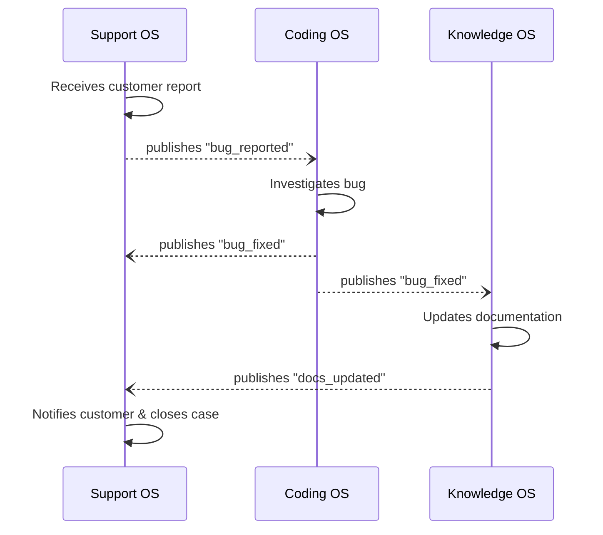
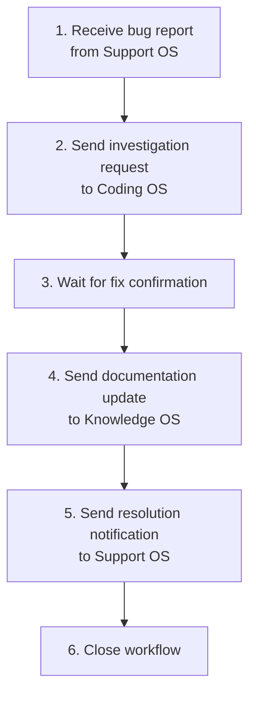
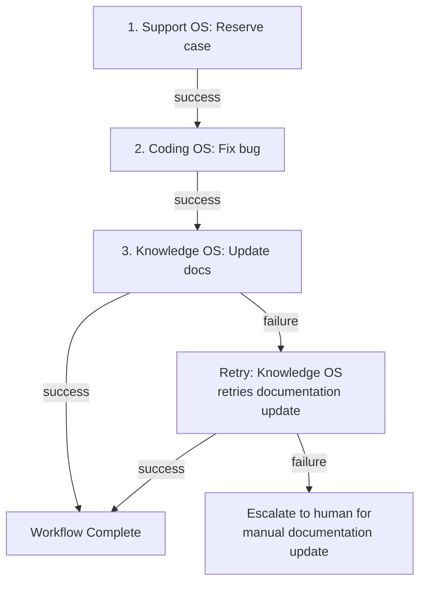

# Multi-OS Coordination

The previous chapters described individual operating systems — each optimized for a single domain. But real organizations do not operate in single domains. A customer support case reveals a bug that requires engineering. A research finding changes the product strategy that changes the codebase that changes the documentation. Work flows across boundaries.

This chapter examines what happens when multiple Agentic OSs must work together.

## The Coordination Problem

Each Agentic OS is designed for independence: its own kernel, its own memory, its own governance, its own process fabric. This independence is a strength — it allows each OS to optimize for its domain without compromise. But it creates a problem when work crosses domains.

Consider this scenario: A customer reports that the export feature produces corrupted CSV files. This involves:

- **Support OS**: Receives the report, triages, gathers customer context.
- **Coding OS**: Investigates the bug, writes a fix, runs tests.
- **Knowledge OS**: Updates the known issues documentation and the troubleshooting guide.

Three operating systems, one workflow. How do they coordinate?

## Federation Architecture

Multi-OS coordination follows a federation model: independent systems that collaborate through negotiated protocols.

### The Federation Bus

The federation bus is the communication layer between operating systems. It carries:

- **Work requests**: "Support OS to Coding OS: investigate CSV export corruption. Here is the customer report, reproduction steps, and relevant account data."
- **Status updates**: "Coding OS to Support OS: bug identified. Fix in progress. Estimated resolution: 2 hours."
- **Results**: "Coding OS to Support OS: fix deployed. Here is the change summary and verification results."
- **Knowledge events**: "Coding OS to Knowledge OS: new known issue — CSV export corruption caused by encoding mismatch in v3.2. Resolution: patch v3.2.1."

### Message Format

Inter-OS messages use a standard format:

```text
Message:
  from: support-os
  to: coding-os
  type: work_request
  priority: high
  payload:
    intent: "Investigate and fix CSV export corruption"
    context:
      customer_report: "..."
      reproduction_steps: "..."
      affected_versions: ["3.2.0"]
    constraints:
      data_classification: "customer_data_redacted"
      time_expectation: "urgent"
    callback:
      on_status_change: "support-os/cases/4521/status"
      on_completion: "support-os/cases/4521/resolution"
```

The message carries enough context for the receiving OS to act without knowing the sender's internal state. It specifies constraints (data classification, urgency) that map to the receiver's governance policies. And it includes callbacks so the sender is notified of progress.

### Capability Discovery

Before OS A can send work to OS B, it must know what OS B can do. Capability discovery operates through a registry:

```text
Registry:
  coding-os:
    capabilities: [bug_investigation, feature_development, code_review, deployment]
    accepts: [work_request, information_request]
    SLA: { bug_investigation: "4 hours", feature_development: "1-5 days" }
    governance: { data_classification: "up to confidential", approval_required: "for production changes" }
  
  knowledge-os:
    capabilities: [documentation_update, knowledge_retrieval, knowledge_validation]
    accepts: [knowledge_event, query]
    SLA: { documentation_update: "1 hour", knowledge_retrieval: "seconds" }
    governance: { data_classification: "up to internal" }
```

Each OS publishes its capabilities, accepted message types, service level expectations, and governance constraints. Senders can discover what is available, what it costs, and what rules apply — without knowing the receiver's internal architecture.

## Coordination Patterns

### Request-Response

The simplest pattern. OS A sends a work request, OS B processes it, OS B sends the result back. The Support OS requests a bug fix, the Coding OS delivers it.

This works for well-defined, self-contained work. It fails when the work requires ongoing collaboration.

### Event-Driven

OSs publish events when significant things happen. Other OSs subscribe to relevant events and react.

- Coding OS publishes: "Deployment completed: v3.2.1 with CSV fix."
- Support OS subscribes: Updates open cases related to the CSV bug.
- Knowledge OS subscribes: Updates documentation and known issues.

Event-driven coordination is loosely coupled — publishers do not know who subscribes. This makes it easy to add new consumers without modifying producers.

### Choreography

Multiple OSs collaborate through a series of events without a central coordinator. Each OS knows its role and reacts to events from others:



Choreography works when the workflow is well-known and each participant's role is clear. It becomes fragile when workflows are complex or when failures require coordinated recovery.

### Orchestration

A coordinator OS (or a dedicated federation orchestrator) manages the workflow. It sends requests to each OS, monitors progress, handles failures, and ensures the workflow completes.



Orchestration is more robust for complex workflows — the orchestrator maintains the overall state and can handle failures (retry, skip, escalate) with full visibility into the workflow's progress.

### Saga Pattern

For long-running, multi-OS workflows that may partially fail, the saga pattern provides compensating actions:



Each step has a compensating action defined. If a step fails, previous steps are compensated if necessary, or the workflow adapts. The key insight: not every failure requires rollback. A bug fix is valuable even if the documentation update fails. The saga pattern acknowledges partial success.

## Cross-OS Governance

When work crosses OS boundaries, governance becomes complex. Each OS has its own policies, but the inter-OS workflow needs additional governance.

### Data Classification at Boundaries

Customer data from the Support OS may be classified as confidential. The Coding OS may have a policy that confidential data does not enter debug logs. The federation layer must enforce data classification as information crosses boundaries.

Rules:
- Data classification travels with the data.
- The receiving OS must honor the classification or reject the data.
- Data can be reclassified at boundaries (e.g., redacted to lower classification) but never silently upgraded.

### Cross-OS Audit

The audit trail must span OS boundaries. When the Support OS triggers a bug fix in the Coding OS that triggers a documentation update in the Knowledge OS, the complete chain must be traceable.

Each OS maintains its internal audit log. The federation layer maintains a cross-OS correlation ID that links related entries across logs:

```text
Correlation ID: fed-2026-04-03-4521
  Support OS: Case opened, escalated to engineering [timestamp]
  Coding OS: Investigation started, bug found, fix deployed [timestamps]
  Knowledge OS: Documentation updated, known issue added [timestamp]
  Support OS: Customer notified, case closed [timestamp]
```

### Cross-OS Authorization

When OS A asks OS B to perform an action, who authorizes it? Options:

- **Delegated authority**: OS A's operator authorized the work. OS B trusts OS A's authorization within defined limits.
- **Independent authorization**: OS B requires its own operator to approve, regardless of OS A's request. Used for high-risk actions.
- **Policy-based**: Pre-agreed policies determine which requests are auto-approved and which require explicit authorization. "Bug fixes with severity ≥ high are auto-approved. Feature requests require Coding OS operator approval."

## Failure Handling

Multi-OS failures are harder than single-OS failures because the failure may be in the communication, not in any individual OS.

### Communication Failures

- **Timeout**: OS A sent a request but OS B did not respond. Is OS B down, or just slow? The federation layer implements exponential backoff with a deadline.
- **Message loss**: The request was lost in transit. The federation layer uses at-least-once delivery with idempotency checks.
- **Partial response**: OS B sent results but the connection dropped midway. The federation layer uses chunked responses with resume capability.

### Semantic Failures

- **Misunderstood request**: OS A asked for X but OS B interpreted it as Y. The standard message format and capability registry reduce this risk, but it cannot be eliminated. Verification steps — where OS A checks OS B's interpretation before execution — catch misunderstandings early.
- **Conflicting actions**: Two OSs take actions that conflict. The Coding OS deploys a fix while the Support OS tells the customer the issue is still under investigation. Coordination timestamps and status synchronization prevent this.

## The Organization as a System

Zoom out far enough, and the collection of coordinated Agentic OSs *is* an organization's operational intelligence. The federation layer is the nervous system connecting specialized organs.

This perspective reveals design principles:

- **Specialize deeply, coordinate loosely.** Each OS should be excellent at its domain and minimally dependent on others. Loose coupling through events and standard messages.
- **Fail independently, recover collectively.** A failure in the Knowledge OS should not bring down the Coding OS. But recovery from a cross-OS workflow failure requires coordination.
- **Share knowledge, not state.** OSs share knowledge events ("a bug was fixed"), not internal state ("this is my current task graph"). This preserves independence.
- **Govern at every boundary.** Trust between OSs is not implicit. Every data exchange, every work request, every status update passes through governance checks.

## When Not to Federate

Federation adds complexity. Before creating multiple OSs, ask:

- **Is the domain separation real?** If the same team does support and coding, one OS with multiple skill sets may be simpler than two federated OSs.
- **Is the data separation necessary?** If all OSs need the same data with the same access policies, the federation boundary creates friction without value.
- **Is independent evolution needed?** If the systems change on different schedules with different teams, federation is justified. If one team builds everything, a monolithic OS with good internal boundaries may be better.

Federation is the right architecture when the organizational structure, security boundaries, and evolution timelines genuinely differ across domains. It is the wrong architecture when it is chosen for elegance rather than necessity.

## Reference Implementation

Multi-OS coordination requires a federation layer. Each OS is an independent Semantic Kernel application. The federation bus connects them via a message protocol.

### Federation Bus

```python
# federation/bus.py
import asyncio
import uuid
from datetime import datetime
from dataclasses import dataclass, field
from enum import Enum

class MessageType(Enum):
    WORK_REQUEST = "work_request"
    STATUS_UPDATE = "status_update"
    RESULT = "result"
    EVENT = "event"

@dataclass
class FederationMessage:
    id: str
    correlation_id: str
    from_os: str
    to_os: str
    type: MessageType
    priority: str
    payload: dict
    timestamp: str = field(default_factory=lambda: datetime.utcnow().isoformat())
    data_classification: str = "internal"

class FederationBus:
    """Routes messages between independent Agentic OSs."""

    def __init__(self):
        self.queues: dict[str, asyncio.Queue] = {}
        self.audit_log: list[FederationMessage] = []
        self.registry: dict[str, dict] = {}

    def register_os(self, name: str, capabilities: list[str],
                    max_classification: str = "internal"):
        self.queues[name] = asyncio.Queue()
        self.registry[name] = {
            "capabilities": capabilities,
            "max_classification": max_classification,
        }

    async def send(self, message: FederationMessage):
        """Send with data classification enforcement at boundary."""
        receiver = self.registry.get(message.to_os, {})
        levels = {"public": 0, "internal": 1, "confidential": 2}
        if levels.get(message.data_classification, 0) > \
           levels.get(receiver.get("max_classification", "internal"), 1):
            raise PermissionError(
                f"Data '{message.data_classification}' exceeds "
                f"'{message.to_os}' clearance"
            )
        self.audit_log.append(message)
        await self.queues[message.to_os].put(message)

    async def receive(self, os_name: str) -> FederationMessage:
        return await self.queues[os_name].get()

    def find_os_for(self, capability: str) -> str | None:
        for name, info in self.registry.items():
            if capability in info["capabilities"]:
                return name
        return None
```

### Federation Plugin for SK Agents

Each OS exposes a **federation plugin** that allows its agents to request help from other OSs:

```python
# plugins/federation_plugin.py
from typing import Annotated
from semantic_kernel.functions import kernel_function

class FederationPlugin:
    """Allows agents to request capabilities from other OSs."""

    def __init__(self, bus, this_os: str):
        self.bus = bus
        self.this_os = this_os

    @kernel_function(description="Request a capability from another OS.")
    async def request_capability(
        self,
        capability: Annotated[str, "Capability to request"],
        description: Annotated[str, "Description of what is needed"],
        priority: Annotated[str, "Priority: critical, high, medium, low"] = "medium",
    ) -> Annotated[str, "Response from the other OS"]:
        target = self.bus.find_os_for(capability)
        if not target:
            return f"No OS provides capability: {capability}"

        correlation_id = str(uuid.uuid4())
        await self.bus.send(FederationMessage(
            id=str(uuid.uuid4()),
            correlation_id=correlation_id,
            from_os=self.this_os,
            to_os=target,
            type=MessageType.WORK_REQUEST,
            priority=priority,
            payload={"capability": capability, "description": description},
        ))

        result = await asyncio.wait_for(
            self.bus.receive(self.this_os), timeout=300
        )
        return json.dumps(result.payload)

    @kernel_function(description="Discover available capabilities across all OSs.")
    async def discover_capabilities(
        self,
    ) -> Annotated[str, "Available capabilities as JSON"]:
        return json.dumps({
            name: info["capabilities"]
            for name, info in self.bus.registry.items()
        })
```

### Cross-OS Workflow: Bug Resolution

```python
# federation/workflows/bug_resolution.py
"""
Cross-OS workflow using SK agents with federation plugin.
Support OS → Coding OS → Knowledge OS → Support OS
"""
from semantic_kernel.agents import ChatCompletionAgent, SequentialOrchestration
from semantic_kernel.agents.runtime import InProcessRuntime

async def bug_resolution(bus: FederationBus, ticket: dict):
    """Orchestrate bug resolution across three OSs."""
    service = AzureChatCompletion(
        deployment_name="gpt-4.1",
        endpoint="https://your-endpoint.openai.azure.com/",
    )

    # Coordinator agent with federation capability
    coordinator = ChatCompletionAgent(
        service=service,
        name="Coordinator",
        instructions="""You coordinate bug resolution across OSs.
1. Ask support-os to triage the ticket
2. Ask coding-os to investigate and fix the bug
3. Ask knowledge-os to update documentation
4. Ask support-os to notify the customer
Use the federation plugin to communicate with each OS.
Redact customer PII before sending to coding-os or knowledge-os.""",
        plugins=[FederationPlugin(bus, "orchestrator")],
    )

    runtime = InProcessRuntime()
    await runtime.start()

    response = await coordinator.get_response(
        messages=f"Bug ticket: {json.dumps(ticket)}"
    )

    await runtime.stop_when_idle()

    # Log cross-OS audit trail
    trace = [m for m in bus.audit_log
             if m.correlation_id == response.thread.id]
    log_correlation_trace(trace)

    return str(response)
```

### Cross-OS Audit

```python
# federation/audit.py

def log_correlation_trace(messages: list[FederationMessage]) -> dict:
    """Build an end-to-end audit trail across OS boundaries."""
    return {
        "started_at": messages[0].timestamp if messages else None,
        "completed_at": messages[-1].timestamp if messages else None,
        "os_involved": list(set(
            m.from_os for m in messages) | set(m.to_os for m in messages
        )),
        "message_count": len(messages),
        "events": [
            {
                "timestamp": m.timestamp,
                "from": m.from_os,
                "to": m.to_os,
                "type": m.type.value,
                "action": m.payload.get("capability", m.payload.get("action")),
            }
            for m in messages
        ],
    }
```

Key patterns: **federation bus** (message routing with data classification enforcement), **federation plugin** (`@kernel_function` enabling agents to call across OS boundaries), **coordinator agent** (single agent with federation capability orchestrating the cross-OS workflow), **cross-OS audit trail** (correlation IDs linking events across independent systems).

